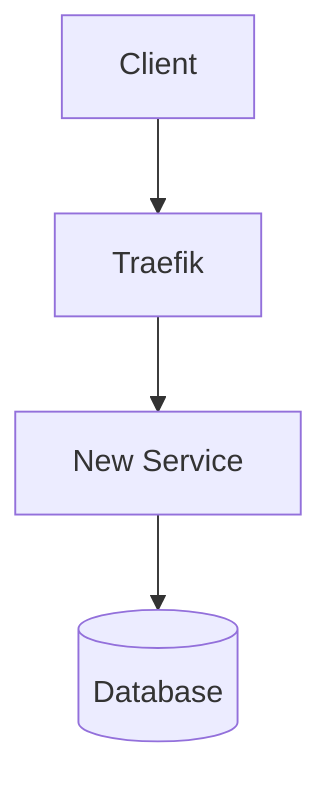

# Update Documentation

Update RawDrive documentation to reflect code changes, new features, or architecture updates.

## References

- **PRD**: [`.claude/PRD.md`](../PRD.md) - Product requirements and architecture overview
- **Best Practices**:
  - [Coding Standards](../reference/coding-standards.md)
  - [All Reference Documentation](../reference/) - Comprehensive best practices for all domains

## Quick Commands

```bash
# Update version
echo "0.3.3" > VERSION

# Update CHANGELOG
# Edit CHANGELOG.md manually

# Update README
# Edit README.md to reflect new features

# Update CLAUDE.md
# Edit CLAUDE.md with new context
```

## Documentation Structure

### Core Documentation Files

| File | Purpose | Update When |
|------|---------|-------------|
| `README.md` | Project overview, quick start, features | New features, version changes |
| `CLAUDE.md` | AI assistant context, architecture | New services, tech stack changes |
| `CHANGELOG.md` | Version history | Every release |
| `VERSION` | Current version number | Every release |

### Documentation Directories

| Directory | Contents | Update When |
|-----------|----------|-------------|
| `docs/` | Feature docs, guides, runbooks | New features, processes |
| `docs/Features/` | Feature specifications | New features |
| `docs/TechnicalSpecs/` | Technical designs | Architecture changes |
| `specs/` | Detailed feature specs | Feature planning |

## Update Checklist

### After Adding New Feature

- [ ] Update `README.md` - Add to features list
- [ ] Update `CHANGELOG.md` - Document changes
- [ ] Create feature doc in `docs/Features/`
- [ ] Update API documentation
- [ ] Update relevant service README
- [ ] Add examples/screenshots if UI feature

### After Adding New Microservice

- [ ] Update `README.md` - Service URLs table
- [ ] Update `CLAUDE.md` - Microservices section
- [ ] Update `docs/ARCHITECTURE_QUICK_REFERENCE.md`
- [ ] Create service README in `services/<service>/README.md`
- [ ] Document API endpoints
- [ ] Add to monitoring dashboard

### After Database Migration

- [ ] Document schema changes in migration file
- [ ] Update data model documentation
- [ ] Update API documentation if endpoints changed
- [ ] Note breaking changes in CHANGELOG

### After Version Release

- [ ] Update `VERSION` file
- [ ] Update `CHANGELOG.md` with release notes
- [ ] Update version badges in `README.md`
- [ ] Tag git commit: `git tag v0.3.3`
- [ ] Update deployment docs if needed

## Documentation Templates

### Feature Documentation Template

```markdown
# Feature Name

## Overview
Brief description of the feature and its purpose.

## User Stories
- As a [user type], I want to [action] so that [benefit]

## Technical Implementation

### Architecture
- Components involved
- Data flow
- API endpoints

### Database Schema
- Tables created/modified
- Indexes
- Relationships

### API Endpoints

#### Create Resource
```http
POST /api/v1/resource
Content-Type: application/json

{
  "name": "Example"
}
```

Response:
```json
{
  "id": "uuid",
  "name": "Example",
  "created_at": "2026-01-09T18:00:00Z"
}
```

## Configuration
Environment variables or settings required.

## Testing
How to test the feature.

## Deployment Notes
Special considerations for deployment.
```

### Service README Template

```markdown
# Service Name

Brief description of the service's purpose.

## Features
- Feature 1
- Feature 2

## API Endpoints

### Health Checks
- `GET /health/live` - Liveness probe
- `GET /health/ready` - Readiness probe

### Service Endpoints
- `GET /api/v1/resource` - List resources
- `POST /api/v1/resource` - Create resource

## Development

### Local Development
```bash
cd services/service-name
uvicorn src.main:app --reload --port 8XXX
```

### Docker
```bash
docker compose up service-name
```

### Testing
```bash
pytest
pytest --cov=src
```

## Configuration

### Environment Variables
- `DATABASE_URL` - PostgreSQL connection
- `REDIS_URL` - Redis connection
- `JWT_SECRET` - JWT signing secret

## Monitoring
- Prometheus metrics: `http://localhost:8XXX/metrics`
- Health check: `http://localhost:8XXX/health/ready`

## Deployment
Service runs on port 8XXX in production.
```

## Common Documentation Tasks

### Update Architecture Diagram

Edit `README.md` Mermaid diagram:



### Update Service Ports Table

In `README.md` and `CLAUDE.md`:

```markdown
| Service | Port | Purpose |
|---------|------|---------|
| New Service | 8XXX | Description |
```

### Update Tech Stack

In `README.md`:

```markdown
| Component | Technology | Purpose |
|-----------|------------|---------|
| New Component | Technology X | Purpose |
```

### Document Breaking Changes

In `CHANGELOG.md`:

```markdown
### Breaking Changes
- **API Change**: Endpoint `/old` renamed to `/new`
- **Migration Required**: Run `alembic upgrade head`
- **Config Change**: New env var `NEW_VAR` required
```

## Documentation Best Practices

### Writing Style
- Use clear, concise language
- Include code examples
- Add diagrams for complex flows
- Keep examples up-to-date

### Code Examples
- Use actual working code
- Include imports and setup
- Show expected output
- Test examples before committing

### API Documentation
- Document all endpoints
- Include request/response examples
- Note authentication requirements
- Document error responses

### Diagrams
- Use Mermaid for architecture diagrams
- Keep diagrams simple and focused
- Update when architecture changes
- Include legend if needed

## Automated Documentation

### Generate API Docs

FastAPI automatically generates OpenAPI docs at `/docs`:

```python
app = FastAPI(
    title="Service Name",
    description="Service description",
    version="0.1.0",
    docs_url="/docs",
    redoc_url="/redoc"
)
```

### Generate Type Documentation

TypeScript types are self-documenting:

```typescript
/**
 * Gallery configuration
 */
export interface Gallery {
  /** Unique identifier */
  id: string;
  /** Gallery name */
  name: string;
  /** Workspace ID */
  workspace_id: string;
}
```

## Verification

### Check Documentation Links

```bash
# Check for broken links in markdown files
find docs -name "*.md" -exec grep -H "http" {} \;
```

### Validate Markdown

```bash
# Install markdownlint
npm install -g markdownlint-cli

# Check markdown files
markdownlint docs/**/*.md
```

### Check Code Examples

Ensure code examples in docs are tested and working.

## Notes

- Keep documentation close to code
- Update docs in same PR as code changes
- Review docs during code review
- Use consistent formatting
- Include screenshots for UI features
