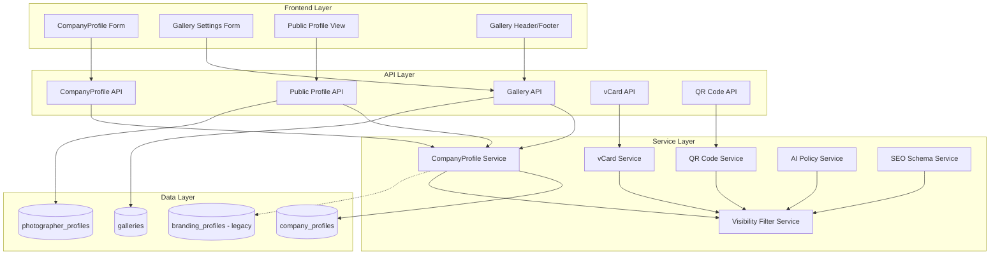
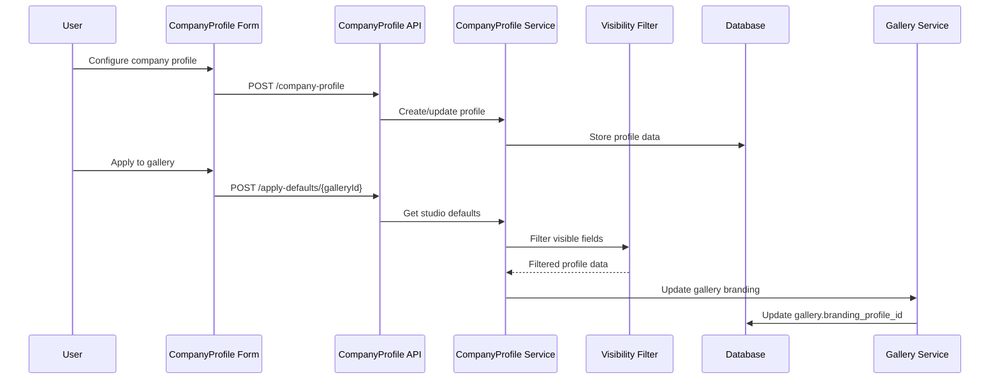

# Design Document: CompanyProfile Branding System

## Overview

The CompanyProfile Branding System consolidates and extends existing branding functionality to serve as the central branding authority across all client-facing surfaces in RawDrive. This system enhances the existing `company_profiles` and `branding_profiles` tables to provide comprehensive branding management with visibility controls, vCard/QR code generation, AI policy integration, and SEO optimization.

The design focuses on:
- Consolidating existing branding systems into a unified CompanyProfile entity
- Maintaining backward compatibility with existing gallery branding references
- Providing granular visibility controls for public/private information
- Enabling seamless integration across galleries, public profiles, and client portals
- Supporting modern business card generation and SEO optimization

## Architecture

### System Architecture



### Data Flow Architecture



## Components and Interfaces

### Core Components

#### 1. Enhanced CompanyProfile Entity

Extends existing `company_profiles` table with additional fields for comprehensive branding:

```typescript
interface CompanyProfile {
  // Core Identity (extends existing)
  id: string;
  workspace_id: string;
  name: string;                    // Enhanced from company_name
  tagline?: string;               // NEW: Brand tagline
  slug: string;                   // NEW: Public URL slug
  
  // Visual Branding (consolidates branding_profiles)
  logoUrl: string;                // Enhanced from logo_object_key
  faviconUrl?: string;           // NEW: Favicon for web
  brandColor?: string;           // Migrated from branding_profiles
  brandFont?: string;            // Migrated from branding_profiles
  
  // Contact Information (enhanced existing)
  email: string;
  phone?: string;
  website?: string;
  
  // Structured Address (enhanced from existing address field)
  address: {
    line1?: string;
    line2?: string;
    city: string;
    state: string;
    postalCode?: string;
    country: string;
  };
  
  // Social & Custom Links (enhanced from social_links)
  socials: Record<string, string>;
  customLinks: Array<{
    label: string;
    url: string;
    logoUrl?: string;
  }>;
  
  // NEW: Visibility Controls
  companyVisibility: Partial<Record<keyof CompanyProfile, boolean>>;
  
  // Metadata
  created_at: Date;
  updated_at: Date;
}
```

#### 2. Visibility Filter Service

```typescript
interface VisibilityFilterService {
  filterVisible<T extends Record<string, any>>(
    data: T, 
    visibilityMap: Partial<Record<keyof T, boolean>>
  ): Partial<T>;
  
  getDefaultVisibility(): Record<string, boolean>;
  updateVisibility(profileId: string, visibility: Record<string, boolean>): Promise<void>;
}
```

#### 3. vCard Generation Service

```typescript
interface VCardService {
  generateVCard(profile: CompanyProfile): string;
  exportVCard(profileId: string): Promise<Blob>;
  validateVCardData(profile: Partial<CompanyProfile>): ValidationResult;
}
```

#### 4. QR Code Service

```typescript
interface QRCodeService {
  generateQRCode(url: string, options?: QROptions): Promise<Buffer>;
  generateProfileQR(slug: string): Promise<Buffer>;
}
```

#### 5. SEO Schema Service

```typescript
interface SEOSchemaService {
  generateBusinessSchema(profile: CompanyProfile): JsonLdSchema;
  generateBreadcrumbSchema(profile: CompanyProfile): JsonLdSchema;
  validateSchema(schema: JsonLdSchema): boolean;
}
```

### API Interfaces

#### CompanyProfile API Endpoints

```typescript
// Enhanced CRUD operations
POST   /api/v1/workspaces/{workspace_id}/company-profile
GET    /api/v1/workspaces/{workspace_id}/company-profile
PATCH  /api/v1/workspaces/{workspace_id}/company-profile
DELETE /api/v1/workspaces/{workspace_id}/company-profile

// Studio defaults integration
POST   /api/v1/workspaces/{workspace_id}/company-profile/apply-to-gallery/{gallery_id}
GET    /api/v1/workspaces/{workspace_id}/company-profile/studio-defaults

// Public profile integration
GET    /api/v1/public/profiles/{slug}
GET    /api/v1/public/profiles/{slug}/vcard
GET    /api/v1/public/profiles/{slug}/qr-code

// Visibility management
PATCH  /api/v1/workspaces/{workspace_id}/company-profile/visibility
GET    /api/v1/workspaces/{workspace_id}/company-profile/visibility

// Migration utilities
POST   /api/v1/workspaces/{workspace_id}/company-profile/migrate-legacy
```

## Data Models

### Enhanced CompanyProfile Table Schema

```sql
-- Enhanced company_profiles table (extends existing)
ALTER TABLE company_profiles ADD COLUMN IF NOT EXISTS tagline TEXT;
ALTER TABLE company_profiles ADD COLUMN IF NOT EXISTS slug VARCHAR(100) UNIQUE;
ALTER TABLE company_profiles ADD COLUMN IF NOT EXISTS favicon_url TEXT;
ALTER TABLE company_profiles ADD COLUMN IF NOT EXISTS brand_color VARCHAR(7);
ALTER TABLE company_profiles ADD COLUMN IF NOT EXISTS brand_font VARCHAR(100);
ALTER TABLE company_profiles ADD COLUMN IF NOT EXISTS socials JSONB DEFAULT '{}';
ALTER TABLE company_profiles ADD COLUMN IF NOT EXISTS custom_links JSONB DEFAULT '[]';
ALTER TABLE company_profiles ADD COLUMN IF NOT EXISTS company_visibility JSONB DEFAULT '{}';

-- Restructure address as JSONB for better structure
ALTER TABLE company_profiles ADD COLUMN IF NOT EXISTS address_structured JSONB;

-- Create indexes for new fields
CREATE INDEX IF NOT EXISTS idx_company_profiles_slug ON company_profiles(slug);
CREATE INDEX IF NOT EXISTS idx_company_profiles_workspace_slug ON company_profiles(workspace_id, slug);
```

### Migration Strategy

```sql
-- Migration script to consolidate branding_profiles into company_profiles
UPDATE company_profiles cp 
SET 
  brand_color = bp.brand_color,
  brand_font = bp.brand_font,
  favicon_url = bp.logo_object_key  -- Repurpose as favicon if needed
FROM branding_profiles bp 
WHERE cp.workspace_id = bp.workspace_id;

-- Update galleries to reference company_profile instead of branding_profile
UPDATE galleries g
SET branding_profile_id = (
  SELECT company_profile_id 
  FROM company_profiles cp 
  WHERE cp.workspace_id = g.workspace_id
)
WHERE g.branding_profile_id IS NOT NULL;
```

### Visibility Configuration Schema

```typescript
interface CompanyVisibilityConfig {
  name: boolean;              // Default: true
  tagline: boolean;           // Default: true
  logoUrl: boolean;           // Default: true
  email: boolean;             // Default: true
  phone: boolean;             // Default: true
  website: boolean;           // Default: true
  address: {
    line1: boolean;           // Default: true
    line2: boolean;           // Default: true
    city: boolean;            // Default: true
    state: boolean;           // Default: true
    postalCode: boolean;      // Default: true
    country: boolean;         // Default: true
  };
  socials: Record<string, boolean>;  // Default: true for all
  customLinks: boolean;       // Default: true
}
```

## Integration Points

### 1. Gallery System Integration

```typescript
interface GalleryBrandingIntegration {
  // Apply company profile to gallery
  applyStudioDefaults(galleryId: string): Promise<void>;
  
  // Get branding for gallery rendering
  getGalleryBranding(galleryId: string): Promise<BrandingData>;
  
  // Bulk update galleries with new branding
  bulkUpdateGalleryBranding(profileId: string): Promise<UpdateResult>;
}
```

### 2. Public Profile Integration

```typescript
interface PublicProfileIntegration {
  // Render public profile with company data
  renderPublicProfile(slug: string): Promise<PublicProfileData>;
  
  // Generate SEO metadata
  generateSEOMetadata(slug: string): Promise<SEOMetadata>;
  
  // Handle custom domain routing
  resolveCustomDomain(domain: string): Promise<CompanyProfile>;
}
```

### 3. AI Policy Integration

```typescript
interface AIPolicyIntegration {
  // Generate legal policies using company data
  generateLegalPolicy(
    policyType: 'terms' | 'privacy' | 'refund',
    profileId: string
  ): Promise<PolicyDocument>;
  
  // Update policies when company data changes
  regeneratePolicies(profileId: string): Promise<PolicyUpdateResult>;
}
```

## Correctness Properties

*A property is a characteristic or behavior that should hold true across all valid executions of a system-essentially, a formal statement about what the system should do. Properties serve as the bridge between human-readable specifications and machine-verifiable correctness guarantees.*

Now I'll analyze the acceptance criteria to determine which can be tested as properties:

<function_calls>
<invoke name="prework">
<parameter name="featureName">company-profile-branding

### Property Reflection

After analyzing the acceptance criteria, I identified several properties that can be consolidated to eliminate redundancy:

- Properties 1.5 and 9.2 both test workspace isolation - these can be combined into one comprehensive property
- Properties 2.2 and 2.3 both test visibility filtering - these can be combined into one property about consistent visibility enforcement
- Properties 4.2 and 8.1 both test visibility-based rendering - these can be combined into one property about conditional display

### Correctness Properties

Based on the prework analysis, here are the testable correctness properties:

**Property 1: Profile Data Persistence**
*For any* valid CompanyProfile data, creating or updating a profile should result in all identity fields (name, tagline, slug, logoUrl, faviconUrl) being stored correctly in the database
**Validates: Requirements 1.1**

**Property 2: Contact Information Validation and Storage**
*For any* contact information provided, the system should validate according to defined rules and store valid data with proper structure
**Validates: Requirements 1.2**

**Property 3: Social Media Links Storage**
*For any* social media data, it should be stored as key-value pairs with platform validation applied
**Validates: Requirements 1.3**

**Property 4: Custom Links Array Storage**
*For any* custom link data, it should be stored as an array with required fields (label, URL) and optional logo
**Validates: Requirements 1.4**

**Property 5: Workspace Isolation Enforcement**
*For any* profile operation, workspace_id should be required and enforced to prevent cross-workspace data access
**Validates: Requirements 1.5, 9.2**

**Property 6: Timestamp Update on Field Changes**
*For any* profile field update, the updated_at timestamp should be modified to reflect the change
**Validates: Requirements 1.6**

**Property 7: Visibility Configuration Updates**
*For any* visibility toggle operation, the companyVisibility configuration should be updated immediately
**Validates: Requirements 2.1**

**Property 8: Consistent Visibility Filtering**
*For any* visibility configuration and public content rendering, only fields marked as visible should be included in the output
**Validates: Requirements 2.2, 2.3**

**Property 9: Studio Defaults Application**
*For any* studio defaults application to a gallery, the gallery branding should be populated with visible profile fields while maintaining compatibility
**Validates: Requirements 3.2**

**Property 10: Public Profile URL Generation**
*For any* created company profile with a slug, a public profile should be accessible at /p/{slug}
**Validates: Requirements 4.1**

**Property 11: Slug Uniqueness Constraint**
*For any* slug value, it should be unique across all workspaces in the system
**Validates: Requirements 4.3**

**Property 12: vCard Format Validation**
*For any* vCard generation request, the output should be valid vCard 3.0 format containing only visible profile fields
**Validates: Requirements 5.1**

**Property 13: QR Code URL Encoding**
*For any* QR code generation, it should encode the correct public profile URL
**Validates: Requirements 5.2**

**Property 14: SEO Schema Markup Inclusion**
*For any* public profile rendering, JSON-LD schema markup should be included in the output
**Validates: Requirements 6.1**

**Property 15: Professional Service Schema Type**
*For any* schema generation for photography businesses, the schema type should be ProfessionalService
**Validates: Requirements 6.2**

**Property 16: AI Policy Company Name Usage**
*For any* legal policy generation, the company name from the profile should be used as the legal entity
**Validates: Requirements 7.1**

**Property 17: Conditional Branding Display**
*For any* gallery header rendering, visible company logo and name should be displayed when available
**Validates: Requirements 8.1**

**Property 18: Field Validation with Zod Schemas**
*For any* profile creation or update, all fields should be validated according to defined Zod schemas
**Validates: Requirements 9.1**

## Error Handling

### Error Categories

1. **Validation Errors**
   - Invalid email format
   - Invalid phone number format
   - Invalid URL format
   - Missing required fields
   - Slug format violations

2. **Business Logic Errors**
   - Duplicate slug conflicts
   - Workspace isolation violations
   - Invalid visibility configurations
   - Migration conflicts

3. **Integration Errors**
   - vCard generation failures
   - QR code generation failures
   - AI service communication errors
   - Schema validation failures

4. **System Errors**
   - Database connection failures
   - File storage errors
   - External service timeouts

### Error Handling Strategies

```typescript
interface ErrorHandlingStrategy {
  // Validation errors - return detailed field-level errors
  handleValidationError(error: ValidationError): ApiErrorResponse;
  
  // Business logic errors - return user-friendly messages
  handleBusinessLogicError(error: BusinessLogicError): ApiErrorResponse;
  
  // Integration errors - provide fallback behavior
  handleIntegrationError(error: IntegrationError): ApiErrorResponse;
  
  // System errors - log and return generic error
  handleSystemError(error: SystemError): ApiErrorResponse;
}
```

### Graceful Degradation

- **vCard Generation Failure**: Return basic contact information as plain text
- **QR Code Generation Failure**: Provide direct URL link as fallback
- **AI Policy Generation Failure**: Use template-based policy generation
- **Schema Validation Failure**: Continue without schema markup but log error

## Testing Strategy

### Dual Testing Approach

The testing strategy combines unit tests for specific examples and edge cases with property-based tests for universal properties across all inputs:

**Unit Tests Focus:**
- Specific validation scenarios (valid/invalid email formats)
- Edge cases (empty fields, maximum length inputs)
- Error conditions (network failures, invalid data)
- Integration points between components
- Migration scenarios from legacy systems

**Property-Based Tests Focus:**
- Universal properties that hold for all inputs (Properties 1-18 above)
- Comprehensive input coverage through randomization
- Data consistency across operations
- Workspace isolation enforcement
- Visibility filtering correctness

### Property-Based Testing Configuration

- **Testing Library**: Use Hypothesis (Python) or fast-check (TypeScript/JavaScript)
- **Minimum Iterations**: 100 iterations per property test
- **Test Tags**: Each property test must reference its design document property
- **Tag Format**: `Feature: company-profile-branding, Property {number}: {property_text}`

### Test Coverage Requirements

1. **API Endpoint Tests**: All CRUD operations with various input combinations
2. **Service Layer Tests**: Business logic validation and data transformation
3. **Integration Tests**: Cross-system interactions (galleries, public profiles, AI services)
4. **Migration Tests**: Legacy data migration and compatibility
5. **Performance Tests**: Public profile loading and vCard/QR generation speed
6. **Security Tests**: Workspace isolation and data visibility enforcement

### Example Property Test Structure

```typescript
// Feature: company-profile-branding, Property 5: Workspace Isolation Enforcement
describe('Workspace Isolation Property', () => {
  it('should enforce workspace_id on all profile operations', async () => {
    await fc.assert(fc.asyncProperty(
      fc.record({
        workspace_id: fc.uuid(),
        profile_data: fc.companyProfileData(),
        operation: fc.constantFrom('create', 'update', 'delete', 'read')
      }),
      async ({ workspace_id, profile_data, operation }) => {
        // Test that operation requires workspace_id and prevents cross-workspace access
        const result = await performProfileOperation(operation, profile_data, workspace_id);
        expect(result.workspace_id).toBe(workspace_id);
        
        // Test that using different workspace_id fails
        const otherWorkspaceId = fc.sample(fc.uuid(), 1)[0];
        if (otherWorkspaceId !== workspace_id) {
          await expect(
            performProfileOperation(operation, profile_data, otherWorkspaceId)
          ).rejects.toThrow('WORKSPACE_ACCESS_DENIED');
        }
      }
    ), { numRuns: 100 });
  });
});
```

This comprehensive design provides a robust foundation for implementing the CompanyProfile branding system while maintaining compatibility with existing systems and ensuring correctness through extensive property-based testing.