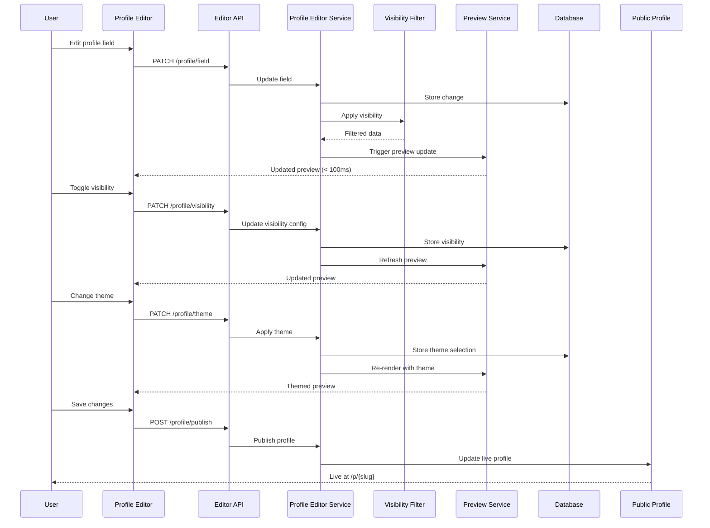
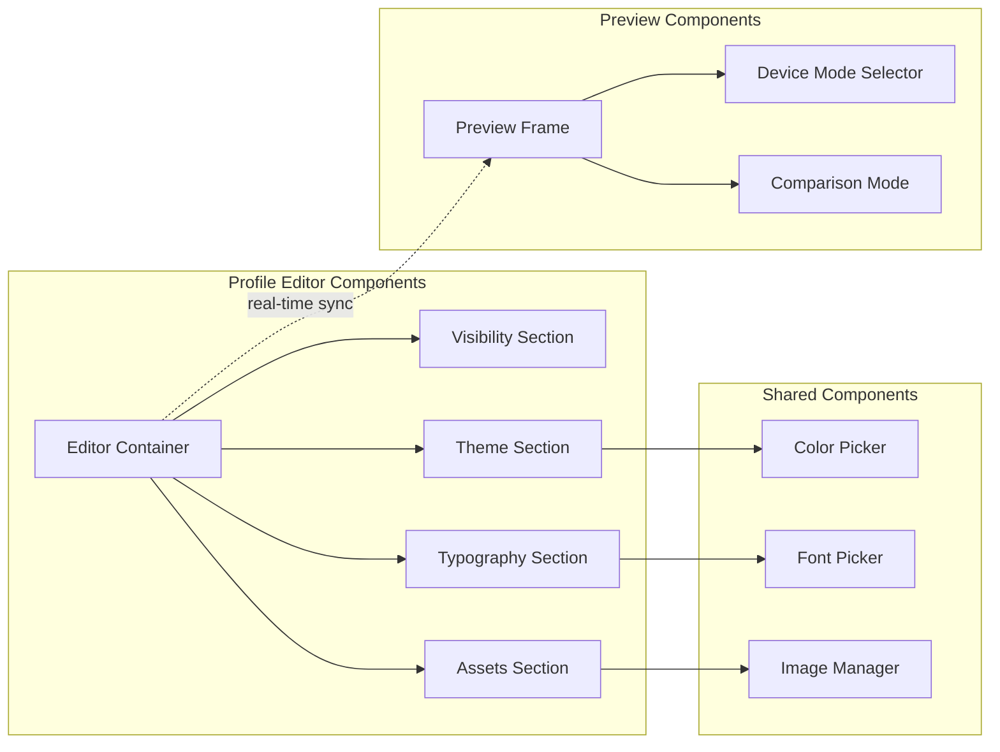

# Design Document: Public Profile Editor

## Overview

The Public Profile Editor is a comprehensive, unified interface that empowers photographers to create and customize their automatically-generated public profile pages with precision and ease. This system extends the existing RawDrive public profile infrastructure (defined in `docs/TechnicalSpecs/public_profile.json`) by adding:

- **Granular Visibility Controls**: Per-field toggles for all profile information including per-platform social media controls
- **Live Multi-Device Preview**: Real-time preview across phone, tablet, and desktop breakpoints
- **Modern Theming System**: Pre-built themes with deep customization (colors, gradients, layouts)
- **Typography Management**: Curated web fonts and custom font upload capabilities
- **Brand Asset Management**: Multiple logo variants with automatic selection
- **Collaboration Features**: Preview sharing, version control, and approval workflows

The design focuses on:
- Seamless integration with existing `company_profiles`, `photographer_profiles`, and `branding_profiles` tables
- Real-time synchronization between editor and live public profile
- Performance optimization for instant preview updates (< 100ms)
- Accessibility compliance (WCAG 2.1 AA) across all features
- Workspace isolation and security for multi-tenant architecture

## Architecture

### System Architecture

```mermaid
graph TB
    subgraph "Frontend Layer"
        PE[Profile Editor UI]
        LP[Live Preview Panel]
        TG[Theme Gallery]
        CP[Color Palette Builder]
        FM[Font Manager]
        AM[Asset Manager]
    end
    
    subgraph "API Layer"
        PEA[Profile Editor API]
        TA[Theme API]
        FA[Font API]
        AA[Asset API]
        PPA[Public Profile API - existing]
    end
    
    subgraph "Service Layer"
        PES[Profile Editor Service]
        VFS[Visibility Filter Service]
        TS[Theme Service]
        TCS[Theme Customization Service]
        FS[Font Service]
        AS[Asset Service]
        PVS[Preview Service]
        VCS[Version Control Service]
    end
    
    subgraph "Data Layer"
        CPT[(company_profiles - existing)]
        PPT[(photographer_profiles - existing)]
        BPT[(branding_profiles - enhanced)]
        TT[(themes - new)]
        TCT[(theme_customizations - new)]
        FT[(custom_fonts - new)]
        AT[(brand_assets - new)]
        VT[(profile_versions - new)]
    end
    
    PE --> PEA
    LP --> PVS
    TG --> TA
    CP --> TCS
    FM --> FA
    AM --> AA
    
    PEA --> PES
    TA --> TS
    FA --> FS
    AA --> AS
    
    PES --> VFS
    PES --> CPT
    PES --> PPT
    TS --> TT
    TCS --> TCT
    TCS --> BPT
    FS --> FT
    AS --> AT
    VCS --> VT
    
    PVS --> VFS
    PVS --> PPA
```



### Data Flow Architecture



### Component Architecture



## Components and Interfaces

### Core Components

#### 1. Enhanced BrandingProfile Entity

Extends existing `branding_profiles` table with theme and customization support:

```typescript
interface EnhancedBrandingProfile {
  // Existing fields
  branding_profile_id: string;
  workspace_id: string;
  brand_color: string;
  brand_font: string;
  logo_object_key?: string;
  cover_object_key?: string;
  created_at: Date;
  
  // NEW: Theme and customization fields
  theme_id?: string;                    // Reference to selected theme
  theme_customization_id?: string;      // Reference to customizations
  color_palette?: ColorPalette;         // Brand color palette
  typography_config?: TypographyConfig; // Font configuration
  layout_preferences?: LayoutPreferences; // Layout options
  updated_at: Date;
}

interface ColorPalette {
  primary: string;
  secondary: string;
  accent: string;
  neutral: string[];
  gradients?: GradientConfig[];
}

interface TypographyConfig {
  heading_font: FontConfig;
  body_font: FontConfig;
  accent_font?: FontConfig;
}

interface FontConfig {
  family: string;
  source: 'web' | 'custom';
  custom_font_id?: string;
  fallback: string[];
  weights: number[];
}

interface LayoutPreferences {
  spacing: 'compact' | 'normal' | 'spacious';
  hero_style: 'card' | 'full-bleed';
  section_layout: 'single-column' | 'two-column';
}
```

#### 2. Visibility Configuration Entity

NEW table for granular visibility controls:

```typescript
interface ProfileVisibilityConfig {
  visibility_config_id: string;
  workspace_id: string;
  profile_type: 'company' | 'photographer';
  profile_id: string;
  
  // Field visibility map
  field_visibility: Record<string, boolean>;
  
  // Per-platform social media visibility
  social_visibility: {
    instagram?: boolean;
    facebook?: boolean;
    whatsapp?: boolean;
    tiktok?: boolean;
    linkedin?: boolean;
    youtube?: boolean;
    twitter?: boolean;
  };
  
  // Visibility presets
  preset_name?: string;
  is_default: boolean;
  
  created_at: Date;
  updated_at: Date;
}
```

#### 3. Theme Entity

NEW table for theme definitions:

```typescript
interface Theme {
  theme_id: string;
  name: string;
  category: 'minimal' | 'bold' | 'elegant' | 'modern' | 'creative';
  description: string;
  preview_image_url: string;
  
  // Theme configuration
  base_colors: ColorPalette;
  default_typography: TypographyConfig;
  layout_config: LayoutPreferences;
  
  // Theme metadata
  is_premium: boolean;
  is_popular: boolean;
  usage_count: number;
  
  // Variants
  supports_dark_mode: boolean;
  variants?: ThemeVariant[];
  
  created_at: Date;
  updated_at: Date;
}

interface ThemeVariant {
  variant_id: string;
  name: string; // 'light', 'dark'
  colors: ColorPalette;
}
```

#### 4. Theme Customization Entity

NEW table for user-specific theme customizations:

```typescript
interface ThemeCustomization {
  customization_id: string;
  workspace_id: string;
  theme_id: string;
  name?: string; // User-provided name for saved preset
  
  // Customized values (override theme defaults)
  custom_colors?: Partial<ColorPalette>;
  custom_typography?: Partial<TypographyConfig>;
  custom_layout?: Partial<LayoutPreferences>;
  
  // Customization metadata
  is_preset: boolean;
  created_at: Date;
  updated_at: Date;
}
```

#### 5. Custom Font Entity

NEW table for uploaded custom fonts:

```typescript
interface CustomFont {
  custom_font_id: string;
  workspace_id: string;
  font_family: string;
  
  // Font files
  font_files: FontFile[];
  
  // Font metadata
  file_size_bytes: number;
  format: 'woff2' | 'ttf' | 'woff';
  
  // Security
  is_validated: boolean;
  validation_date?: Date;
  
  created_at: Date;
  updated_at: Date;
}

interface FontFile {
  file_id: string;
  object_key: string;
  weight: number;
  style: 'normal' | 'italic';
  format: 'woff2' | 'ttf' | 'woff';
}
```

#### 6. Brand Asset Entity

NEW table for logo variants and brand assets:

```typescript
interface BrandAsset {
  asset_id: string;
  workspace_id: string;
  asset_type: 'logo' | 'favicon' | 'cover';
  variant: 'full' | 'icon' | 'light' | 'dark';
  
  // Asset storage
  object_key: string;
  optimized_formats: {
    webp?: string;
    avif?: string;
    png?: string;
  };
  
  // Asset metadata
  width: number;
  height: number;
  file_size_bytes: number;
  
  // Usage context
  recommended_for: string[]; // ['light-backgrounds', 'dark-backgrounds']
  
  // Version control
  version: number;
  is_current: boolean;
  
  created_at: Date;
  updated_at: Date;
}
```

#### 7. Profile Version Entity

NEW table for version control:

```typescript
interface ProfileVersion {
  version_id: string;
  workspace_id: string;
  profile_type: 'company' | 'photographer';
  profile_id: string;
  
  // Snapshot data
  profile_snapshot: any; // JSON snapshot of profile state
  visibility_snapshot: any; // JSON snapshot of visibility config
  theme_snapshot: any; // JSON snapshot of theme/customization
  
  // Version metadata
  version_number: number;
  label?: string; // User-provided label
  is_auto_snapshot: boolean;
  
  created_at: Date;
  created_by: string;
}
```

### Service Interfaces

#### 1. Profile Editor Service

```typescript
interface ProfileEditorService {
  // Profile management
  getProfile(workspaceId: string, profileType: string, profileId: string): Promise<ProfileData>;
  updateProfile(workspaceId: string, profileType: string, profileId: string, updates: Partial<ProfileData>): Promise<ProfileData>;
  
  // Visibility management
  getVisibilityConfig(workspaceId: string, profileId: string): Promise<ProfileVisibilityConfig>;
  updateVisibility(workspaceId: string, profileId: string, visibility: Partial<ProfileVisibilityConfig>): Promise<ProfileVisibilityConfig>;
  saveVisibilityPreset(workspaceId: string, profileId: string, presetName: string): Promise<ProfileVisibilityConfig>;
  
  // Publishing
  publishProfile(workspaceId: string, profileId: string): Promise<PublishResult>;
  unpublishProfile(workspaceId: string, profileId: string): Promise<void>;
}
```

#### 2. Theme Service

```typescript
interface ThemeService {
  // Theme browsing
  listThemes(filters?: ThemeFilters): Promise<Theme[]>;
  getTheme(themeId: string): Promise<Theme>;
  getThemesByCategory(category: string): Promise<Theme[]>;
  
  // Theme application
  applyTheme(workspaceId: string, profileId: string, themeId: string): Promise<void>;
  getActiveTheme(workspaceId: string, profileId: string): Promise<Theme>;
}
```

#### 3. Theme Customization Service

```typescript
interface ThemeCustomizationService {
  // Customization management
  getCustomization(workspaceId: string, customizationId: string): Promise<ThemeCustomization>;
  updateCustomization(workspaceId: string, customizationId: string, updates: Partial<ThemeCustomization>): Promise<ThemeCustomization>;
  
  // Color management
  updateColors(workspaceId: string, customizationId: string, colors: Partial<ColorPalette>): Promise<ThemeCustomization>;
  extractColorsFromLogo(logoUrl: string): Promise<ColorPalette>;
  suggestColorHarmony(baseColor: string, scheme: 'complementary' | 'analogous' | 'triadic'): Promise<ColorPalette>;
  validateContrast(foreground: string, background: string): Promise<ContrastResult>;
  
  // Layout management
  updateLayout(workspaceId: string, customizationId: string, layout: Partial<LayoutPreferences>): Promise<ThemeCustomization>;
  
  // Preset management
  saveAsPreset(workspaceId: string, customizationId: string, presetName: string): Promise<ThemeCustomization>;
  listPresets(workspaceId: string): Promise<ThemeCustomization[]>;
}
```

#### 4. Font Service

```typescript
interface FontService {
  // Web fonts
  listWebFonts(): Promise<WebFont[]>;
  getWebFont(fontFamily: string): Promise<WebFont>;
  
  // Custom fonts
  uploadCustomFont(workspaceId: string, fontFile: File): Promise<CustomFont>;
  validateFontFile(file: File): Promise<ValidationResult>;
  deleteCustomFont(workspaceId: string, fontId: string): Promise<void>;
  listCustomFonts(workspaceId: string): Promise<CustomFont[]>;
  
  // Font configuration
  updateTypography(workspaceId: string, customizationId: string, typography: Partial<TypographyConfig>): Promise<ThemeCustomization>;
  suggestFontPairings(headingFont: string): Promise<FontPairing[]>;
}
```

#### 5. Asset Service

```typescript
interface AssetService {
  // Asset upload
  uploadAsset(workspaceId: string, assetType: string, variant: string, file: File): Promise<BrandAsset>;
  optimizeAsset(assetId: string): Promise<BrandAsset>;
  
  // Asset management
  listAssets(workspaceId: string, assetType?: string): Promise<BrandAsset[]>;
  getAsset(workspaceId: string, assetId: string): Promise<BrandAsset>;
  deleteAsset(workspaceId: string, assetId: string): Promise<void>;
  
  // Asset selection
  selectBestAsset(workspaceId: string, assetType: string, context: AssetContext): Promise<BrandAsset>;
  
  // Version management
  getAssetHistory(workspaceId: string, assetType: string): Promise<BrandAsset[]>;
  restoreAssetVersion(workspaceId: string, assetId: string): Promise<BrandAsset>;
}
```

#### 6. Preview Service

```typescript
interface PreviewService {
  // Preview generation
  generatePreview(workspaceId: string, profileId: string, deviceMode: DeviceMode): Promise<PreviewData>;
  refreshPreview(workspaceId: string, profileId: string): Promise<PreviewData>;
  
  // Preview sharing
  createPreviewLink(workspaceId: string, profileId: string, options: PreviewLinkOptions): Promise<PreviewLink>;
  getPreviewByToken(token: string): Promise<PreviewData>;
  revokePreviewLink(workspaceId: string, linkId: string): Promise<void>;
  
  // Comparison
  compareVersions(workspaceId: string, profileId: string, versionA: string, versionB: string): Promise<ComparisonResult>;
}
```

#### 7. Version Control Service

```typescript
interface VersionControlService {
  // Snapshot management
  createSnapshot(workspaceId: string, profileId: string, label?: string): Promise<ProfileVersion>;
  listVersions(workspaceId: string, profileId: string): Promise<ProfileVersion[]>;
  getVersion(workspaceId: string, versionId: string): Promise<ProfileVersion>;
  
  // Restore
  restoreVersion(workspaceId: string, profileId: string, versionId: string): Promise<void>;
  
  // Diff
  compareVersions(workspaceId: string, versionIdA: string, versionIdB: string): Promise<VersionDiff>;
  
  // Export/Import
  exportProfile(workspaceId: string, profileId: string): Promise<ProfileExport>;
  importProfile(workspaceId: string, profileData: ProfileExport): Promise<ProfileData>;
}
```

## Data Models

### Database Schema Extensions

#### 1. Enhanced branding_profiles Table

```sql
-- Extend existing branding_profiles table
ALTER TABLE branding_profiles 
ADD COLUMN IF NOT EXISTS theme_id UUID REFERENCES themes(theme_id),
ADD COLUMN IF NOT EXISTS theme_customization_id UUID REFERENCES theme_customizations(customization_id),
ADD COLUMN IF NOT EXISTS color_palette JSONB,
ADD COLUMN IF NOT EXISTS typography_config JSONB,
ADD COLUMN IF NOT EXISTS layout_preferences JSONB,
ADD COLUMN IF NOT EXISTS updated_at TIMESTAMP DEFAULT NOW();

-- Create index for theme lookups
CREATE INDEX IF NOT EXISTS idx_branding_profiles_theme 
ON branding_profiles(theme_id);
```

#### 2. NEW profile_visibility_configs Table

```sql
CREATE TABLE profile_visibility_configs (
  visibility_config_id UUID PRIMARY KEY DEFAULT gen_random_uuid(),
  workspace_id UUID NOT NULL REFERENCES workspaces(workspace_id) ON DELETE CASCADE,
  profile_type VARCHAR(20) NOT NULL CHECK (profile_type IN ('company', 'photographer')),
  profile_id UUID NOT NULL,
  
  field_visibility JSONB NOT NULL DEFAULT '{}',
  social_visibility JSONB NOT NULL DEFAULT '{}',
  
  preset_name VARCHAR(100),
  is_default BOOLEAN DEFAULT false,
  
  created_at TIMESTAMP DEFAULT NOW(),
  updated_at TIMESTAMP DEFAULT NOW(),
  
  UNIQUE(workspace_id, profile_type, profile_id)
);

CREATE INDEX idx_visibility_configs_workspace 
ON profile_visibility_configs(workspace_id);

CREATE INDEX idx_visibility_configs_profile 
ON profile_visibility_configs(workspace_id, profile_type, profile_id);
```

#### 3. NEW themes Table

```sql
CREATE TABLE themes (
  theme_id UUID PRIMARY KEY DEFAULT gen_random_uuid(),
  name VARCHAR(100) NOT NULL,
  category VARCHAR(50) NOT NULL CHECK (category IN ('minimal', 'bold', 'elegant', 'modern', 'creative')),
  description TEXT,
  preview_image_url TEXT,
  
  base_colors JSONB NOT NULL,
  default_typography JSONB NOT NULL,
  layout_config JSONB NOT NULL,
  
  is_premium BOOLEAN DEFAULT false,
  is_popular BOOLEAN DEFAULT false,
  usage_count INTEGER DEFAULT 0,
  
  supports_dark_mode BOOLEAN DEFAULT false,
  variants JSONB,
  
  created_at TIMESTAMP DEFAULT NOW(),
  updated_at TIMESTAMP DEFAULT NOW()
);

CREATE INDEX idx_themes_category ON themes(category);
CREATE INDEX idx_themes_popular ON themes(is_popular, usage_count DESC);
```

#### 4. NEW theme_customizations Table

```sql
CREATE TABLE theme_customizations (
  customization_id UUID PRIMARY KEY DEFAULT gen_random_uuid(),
  workspace_id UUID NOT NULL REFERENCES workspaces(workspace_id) ON DELETE CASCADE,
  theme_id UUID NOT NULL REFERENCES themes(theme_id) ON DELETE CASCADE,
  name VARCHAR(100),
  
  custom_colors JSONB,
  custom_typography JSONB,
  custom_layout JSONB,
  
  is_preset BOOLEAN DEFAULT false,
  
  created_at TIMESTAMP DEFAULT NOW(),
  updated_at TIMESTAMP DEFAULT NOW()
);

CREATE INDEX idx_theme_customizations_workspace 
ON theme_customizations(workspace_id);

CREATE INDEX idx_theme_customizations_theme 
ON theme_customizations(theme_id);

CREATE INDEX idx_theme_customizations_presets 
ON theme_customizations(workspace_id, is_preset) 
WHERE is_preset = true;
```

#### 5. NEW custom_fonts Table

```sql
CREATE TABLE custom_fonts (
  custom_font_id UUID PRIMARY KEY DEFAULT gen_random_uuid(),
  workspace_id UUID NOT NULL REFERENCES workspaces(workspace_id) ON DELETE CASCADE,
  font_family VARCHAR(100) NOT NULL,
  
  font_files JSONB NOT NULL,
  
  file_size_bytes INTEGER NOT NULL,
  format VARCHAR(20) NOT NULL CHECK (format IN ('woff2', 'ttf', 'woff')),
  
  is_validated BOOLEAN DEFAULT false,
  validation_date TIMESTAMP,
  
  created_at TIMESTAMP DEFAULT NOW(),
  updated_at TIMESTAMP DEFAULT NOW(),
  
  UNIQUE(workspace_id, font_family)
);

CREATE INDEX idx_custom_fonts_workspace 
ON custom_fonts(workspace_id);
```

#### 6. NEW brand_assets Table

```sql
CREATE TABLE brand_assets (
  asset_id UUID PRIMARY KEY DEFAULT gen_random_uuid(),
  workspace_id UUID NOT NULL REFERENCES workspaces(workspace_id) ON DELETE CASCADE,
  asset_type VARCHAR(20) NOT NULL CHECK (asset_type IN ('logo', 'favicon', 'cover')),
  variant VARCHAR(20) NOT NULL CHECK (variant IN ('full', 'icon', 'light', 'dark')),
  
  object_key TEXT NOT NULL,
  optimized_formats JSONB,
  
  width INTEGER NOT NULL,
  height INTEGER NOT NULL,
  file_size_bytes INTEGER NOT NULL,
  
  recommended_for TEXT[],
  
  version INTEGER DEFAULT 1,
  is_current BOOLEAN DEFAULT true,
  
  created_at TIMESTAMP DEFAULT NOW(),
  updated_at TIMESTAMP DEFAULT NOW(),
  
  UNIQUE(workspace_id, asset_type, variant, version)
);

CREATE INDEX idx_brand_assets_workspace 
ON brand_assets(workspace_id);

CREATE INDEX idx_brand_assets_current 
ON brand_assets(workspace_id, asset_type, is_current) 
WHERE is_current = true;
```

#### 7. NEW profile_versions Table

```sql
CREATE TABLE profile_versions (
  version_id UUID PRIMARY KEY DEFAULT gen_random_uuid(),
  workspace_id UUID NOT NULL REFERENCES workspaces(workspace_id) ON DELETE CASCADE,
  profile_type VARCHAR(20) NOT NULL CHECK (profile_type IN ('company', 'photographer')),
  profile_id UUID NOT NULL,
  
  profile_snapshot JSONB NOT NULL,
  visibility_snapshot JSONB NOT NULL,
  theme_snapshot JSONB NOT NULL,
  
  version_number INTEGER NOT NULL,
  label VARCHAR(200),
  is_auto_snapshot BOOLEAN DEFAULT false,
  
  created_at TIMESTAMP DEFAULT NOW(),
  created_by UUID REFERENCES users(user_id)
);

CREATE INDEX idx_profile_versions_workspace 
ON profile_versions(workspace_id);

CREATE INDEX idx_profile_versions_profile 
ON profile_versions(workspace_id, profile_type, profile_id, created_at DESC);
```

### API Endpoints

#### Profile Editor Endpoints

```typescript
// Profile management
GET    /api/v1/workspaces/{workspace_id}/profile-editor/profile
PATCH  /api/v1/workspaces/{workspace_id}/profile-editor/profile
POST   /api/v1/workspaces/{workspace_id}/profile-editor/publish

// Visibility management
GET    /api/v1/workspaces/{workspace_id}/profile-editor/visibility
PATCH  /api/v1/workspaces/{workspace_id}/profile-editor/visibility
POST   /api/v1/workspaces/{workspace_id}/profile-editor/visibility/presets
GET    /api/v1/workspaces/{workspace_id}/profile-editor/visibility/presets

// Theme management
GET    /api/v1/themes
GET    /api/v1/themes/{theme_id}
GET    /api/v1/themes/categories/{category}
POST   /api/v1/workspaces/{workspace_id}/profile-editor/theme/apply

// Theme customization
GET    /api/v1/workspaces/{workspace_id}/profile-editor/customization
PATCH  /api/v1/workspaces/{workspace_id}/profile-editor/customization/colors
PATCH  /api/v1/workspaces/{workspace_id}/profile-editor/customization/typography
PATCH  /api/v1/workspaces/{workspace_id}/profile-editor/customization/layout
POST   /api/v1/workspaces/{workspace_id}/profile-editor/customization/presets

// Color tools
POST   /api/v1/workspaces/{workspace_id}/profile-editor/colors/extract
POST   /api/v1/workspaces/{workspace_id}/profile-editor/colors/harmony
POST   /api/v1/workspaces/{workspace_id}/profile-editor/colors/contrast

// Font management
GET    /api/v1/fonts/web
POST   /api/v1/workspaces/{workspace_id}/profile-editor/fonts/upload
GET    /api/v1/workspaces/{workspace_id}/profile-editor/fonts/custom
DELETE /api/v1/workspaces/{workspace_id}/profile-editor/fonts/{font_id}
GET    /api/v1/fonts/pairings

// Asset management
POST   /api/v1/workspaces/{workspace_id}/profile-editor/assets/upload
GET    /api/v1/workspaces/{workspace_id}/profile-editor/assets
DELETE /api/v1/workspaces/{workspace_id}/profile-editor/assets/{asset_id}
GET    /api/v1/workspaces/{workspace_id}/profile-editor/assets/history

// Preview
GET    /api/v1/workspaces/{workspace_id}/profile-editor/preview
POST   /api/v1/workspaces/{workspace_id}/profile-editor/preview/share
GET    /api/v1/preview/{token}
DELETE /api/v1/workspaces/{workspace_id}/profile-editor/preview/{link_id}

// Version control
POST   /api/v1/workspaces/{workspace_id}/profile-editor/versions/snapshot
GET    /api/v1/workspaces/{workspace_id}/profile-editor/versions
POST   /api/v1/workspaces/{workspace_id}/profile-editor/versions/{version_id}/restore
GET    /api/v1/workspaces/{workspace_id}/profile-editor/versions/compare
POST   /api/v1/workspaces/{workspace_id}/profile-editor/export
POST   /api/v1/workspaces/{workspace_id}/profile-editor/import
```


## Correctness Properties

*A property is a characteristic or behavior that should hold true across all valid executions of a system—essentially, a formal statement about what the system should do. Properties serve as the bridge between human-readable specifications and machine-verifiable correctness guarantees.*

### Property Reflection

After analyzing all acceptance criteria, I identified several redundant properties that can be consolidated:

- Properties 2.5, 4.8, 5.9, and 6.7 all test preview updates for different change types - consolidated into one comprehensive property about real-time preview synchronization
- Properties 2.4 and 11.2 both test preview update performance - consolidated into one property
- Properties 2.10 and 2.7 both test preview accuracy - 2.10 is redundant with 2.7
- Properties 2.12 and 9.4 both test version comparison - consolidated into one property
- Properties 4.7, 12.6 both test ARIA attributes - consolidated into one property
- Properties 5.6 and 12.5 both test color contrast - consolidated into one property
- Properties 6.11 and 13.5 both test file validation - consolidated into one property
- Properties 8.10 and 12.2 both test keyboard navigation - consolidated into one property

### Correctness Properties

Based on the prework analysis and reflection, here are the testable correctness properties:

**Property 1: Visibility Toggle Availability**
*For any* profile with fields, all fields should have corresponding visibility toggles in the UI
**Validates: Requirements 1.1**

**Property 2: Immediate Visibility Update and Preview Sync**
*For any* visibility toggle change, both the visibility configuration and the live preview should update immediately (< 100ms)
**Validates: Requirements 1.2, 2.4**

**Property 3: Per-Platform Social Media Toggles**
*For any* set of social media platforms configured in a profile, each platform should have an independent visibility toggle
**Validates: Requirements 1.3**

**Property 4: Social Platform Visibility Filtering**
*For any* social platform with visibility disabled, that platform should be completely omitted from public rendering (no placeholders or empty elements)
**Validates: Requirements 1.4**

**Property 5: Bulk Visibility Operations**
*For any* profile, "Show All" should set all visibility flags to true, and "Hide All" should set all to false
**Validates: Requirements 1.6**

**Property 6: Visibility Preset Persistence**
*For any* visibility preset created, it should be stored correctly and retrievable by name
**Validates: Requirements 1.7**

**Property 7: Default Visibility for New Profiles**
*For any* newly created profile, it should have sensible default visibility settings applied
**Validates: Requirements 1.8**

**Property 8: Theme Change Preserves Visibility**
*For any* theme change operation, all visibility settings should remain unchanged
**Validates: Requirements 1.9**

**Property 9: Visibility Settings Persistence**
*For any* visibility configuration update, the settings should be persisted to the database and retrievable
**Validates: Requirements 1.10**

**Property 10: Device Mode Resize**
*For any* device mode selection (phone/tablet/desktop), the preview frame should resize to the corresponding breakpoint dimensions
**Validates: Requirements 2.3**

**Property 11: Real-Time Preview Synchronization**
*For any* change to profile data, visibility, theme, or typography, the live preview should update immediately to reflect the change
**Validates: Requirements 2.5, 2.6, 4.8, 5.9, 6.7**

**Property 12: Preview Component Reuse**
*For any* public profile rendering, the preview and live profile should use the exact same rendering components and logic
**Validates: Requirements 2.7**

**Property 13: Preview Read-Only Enforcement**
*For any* attempt to edit content within the preview frame, the operation should be prevented
**Validates: Requirements 2.8**

**Property 14: State Preservation Across Device Modes**
*For any* device mode switch, the current theme and visibility state should be preserved
**Validates: Requirements 2.9**

**Property 15: Version Comparison and Diff Highlighting**
*For any* two profile versions, the comparison view should highlight all differences between them
**Validates: Requirements 2.12, 2.13, 9.4**

**Property 16: Theme Categorization**
*For any* theme in the system, it should have a valid category and be grouped correctly in the gallery
**Validates: Requirements 3.3**

**Property 17: Theme Filtering**
*For any* filter criteria (style, color scheme, layout), only themes matching the criteria should be returned
**Validates: Requirements 3.4**

**Property 18: Theme Badge Display**
*For any* theme meeting popularity or recommendation criteria, the appropriate badge should be displayed
**Validates: Requirements 3.5**

**Property 19: Immediate Theme Application**
*For any* theme selection, the theme should be applied immediately to both the profile and preview
**Validates: Requirements 3.7**

**Property 20: Theme Variant Support**
*For any* theme with light and dark variants, switching between variants should update the profile correctly
**Validates: Requirements 3.8**

**Property 21: Theme Preset Saving**
*For any* custom theme configuration saved as a preset, it should be stored correctly and retrievable
**Validates: Requirements 3.9**

**Property 22: Color Customization Updates Theme**
*For any* color customization (primary, secondary, accent), the theme should update to reflect the new colors
**Validates: Requirements 4.1**

**Property 23: Gradient and Pattern Customization**
*For any* gradient or pattern adjustment, the theme should update to reflect the changes
**Validates: Requirements 4.2**

**Property 24: Layout Option Customization**
*For any* layout option change (spacing, hero style, section layout), the theme should update accordingly
**Validates: Requirements 4.3**

**Property 25: Theme Customization Workspace Isolation**
*For any* theme customization, it should be stored with workspace_id and only applied to that workspace's profile
**Validates: Requirements 4.4, 4.5**

**Property 26: Theme Responsiveness and Accessibility**
*For any* theme customization, the resulting theme should remain responsive at all breakpoints and meet WCAG 2.1 AA standards
**Validates: Requirements 4.6, 12.1**

**Property 27: Accessibility Attributes Maintenance**
*For any* theme or customization, all interactive elements should maintain proper focus states and ARIA attributes
**Validates: Requirements 4.7, 12.6**

**Property 28: Theme Reset to Defaults**
*For any* customized theme, resetting should restore all original theme values
**Validates: Requirements 4.9**

**Property 29: Theme Duplication Independence**
*For any* theme duplication, the new copy should be independent and modifications should not affect the original
**Validates: Requirements 4.10**

**Property 30: Logo Color Extraction**
*For any* logo upload, the system should extract dominant colors and generate a suggested color palette
**Validates: Requirements 5.2**

**Property 31: Color Harmony Generation**
*For any* base color and harmony scheme (complementary, analogous, triadic), the system should generate appropriate color suggestions
**Validates: Requirements 5.3**

**Property 32: Color Palette CRUD Operations**
*For any* color palette, it should be saveable, retrievable, and switchable
**Validates: Requirements 5.4**

**Property 33: Color Palette Export**
*For any* color palette, it should be exportable in specified formats (CSS variables, JSON)
**Validates: Requirements 5.5**

**Property 34: Automatic Contrast Validation**
*For any* color combination selected, the system should check contrast ratio against WCAG 2.1 AA standards (4.5:1 for text, 3:1 for UI)
**Validates: Requirements 5.6, 12.5**

**Property 35: Contrast Warning and Suggestions**
*For any* color combination failing readability standards, the system should display warnings and offer adjusted suggestions
**Validates: Requirements 5.7**

**Property 36: Color Palette Import**
*For any* supported palette format, the system should be able to import and apply the palette
**Validates: Requirements 5.10**

**Property 37: Font Application to Preview and Profile**
*For any* font selection (web or custom), the font should be applied immediately to both the live preview and public profile
**Validates: Requirements 6.2**

**Property 38: Custom Font Upload and Storage**
*For any* valid custom font file upload, the font should be stored correctly and associated with the workspace
**Validates: Requirements 6.3**

**Property 39: Font File Validation**
*For any* font file upload, the system should validate file type, size (max 500KB), and security constraints, rejecting invalid files
**Validates: Requirements 6.4, 6.11, 13.5**

**Property 40: Font CSS Generation with Workspace Scoping**
*For any* custom font, the generated @font-face configuration should be scoped to that workspace's profile only
**Validates: Requirements 6.5**

**Property 41: Font Role Assignment**
*For any* font (web or custom), it should be assignable to roles (heading, body, accent) via the UI
**Validates: Requirements 6.6**

**Property 42: Font Fallback Configuration**
*For any* custom font, the system should define a sensible fallback font stack
**Validates: Requirements 6.8**

**Property 43: Font Loading Performance**
*For any* font loading operation, it should complete within 200ms without causing significant performance degradation
**Validates: Requirements 6.9**

**Property 44: Font Display Configuration**
*For any* custom font, the CSS should include font-display: swap to prevent layout shift
**Validates: Requirements 6.10**

**Property 45: Font Pairing Suggestions**
*For any* heading font selected, the system should suggest compatible body font pairings
**Validates: Requirements 6.13**

**Property 46: Font Readability Warnings**
*For any* font combination with poor readability, the system should display warnings
**Validates: Requirements 6.14**

**Property 47: Multi-Variant Asset Upload**
*For any* asset type (logo, favicon, cover), multiple variants (full, icon, light, dark) should be uploadable and stored
**Validates: Requirements 7.1**

**Property 48: Automatic Logo Variant Selection**
*For any* theme application, the system should automatically select the appropriate logo variant based on theme background
**Validates: Requirements 7.2**

**Property 49: Asset Optimization**
*For any* uploaded asset, the system should generate optimized formats (WebP, AVIF) with fallbacks
**Validates: Requirements 7.3**

**Property 50: Asset Library Accessibility**
*For any* asset in the brand asset library, it should be accessible to all galleries within the same workspace
**Validates: Requirements 7.5**

**Property 51: Asset Version Tracking**
*For any* asset update, the system should create a new version record while maintaining history
**Validates: Requirements 7.6**

**Property 52: Bulk Logo Replacement**
*For any* logo replacement operation, all galleries in the workspace should be updated with the new logo
**Validates: Requirements 7.7**

**Property 53: Asset File Validation**
*For any* asset upload, the system should validate file format (PNG, SVG, JPG) and size (max 5MB), rejecting invalid files
**Validates: Requirements 7.8**

**Property 54: Automatic Favicon Generation**
*For any* logo upload without a separate favicon, the system should automatically generate a favicon from the logo
**Validates: Requirements 7.9**

**Property 55: Immediate Change Persistence**
*For any* change made in the editor (profile data, visibility, theme, typography), it should be persisted immediately to the database
**Validates: Requirements 8.4**

**Property 56: Undo and Redo Functionality**
*For any* sequence of operations, undo should reverse the last operation and redo should reapply it
**Validates: Requirements 8.5**

**Property 57: Undo History Depth**
*For any* editing session, the system should maintain undo history for at least 20 actions
**Validates: Requirements 8.6**

**Property 58: Reset with Confirmation**
*For any* reset operation, the system should display a confirmation dialog before restoring defaults
**Validates: Requirements 8.7**

**Property 59: Keyboard Navigation Completeness**
*For any* interactive element in the editor, it should be reachable and operable via keyboard with logical tab order and visible focus indicators
**Validates: Requirements 8.10, 12.2**

**Property 60: Responsive Editor Layout**
*For any* viewport size at or above tablet breakpoint (768px), the editor should display correctly and remain functional
**Validates: Requirements 8.12**

**Property 61: Touch-Optimized Controls**
*For any* control in the editor, it should respond correctly to touch events on mobile and tablet devices
**Validates: Requirements 8.13**

**Property 62: Preview Link Generation with Expiration**
*For any* preview link creation, the link should be generated with the specified expiration time and become inaccessible after expiration
**Validates: Requirements 9.1**

**Property 63: Preview Mode Banner Display**
*For any* preview link access, the profile should display in preview mode with a banner indicating it's not live
**Validates: Requirements 9.2**

**Property 64: Comment and Feedback Storage**
*For any* comment added to a preview, it should be stored correctly and associated with the specific element
**Validates: Requirements 9.3**

**Property 65: Approval Workflow Enforcement**
*For any* team/enterprise account, the approval workflow should be enforced and approvals tracked
**Validates: Requirements 9.5**

**Property 66: Feedback Notifications**
*For any* feedback received on a preview, the profile owner should receive a notification
**Validates: Requirements 9.6**

**Property 67: Publish from Approved Preview**
*For any* approved preview, the system should allow publishing directly from the preview state
**Validates: Requirements 9.7**

**Property 68: Preview View Tracking**
*For any* preview link access, the system should log who viewed it and when
**Validates: Requirements 9.8**

**Property 69: Preview Link Revocation**
*For any* preview link revocation, the link should become immediately inaccessible
**Validates: Requirements 9.9**

**Property 70: Password-Protected Preview Links**
*For any* password-protected preview link, access should require correct password authentication
**Validates: Requirements 9.10**

**Property 71: Automatic Daily Snapshots**
*For any* profile, the system should automatically create a snapshot daily
**Validates: Requirements 10.1**

**Property 72: Manual Snapshot Creation**
*For any* user-initiated snapshot request, the system should create a snapshot immediately
**Validates: Requirements 10.2**

**Property 73: Version Retention Period**
*For any* profile version, it should be maintained for at least 30 days before potential cleanup
**Validates: Requirements 10.3**

**Property 74: Version Restore**
*For any* previous version, restoring it should update the current profile to match that version's state
**Validates: Requirements 10.4**

**Property 75: Version Diff View**
*For any* two versions, the diff view should show all differences between them
**Validates: Requirements 10.5**

**Property 76: Profile Export to JSON**
*For any* profile, it should be exportable as a valid JSON configuration
**Validates: Requirements 10.6**

**Property 77: Profile Import from JSON**
*For any* valid JSON backup, it should be importable and restore the profile correctly
**Validates: Requirements 10.7**

**Property 78: Version Metadata Tagging**
*For any* version, it should have a timestamp and optionally a user-provided label
**Validates: Requirements 10.8**

**Property 79: Restore Warning Display**
*For any* restore operation that would overwrite current changes, the system should display a warning
**Validates: Requirements 10.9**

**Property 80: Separate Version Histories**
*For any* profile, theme, visibility, and content changes should maintain separate version histories
**Validates: Requirements 10.10**

**Property 81: Editor Initial Load Performance**
*For any* editor load, the initial render should complete in less than 1 second
**Validates: Requirements 11.1**

**Property 82: Public Profile Lighthouse Score**
*For any* public profile, it should achieve a Lighthouse score of 95+ on both mobile and desktop
**Validates: Requirements 11.3**

**Property 83: Image Optimization and Delivery**
*For any* image (logo, cover, etc.), it should be optimized and delivered in less than 500ms
**Validates: Requirements 11.4**

**Property 84: Lazy Loading Implementation**
*For any* theme thumbnail or preview asset, it should be loaded on demand (lazy loading)
**Validates: Requirements 11.5**

**Property 85: Theme and Font Caching**
*For any* theme configuration or font file, it should be cached for instant switching on subsequent loads
**Validates: Requirements 11.6**

**Property 86: Preview Update Debouncing**
*For any* rapid sequence of changes (e.g., typing), preview updates should be debounced with a 300ms delay
**Validates: Requirements 11.7**

**Property 87: Device Mode Transition Performance**
*For any* device mode transition, the animation should maintain 60fps using CSS transforms
**Validates: Requirements 11.8**

**Property 88: Critical Font Preloading**
*For any* critical font, it should be preloaded to prevent FOIT (Flash of Invisible Text)
**Validates: Requirements 11.9**

**Property 89: Offline Editor Access**
*For any* editor with service worker enabled, it should be accessible offline with cached data
**Validates: Requirements 11.10**

**Property 90: Screen Reader Announcements**
*For any* interactive element, it should have proper ARIA labels for screen reader announcements
**Validates: Requirements 12.3**

**Property 91: Dark Mode Support**
*For any* theme, it should support dark mode theming across both editor and public profile
**Validates: Requirements 12.4**

**Property 92: Browser Zoom Support**
*For any* viewport, the layout should remain functional and readable at up to 200% browser zoom
**Validates: Requirements 12.7**

**Property 93: Image Alt Text**
*For any* image or icon, it should have appropriate alt text or ARIA labels
**Validates: Requirements 12.8**

**Property 94: Form Input Labels**
*For any* form input, it should have an associated label element
**Validates: Requirements 12.9**

**Property 95: Workspace Isolation Enforcement**
*For any* profile operation, it should be scoped to workspace_id and prevent cross-workspace access
**Validates: Requirements 13.1**

**Property 96: Input Sanitization for XSS Prevention**
*For any* user input, it should be validated and sanitized to prevent XSS attacks
**Validates: Requirements 13.2**

**Property 97: CSRF Protection**
*For any* profile update endpoint, requests without valid CSRF tokens should be rejected
**Validates: Requirements 13.3**

**Property 98: Rate Limiting Enforcement**
*For any* user, profile operations should be rate limited (e.g., 10 updates per minute)
**Validates: Requirements 13.4**

**Property 99: Font Storage Workspace Isolation**
*For any* custom font, it should be stored in isolated storage scoped to the workspace
**Validates: Requirements 13.6**

**Property 100: Content Security Policy Headers**
*For any* response, appropriate CSP headers should be included
**Validates: Requirements 13.7**

**Property 101: Audit Logging**
*For any* profile change, it should be logged for audit trail purposes
**Validates: Requirements 13.8**

**Property 102: Data Encryption**
*For any* sensitive data, it should be encrypted at rest and in transit
**Validates: Requirements 13.9**

**Property 103: Secure Preview Token Generation**
*For any* preview link, the token should be cryptographically secure and unpredictable
**Validates: Requirements 13.10**

**Property 104: Analytics View Tracking**
*For any* public profile page view, it should be tracked and aggregated by day/week/month
**Validates: Requirements 14.1**

**Property 105: Link Click Tracking**
*For any* click on social media links or custom links, it should be logged
**Validates: Requirements 14.2**

**Property 106: Download and Scan Tracking**
*For any* vCard download or QR code scan, it should be tracked
**Validates: Requirements 14.3**

**Property 107: Geographic Analytics**
*For any* profile visitor, their geographic location should be tracked (with privacy compliance)
**Validates: Requirements 14.4**

**Property 108: Referrer Tracking**
*For any* profile visit, the referrer source should be logged
**Validates: Requirements 14.5**

**Property 109: Privacy Compliance**
*For any* analytics data collection, it should comply with GDPR/CCPA requirements
**Validates: Requirements 14.7**

**Property 110: Analytics Opt-Out**
*For any* photographer preference, analytics should be disableable per account
**Validates: Requirements 14.8**

**Property 111: Theme Popularity Insights**
*For any* theme usage data, the system should identify and display most popular themes and customizations
**Validates: Requirements 14.9**

**Property 112: Session Duration Tracking**
*For any* profile visit, the time spent on the page should be tracked
**Validates: Requirements 14.10**


## Error Handling

### Error Categories

1. **Validation Errors**
   - Invalid color format (not hex, RGB, or HSL)
   - Invalid font file format or size
   - Invalid asset file format or size
   - Missing required fields
   - Invalid theme customization values

2. **Business Logic Errors**
   - Theme not found
   - Customization not found
   - Version not found
   - Preview link expired or revoked
   - Insufficient permissions for operation
   - Rate limit exceeded

3. **Integration Errors**
   - Color extraction service failure
   - Font upload service failure
   - Asset optimization service failure
   - Preview generation failure
   - Analytics service unavailable

4. **System Errors**
   - Database connection failures
   - Storage service errors
   - Cache service errors
   - Network timeouts

### Error Handling Strategies

```typescript
interface ErrorHandlingStrategy {
  // Validation errors - return detailed field-level errors
  handleValidationError(error: ValidationError): ApiErrorResponse;
  
  // Business logic errors - return user-friendly messages
  handleBusinessLogicError(error: BusinessLogicError): ApiErrorResponse;
  
  // Integration errors - provide fallback behavior
  handleIntegrationError(error: IntegrationError): ApiErrorResponse;
  
  // System errors - log and return generic error
  handleSystemError(error: SystemError): ApiErrorResponse;
}
```

### Graceful Degradation

- **Color Extraction Failure**: Use default color palette based on theme
- **Font Upload Failure**: Fall back to web fonts only
- **Asset Optimization Failure**: Use original uploaded file
- **Preview Generation Failure**: Show cached preview with warning banner
- **Analytics Service Failure**: Continue without analytics, log error

### User-Friendly Error Messages

```typescript
const ERROR_MESSAGES = {
  THEME_NOT_FOUND: "The selected theme is no longer available. Please choose another theme.",
  FONT_TOO_LARGE: "Font file is too large (max 500KB). Please use a smaller file or web fonts.",
  INVALID_COLOR: "Invalid color format. Please use hex (#RRGGBB), RGB, or HSL format.",
  CONTRAST_TOO_LOW: "Color combination has insufficient contrast for accessibility. Suggested: {suggestion}",
  RATE_LIMIT_EXCEEDED: "Too many updates. Please wait a moment before making more changes.",
  PREVIEW_EXPIRED: "This preview link has expired. Please request a new preview link.",
  WORKSPACE_ACCESS_DENIED: "You don't have permission to access this profile.",
};
```

## Testing Strategy

### Dual Testing Approach

The testing strategy combines unit tests for specific examples and edge cases with property-based tests for universal properties across all inputs:

**Unit Tests Focus:**
- Specific UI interactions (button clicks, form submissions)
- Edge cases (empty inputs, maximum values, boundary conditions)
- Error conditions (network failures, invalid data, permission errors)
- Integration points between components
- Specific device breakpoints (375px, 768px, 1440px)

**Property-Based Tests Focus:**
- Universal properties that hold for all inputs (Properties 1-112 above)
- Comprehensive input coverage through randomization
- Data consistency across operations
- Workspace isolation enforcement
- Real-time synchronization correctness

### Property-Based Testing Configuration

- **Testing Library**: Use fast-check (TypeScript/JavaScript) for frontend, Hypothesis (Python) for backend
- **Minimum Iterations**: 100 iterations per property test
- **Test Tags**: Each property test must reference its design document property
- **Tag Format**: `Feature: public-profile-editor, Property {number}: {property_text}`

### Test Coverage Requirements

1. **Component Tests**: All React components with various prop combinations
2. **Service Layer Tests**: Business logic validation and data transformation
3. **API Endpoint Tests**: All CRUD operations with various input combinations
4. **Integration Tests**: Cross-system interactions (editor ↔ preview ↔ public profile)
5. **Performance Tests**: Load times, preview update latency, animation frame rates
6. **Accessibility Tests**: WCAG 2.1 AA compliance, keyboard navigation, screen reader support
7. **Security Tests**: Workspace isolation, input sanitization, CSRF protection

### Example Property Test Structure

```typescript
// Feature: public-profile-editor, Property 2: Immediate Visibility Update and Preview Sync
describe('Visibility Update and Preview Sync Property', () => {
  it('should update visibility config and preview immediately (< 100ms)', async () => {
    await fc.assert(fc.asyncProperty(
      fc.record({
        workspace_id: fc.uuid(),
        profile_id: fc.uuid(),
        field_name: fc.constantFrom('name', 'email', 'phone', 'address', 'website'),
        visibility: fc.boolean()
      }),
      async ({ workspace_id, profile_id, field_name, visibility }) => {
        const startTime = Date.now();
        
        // Toggle visibility
        await toggleFieldVisibility(workspace_id, profile_id, field_name, visibility);
        
        // Check config updated
        const config = await getVisibilityConfig(workspace_id, profile_id);
        expect(config.field_visibility[field_name]).toBe(visibility);
        
        // Check preview updated
        const preview = await getPreview(workspace_id, profile_id);
        const fieldVisible = preview.includes(field_name);
        expect(fieldVisible).toBe(visibility);
        
        // Check performance
        const elapsed = Date.now() - startTime;
        expect(elapsed).toBeLessThan(100);
      }
    ), { numRuns: 100 });
  });
});
```

### Performance Testing

```typescript
describe('Performance Requirements', () => {
  it('should load editor in < 1 second', async () => {
    const startTime = performance.now();
    await loadEditor(workspace_id);
    const loadTime = performance.now() - startTime;
    expect(loadTime).toBeLessThan(1000);
  });
  
  it('should update preview in < 100ms', async () => {
    const startTime = performance.now();
    await updateProfileField(workspace_id, profile_id, 'name', 'New Name');
    const updateTime = performance.now() - startTime;
    expect(updateTime).toBeLessThan(100);
  });
  
  it('should maintain 60fps during device mode transitions', async () => {
    const frameRates = await measureFrameRates(() => {
      switchDeviceMode('phone');
      switchDeviceMode('tablet');
      switchDeviceMode('desktop');
    });
    expect(Math.min(...frameRates)).toBeGreaterThanOrEqual(60);
  });
});
```

### Accessibility Testing

```typescript
describe('Accessibility Requirements', () => {
  it('should be fully keyboard navigable', async () => {
    const editor = await loadEditor(workspace_id);
    const focusableElements = editor.querySelectorAll('[tabindex]:not([tabindex="-1"])');
    
    // Test tab order
    for (let i = 0; i < focusableElements.length; i++) {
      simulateKeyPress('Tab');
      expect(document.activeElement).toBe(focusableElements[i]);
    }
  });
  
  it('should have proper ARIA labels', async () => {
    const editor = await loadEditor(workspace_id);
    const interactiveElements = editor.querySelectorAll('button, input, select, [role="button"]');
    
    interactiveElements.forEach(element => {
      const hasLabel = element.hasAttribute('aria-label') || 
                      element.hasAttribute('aria-labelledby') ||
                      element.querySelector('label');
      expect(hasLabel).toBe(true);
    });
  });
  
  it('should meet WCAG 2.1 AA contrast requirements', async () => {
    const profile = await getPublicProfile(slug);
    const contrastResults = await checkContrast(profile);
    
    contrastResults.forEach(result => {
      if (result.isText) {
        expect(result.ratio).toBeGreaterThanOrEqual(4.5);
      } else {
        expect(result.ratio).toBeGreaterThanOrEqual(3.0);
      }
    });
  });
});
```

## Integration Points

### 1. Existing Public Profile System

```typescript
interface PublicProfileIntegration {
  // Render public profile with editor data
  renderPublicProfile(slug: string): Promise<PublicProfileData>;
  
  // Apply editor changes to live profile
  publishChanges(workspaceId: string, profileId: string): Promise<void>;
  
  // Get current live profile state
  getLiveProfile(slug: string): Promise<ProfileData>;
}
```

### 2. Company and Photographer Profiles

```typescript
interface ProfileDataIntegration {
  // Get profile data for editing
  getProfileData(workspaceId: string, profileType: string, profileId: string): Promise<ProfileData>;
  
  // Update profile data from editor
  updateProfileData(workspaceId: string, profileType: string, profileId: string, updates: Partial<ProfileData>): Promise<ProfileData>;
  
  // Sync with existing company_profiles and photographer_profiles tables
  syncWithExistingTables(workspaceId: string): Promise<void>;
}
```

### 3. Gallery System

```typescript
interface GalleryIntegration {
  // Apply branding to galleries
  applyBrandingToGalleries(workspaceId: string, brandingProfileId: string): Promise<void>;
  
  // Get galleries using branding
  getGalleriesWithBranding(workspaceId: string, brandingProfileId: string): Promise<Gallery[]>;
  
  // Update gallery branding when profile changes
  updateGalleryBranding(workspaceId: string, galleryId: string): Promise<void>;
}
```

### 4. Storage Service

```typescript
interface StorageIntegration {
  // Upload assets (logos, fonts, etc.)
  uploadAsset(workspaceId: string, file: File, assetType: string): Promise<StorageResult>;
  
  // Optimize images
  optimizeImage(objectKey: string, formats: string[]): Promise<OptimizationResult>;
  
  // Generate signed URLs for preview
  generateSignedUrl(objectKey: string, expiresIn: number): Promise<string>;
}
```

### 5. Analytics Service

```typescript
interface AnalyticsIntegration {
  // Track profile views
  trackProfileView(slug: string, metadata: ViewMetadata): Promise<void>;
  
  // Track link clicks
  trackLinkClick(slug: string, linkType: string, linkUrl: string): Promise<void>;
  
  // Get analytics data
  getAnalytics(workspaceId: string, profileId: string, timeRange: TimeRange): Promise<AnalyticsData>;
}
```

## Security Considerations

### Workspace Isolation

- All database queries MUST include `workspace_id` filtering
- Preview links MUST be scoped to workspace
- Custom fonts MUST be stored in workspace-isolated storage
- Theme customizations MUST be workspace-scoped

### Input Validation

- Sanitize all user inputs to prevent XSS
- Validate file uploads (type, size, content)
- Validate color formats (hex, RGB, HSL)
- Validate URLs for custom links

### Authentication and Authorization

- Require valid JWT for all editor endpoints
- Verify user has permission to edit profile
- Implement CSRF protection for state-changing operations
- Rate limit all endpoints (10 requests/minute per user)

### Data Protection

- Encrypt sensitive data at rest
- Use HTTPS for all communications
- Implement Content Security Policy headers
- Sanitize uploaded font files for malicious code

## Performance Optimization

### Caching Strategy

```typescript
interface CachingStrategy {
  // Cache theme configurations
  cacheTheme(themeId: string, theme: Theme): Promise<void>;
  
  // Cache font files
  cacheFont(fontId: string, fontData: Buffer): Promise<void>;
  
  // Cache preview renders
  cachePreview(workspaceId: string, profileId: string, preview: PreviewData): Promise<void>;
  
  // Invalidate cache on changes
  invalidateCache(workspaceId: string, cacheType: string): Promise<void>;
}
```

### Lazy Loading

- Theme thumbnails loaded on scroll
- Font previews loaded on demand
- Asset history loaded when requested
- Version history loaded when accessed

### Debouncing and Throttling

- Preview updates debounced (300ms)
- Auto-save throttled (1 second)
- Analytics events batched (5 seconds)
- Search queries debounced (500ms)

### Code Splitting

- Editor components loaded on demand
- Theme gallery loaded separately
- Font manager loaded separately
- Analytics dashboard loaded separately

## Deployment Considerations

### Database Migrations

```sql
-- Migration order
1. Create new tables (themes, theme_customizations, custom_fonts, brand_assets, profile_versions, profile_visibility_configs)
2. Extend branding_profiles table
3. Migrate existing data
4. Create indexes
5. Add foreign key constraints
```

### Feature Flags

- `editor.themes.enabled` - Enable theme system
- `editor.fonts.custom_upload` - Enable custom font uploads
- `editor.preview.sharing` - Enable preview sharing
- `editor.analytics.enabled` - Enable analytics dashboard

### Rollout Strategy

1. **Phase 1**: Deploy backend APIs and database changes
2. **Phase 2**: Deploy editor UI for internal testing
3. **Phase 3**: Enable for beta users (10% of workspaces)
4. **Phase 4**: Gradual rollout to all users (25%, 50%, 100%)
5. **Phase 5**: Deprecate old profile editing interface

### Monitoring and Alerts

- Alert on editor load time > 2 seconds
- Alert on preview update time > 200ms
- Alert on high error rates (> 5%)
- Alert on storage quota exceeded
- Alert on rate limit violations

## Open Questions

1. Should we support custom CSS for advanced users?
2. Should we provide A/B testing for themes?
3. Should we allow exporting themes as marketplace items?
4. Should we support video backgrounds in themes?
5. Should we provide AI-powered theme suggestions based on industry?
6. Should we support collaborative editing (multiple users editing simultaneously)?
7. Should we provide theme preview on actual devices (not just responsive preview)?
8. Should we integrate with design tools (Figma, Adobe XD) for theme import?

## Future Enhancements

1. **AI-Powered Features**
   - AI-generated color palettes from brand description
   - AI-suggested layouts based on content type
   - AI-optimized typography for readability

2. **Advanced Theming**
   - Animation customization
   - Micro-interactions configuration
   - Custom CSS support for power users

3. **Collaboration Features**
   - Real-time collaborative editing
   - Comment threads on specific elements
   - Approval workflows with multiple reviewers

4. **Marketplace**
   - Theme marketplace for premium themes
   - Font marketplace for licensed fonts
   - Template marketplace for complete profiles

5. **Integration Enhancements**
   - Figma plugin for theme design
   - Adobe XD integration
   - Canva integration for asset creation

This comprehensive design provides a robust foundation for implementing the Public Profile Editor while maintaining compatibility with existing systems and ensuring correctness through extensive property-based testing.
