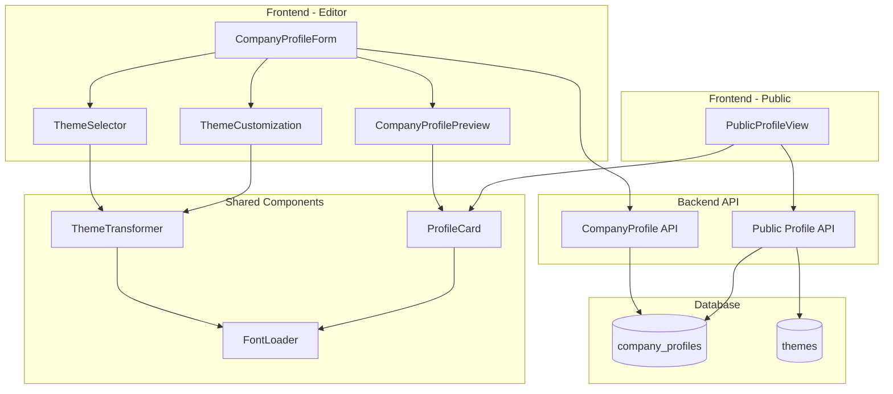
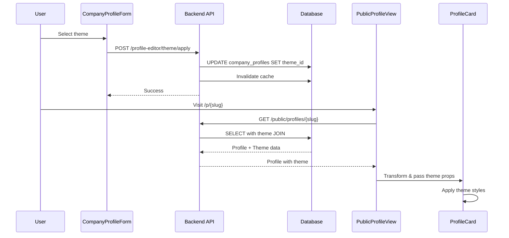

# Design Document: Public Profile Sync & Themes Enhancement

## Overview

This design addresses critical synchronization issues between the Company Profile editor preview and the live public profile, fixes theme persistence and application, expands the theme library to 20+ modern themes with gradients, and adds GPS coordinates for precise location mapping.

The design focuses on:
- Ensuring visual parity between preview and live public profile
- Proper theme persistence and retrieval from database
- Expanded theme library with modern gradient designs
- GPS coordinate support for accurate location mapping
- UI consistency improvements for action buttons
- Font loading optimization

## Architecture

### System Architecture



### Data Flow for Theme Application



## Components and Interfaces

### 1. Theme Transformer Utility

A shared utility that transforms theme data into ProfileCard-compatible props:

```typescript
// frontend/src/utils/themeTransformer.ts

interface ThemeTransformInput {
  theme?: {
    theme_id: string;
    name?: string;
    base_colors?: {
      primary: string;
      secondary: string;
      accent: string;
      gradients?: GradientConfig[];
    };
    typography?: {
      headingFont?: string;
      bodyFont?: string;
    };
    layout?: {
      spacing?: 'compact' | 'normal' | 'spacious';
      heroStyle?: 'card' | 'full-bleed';
      sectionLayout?: 'single-column' | 'two-column';
    };
  };
  customization?: Partial<ThemeCustomization>;
}

interface ThemeTransformOutput {
  themeColors?: ThemeColors;
  themeTypography?: ThemeTypography;
  themeLayout?: ThemeLayout;
  backgroundGradient?: string;
}

function transformThemeForProfileCard(input: ThemeTransformInput): ThemeTransformOutput;
```

### 2. Enhanced ProfileCard Props

```typescript
interface ProfileCardProps {
  profile: Partial<CompanyProfile>;
  visibility?: Partial<CompanyVisibilityConfig>;
  showActions?: boolean;
  slug?: string;
  compact?: boolean;
  
  // Theme props (unified structure)
  themeColors?: {
    primary: string;
    secondary: string;
    accent: string;
  };
  themeTypography?: {
    headingFont?: string;
    bodyFont?: string;
  };
  themeLayout?: {
    spacing?: 'compact' | 'normal' | 'spacious';
    heroStyle?: 'card' | 'full-bleed';
    sectionLayout?: 'single-column' | 'two-column';
  };
  backgroundGradient?: string;
  
  // Action callbacks
  onDownloadVCard?: () => void;
  onDownloadQr?: () => void;
  onShare?: () => void;
}
```

### 3. Enhanced Address Structure with Coordinates

```typescript
interface AddressStructured {
  line1?: string;
  line2?: string;
  city?: string;
  state?: string;
  postal_code?: string;
  country?: string;
  // NEW: GPS coordinates
  latitude?: number;
  longitude?: number;
}
```

### 4. Map URL Generator

```typescript
// frontend/src/utils/mapUrlGenerator.ts

interface MapUrlOptions {
  address?: AddressStructured;
  preferCoordinates?: boolean;
}

function generateMapUrl(options: MapUrlOptions): string {
  const { address, preferCoordinates = true } = options;
  
  if (preferCoordinates && address?.latitude && address?.longitude) {
    return `https://www.google.com/maps?q=${address.latitude},${address.longitude}`;
  }
  
  // Fallback to address
  const addressParts = [
    address?.line1,
    address?.line2,
    address?.city,
    address?.state,
    address?.postal_code,
    address?.country,
  ].filter(Boolean);
  
  return `https://www.google.com/maps/search/?api=1&query=${encodeURIComponent(addressParts.join(', '))}`;
}
```

## Data Models

### Enhanced Theme Schema (20+ Themes)

```typescript
// frontend/src/constants/themes.ts

const PREBUILT_THEMES: Theme[] = [
  // MINIMAL CATEGORY (4 themes)
  { theme_id: 'theme-clean-slate', name: 'Clean Slate', category: 'minimal', ... },
  { theme_id: 'theme-monochrome', name: 'Monochrome', category: 'minimal', ... },
  { theme_id: 'theme-paper-white', name: 'Paper White', category: 'minimal', ... },
  { theme_id: 'theme-soft-gray', name: 'Soft Gray', category: 'minimal', ... },
  
  // BOLD CATEGORY (3 themes)
  { theme_id: 'theme-vivid-impact', name: 'Vivid Impact', category: 'bold', ... },
  { theme_id: 'theme-electric-pop', name: 'Electric Pop', category: 'bold', ... },
  { theme_id: 'theme-neon-nights', name: 'Neon Nights', category: 'bold', ... },
  
  // ELEGANT CATEGORY (3 themes)
  { theme_id: 'theme-golden-hour', name: 'Golden Hour', category: 'elegant', ... },
  { theme_id: 'theme-rose-gold', name: 'Rose Gold', category: 'elegant', ... },
  { theme_id: 'theme-champagne', name: 'Champagne', category: 'elegant', ... },
  
  // MODERN CATEGORY (3 themes)
  { theme_id: 'theme-tech-forward', name: 'Tech Forward', category: 'modern', ... },
  { theme_id: 'theme-midnight-blue', name: 'Midnight Blue', category: 'modern', ... },
  { theme_id: 'theme-slate-pro', name: 'Slate Pro', category: 'modern', ... },
  
  // CREATIVE CATEGORY (3 themes)
  { theme_id: 'theme-aurora-dreams', name: 'Aurora Dreams', category: 'creative', ... },
  { theme_id: 'theme-cosmic-purple', name: 'Cosmic Purple', category: 'creative', ... },
  { theme_id: 'theme-sunset-vibes', name: 'Sunset Vibes', category: 'creative', ... },
  
  // GRADIENT CATEGORY (4 themes) - NEW
  { theme_id: 'theme-ocean-breeze', name: 'Ocean Breeze', category: 'gradient', ... },
  { theme_id: 'theme-forest-mist', name: 'Forest Mist', category: 'gradient', ... },
  { theme_id: 'theme-peach-sunset', name: 'Peach Sunset', category: 'gradient', ... },
  { theme_id: 'theme-lavender-haze', name: 'Lavender Haze', category: 'gradient', ... },
];
```

### Gradient Theme Example

```typescript
{
  theme_id: 'theme-ocean-breeze',
  name: 'Ocean Breeze',
  category: 'gradient',
  description: 'Calming ocean-inspired gradient with teal and blue tones',
  preview_image_url: '/themes/previews/ocean-breeze.webp',
  base_colors: {
    primary: '#0891B2',
    secondary: '#06B6D4',
    accent: '#22D3EE',
    neutral: ['#F0FDFA', '#CCFBF1', '#99F6E4', '#5EEAD4', '#2DD4BF', '#14B8A6', '#0D9488', '#0F766E', '#115E59', '#134E4A'],
    gradients: [
      {
        name: 'Ocean Wave',
        type: 'linear',
        direction: '135deg',
        stops: ['#0891B2', '#06B6D4', '#22D3EE'],
      },
      {
        name: 'Deep Sea',
        type: 'linear',
        direction: '180deg',
        stops: ['#134E4A', '#0F766E', '#0891B2'],
      },
    ],
  },
  default_typography: {
    heading_font: {
      family: 'Outfit',
      source: 'web',
      fallback: ['system-ui', 'sans-serif'],
      weights: [400, 500, 600, 700],
    },
    body_font: {
      family: 'Inter',
      source: 'web',
      fallback: ['system-ui', 'sans-serif'],
      weights: [400, 500],
    },
  },
  layout_config: {
    spacing: 'normal',
    hero_style: 'full-bleed',
    section_layout: 'single-column',
  },
  is_premium: false,
  is_popular: true,
  usage_count: 0,
  supports_dark_mode: true,
  variants: [
    {
      variant_id: 'ocean-breeze-light',
      name: 'Light',
      colors: {
        background: '#F0FDFA',
        surface: '#FFFFFF',
        text_primary: '#134E4A',
        text_secondary: '#0F766E',
      },
    },
    {
      variant_id: 'ocean-breeze-dark',
      name: 'Dark',
      colors: {
        background: '#042F2E',
        surface: '#134E4A',
        text_primary: '#F0FDFA',
        text_secondary: '#5EEAD4',
        glass: 'rgba(8, 145, 178, 0.1)',
        glass_border: 'rgba(34, 211, 238, 0.2)',
      },
    },
  ],
  created_at: '2024-01-01T00:00:00Z',
  updated_at: '2024-01-01T00:00:00Z',
}
```

### Database Schema Updates

```sql
-- Add coordinates to address_structured
-- No schema change needed - JSONB already supports arbitrary fields
-- Just ensure the application handles latitude/longitude in address_structured

-- Example address_structured with coordinates:
-- {
--   "line1": "123 Main St",
--   "city": "Hyderabad",
--   "state": "Telangana",
--   "postal_code": "500001",
--   "country": "India",
--   "latitude": 17.385044,
--   "longitude": 78.486671
-- }
```

## Correctness Properties

*A property is a characteristic or behavior that should hold true across all valid executions of a system-essentially, a formal statement about what the system should do. Properties serve as the bridge between human-readable specifications and machine-verifiable correctness guarantees.*

Based on the prework analysis, here are the consolidated correctness properties:

### Property 1: Preview and Public Profile Visual Parity

*For any* company profile data and theme configuration, the ProfileCard component should render identically when called from CompanyProfilePreview (editor) and PublicProfileView (live page), producing the same CSS variables, font-family values, and visible fields.

**Validates: Requirements 1.1, 1.2, 1.3, 1.4, 1.6**

### Property 2: Theme Data Persistence Round-Trip

*For any* valid theme selection and customization, saving to the database and then retrieving should produce equivalent theme_id, color_palette, typography_config, and layout_preferences values.

**Validates: Requirements 2.1, 2.2, 3.5**

### Property 3: Theme Color CSS Variable Generation

*For any* valid theme base_colors, the system should generate correct CSS variables (--profile-primary, --profile-secondary, --profile-accent) with properly formatted color values.

**Validates: Requirements 2.4, 10.3**

### Property 4: Font Loading and Fallback

*For any* theme typography configuration, the generated font-family CSS should include the specified font family followed by appropriate fallback fonts.

**Validates: Requirements 3.1, 3.2, 3.4**

### Property 5: Action Button Accessibility

*For all* action buttons (Save Contact, QR, Share), each button should have a valid aria-label attribute and title attribute for accessibility.

**Validates: Requirements 4.3, 4.4**

### Property 6: Theme Structure Validation

*For all* themes in the theme library, each theme should have a valid category assignment and include both light and dark variants with required color properties.

**Validates: Requirements 5.4, 5.7**

### Property 7: WCAG Contrast Compliance

*For all* theme color combinations (text on background), the contrast ratio should be at least 4.5:1 for normal text and 3:1 for large text to meet WCAG 2.1 AA requirements.

**Validates: Requirements 5.8**

### Property 8: Gradient CSS Generation

*For any* valid gradient configuration (type, direction, stops), the system should generate valid CSS gradient syntax and reject invalid color values to prevent CSS injection.

**Validates: Requirements 6.1, 6.3, 6.4**

### Property 9: Coordinate Validation

*For any* latitude value, it should be within the range [-90, 90], and for any longitude value, it should be within the range [-180, 180], with precision up to 6 decimal places.

**Validates: Requirements 9.2, 9.12**

### Property 10: Map URL Generation Priority

*For any* address with both coordinates and text address, the generated map URL should use coordinates format (`?q={lat},{lng}`). For addresses without coordinates, the URL should use the text address as query parameter.

**Validates: Requirements 9.5, 9.6, 9.8**

### Property 11: Coordinate Display Privacy

*For any* public profile rendering, raw coordinate values (latitude, longitude) should never appear in the rendered DOM, while the human-readable address text should be displayed.

**Validates: Requirements 9.7, 9.11**

### Property 12: Visibility Filtering Consistency

*For any* visibility configuration, fields marked as hidden (visibility[field] === false) should not appear in the rendered output for both secondary contacts and social media links.

**Validates: Requirements 11.5, 12.4**

### Property 13: Secondary Contact Limits

*For any* profile, the system should accept up to 3 secondary emails and 3 secondary phones, rejecting attempts to add more.

**Validates: Requirements 11.1, 11.2**

### Property 14: Social Platform Brand Colors

*For each* supported social platform, the rendered icon should use the correct platform-specific brand color.

**Validates: Requirements 12.2**

### Property 15: Contact Format Validation

*For any* email input, it should match standard email format. For any phone input, it should accept international phone number formats.

**Validates: Requirements 11.6, 12.5**

## Error Handling

### Error Categories

1. **Theme Loading Errors**
   - Theme not found in database
   - Invalid theme data structure
   - Font loading failures

2. **Coordinate Validation Errors**
   - Out of range latitude/longitude
   - Invalid coordinate format
   - Geolocation permission denied

3. **Data Sync Errors**
   - Cache invalidation failures
   - API timeout during save
   - Concurrent edit conflicts

### Error Handling Strategies

```typescript
// Theme loading with fallback
async function loadThemeWithFallback(themeId: string): Promise<Theme> {
  try {
    const theme = await fetchTheme(themeId);
    return theme;
  } catch (error) {
    console.error('Failed to load theme, using default:', error);
    return getDefaultTheme();
  }
}

// Coordinate validation with user feedback
function validateCoordinates(lat: number, lng: number): ValidationResult {
  const errors: string[] = [];
  
  if (lat < -90 || lat > 90) {
    errors.push('Latitude must be between -90 and 90');
  }
  if (lng < -180 || lng > 180) {
    errors.push('Longitude must be between -180 and 180');
  }
  
  return {
    valid: errors.length === 0,
    errors,
  };
}
```

## Testing Strategy

### Dual Testing Approach

The testing strategy combines unit tests for specific examples and edge cases with property-based tests for universal properties:

**Unit Tests Focus:**
- Specific theme rendering scenarios
- Edge cases (missing theme, invalid colors)
- Error conditions (font load failure, API timeout)
- UI component rendering
- Coordinate input validation

**Property-Based Tests Focus:**
- Visual parity between preview and public profile (Property 1)
- Theme data round-trip persistence (Property 2)
- CSS variable generation (Property 3)
- WCAG contrast compliance (Property 7)
- Coordinate validation (Property 9)
- Map URL generation (Property 10)
- Visibility filtering (Property 12)

### Property-Based Testing Configuration

- **Testing Library**: fast-check (TypeScript)
- **Minimum Iterations**: 100 per property test
- **Test Tags**: Each test references its design document property
- **Tag Format**: `Feature: public-profile-sync-themes, Property {number}: {property_text}`

### Example Property Test

```typescript
import fc from 'fast-check';
import { transformThemeForProfileCard } from '../utils/themeTransformer';

// Feature: public-profile-sync-themes, Property 3: Theme Color CSS Variable Generation
describe('Theme Color CSS Variable Generation', () => {
  it('should generate valid CSS variables for any valid theme colors', () => {
    fc.assert(
      fc.property(
        fc.record({
          primary: fc.hexaString({ minLength: 6, maxLength: 6 }).map(s => `#${s}`),
          secondary: fc.hexaString({ minLength: 6, maxLength: 6 }).map(s => `#${s}`),
          accent: fc.hexaString({ minLength: 6, maxLength: 6 }).map(s => `#${s}`),
        }),
        (colors) => {
          const result = transformThemeForProfileCard({
            theme: { theme_id: 'test', base_colors: colors }
          });
          
          expect(result.themeColors?.primary).toBe(colors.primary);
          expect(result.themeColors?.secondary).toBe(colors.secondary);
          expect(result.themeColors?.accent).toBe(colors.accent);
        }
      ),
      { numRuns: 100 }
    );
  });
});
```

