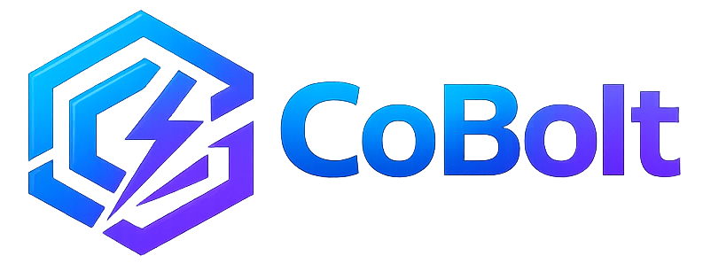

<!-- raw HTML for layout and styling flexibility -->
<p align="center">
  <a href="https://rawdrive.com">
    
  </a>
</p>

<!-- Title & Tagline -->
<h1 align="center" style="font-size: 3.5em; font-weight: 800; color: #0f172a; margin-bottom: 0;">RawDrive</h1>

<h3 align="center" style="color: #475569; font-weight: 500; font-size: 1.5em; margin-top: 10px;">
  The Advanced Operating System for Professional Photography in India 📸
</h3>

<p align="center" style="font-size: 1.1em; color: #64748b;">
  <em>Made in India, Made for India, with ❤️</em>
</p>

<!-- Badges -->
<p align="center">
  <a href="#vision"></a>
  <a href="#tech-stack"></a>
  <a href="#tech-stack"></a>
  <a href="#tech-stack"></a>
  <a href="#tech-stack"></a>
</p>

<p align="center">
  
  
  
  
</p>

---

<!-- Table of Contents using decorative style -->
<details open>
  <summary><b>📖 Table of Contents</b></summary>
  <ul>
    <li><a href="#-the-vision-indias-photography-paradigm-redefined">🚀 The Vision</a></li>
    <li><a href="#-why-rawdrive-stands-apart">💎 Why RawDrive Stands Apart</a></li>
    <li><a href="#-feature-deep-dive">🔥 Feature Deep-Dive</a></li>
    <li><a href="#-the-tech-titan-stack">🛠️ The Tech Titan Stack</a></li>
    <li><a href="#-project-architecture">📁 Project Architecture</a></li>
    <li><a href="#-roadmap-to-10-victory">🗺️ Roadmap</a></li>
    <li><a href="#-getting-started">🚀 Getting Started</a></li>
    <li><a href="#-the-authors">🤝 Authors & Acknowledgements</a></li>
  </ul>
</details>

---

## 🚀 The Vision: India's Photography Paradigm, Redefined.

Professional photography in India is a uniquely complex ecosystem involving massive million-dollar weddings, strong regional dealer networks, and diverse cultural nuances across 28 states. 

**RawDrive** is not just a photo gallery; it is a unified business engine. We are replacing the chaos of 10+ disjointed tools (spreadsheets, chat apps, generic drives, messy billing systems) with a single, stunning, **AI-powered platform**.

> *"We didn't just build a folder. We built a command center for the Indian artist. Where creation meets monetization seamlessly."*

---

## 💎 Why RawDrive Stands Apart

We compared the typical workflows against the **RawDrive Solution** to demonstrate overwhelming superiority:

| The Old Way 📉 | The RawDrive Way 📈 |
| :--- | :--- |
| **Scattered Tools** | **One Unified Vault:** Galleries, CRM, Invoicing, and Marketing in one tab. |
| **English-Only Portals** | **Indic-Native:** Full support for Hindi, Telugu, Tamil, & 10+ Indian languages. |
| **Manual Culling** | **AI Smart Cull:** Gemini-powered aesthetic scoring, closed-eye, and blur detection. |
| **Payment Friction** | **Integrated UPI:** One-click PhonePe, Google Pay, & GST-aware precise billing. |
| **Generic UX** | **Premium Galleries:** PWA-enabled, stunning client experiences that close more deals. |

---

## 🔥 Feature Deep-Dive

<div align="center">
  
</div>

### 🎨 1. Stunning Gallery & Client Delivery
*   **Liquid Glass Design:** Premium, high-performance, meticulously designed galleries that dazzle clients at first sight.
*   **Interactive Proofing:** Seamless selection workflows, accelerating delivery turnaround times by 70%.
*   **Cover Design Studio:** 25+ professional layouts available for eye-catching album previews.
*   **PWA Mobility:** Client galleries seamlessly install as branded Apps right on their mobile home screens with zero App Store friction.
*   **"View as Client":** Instant contextual previews to ensure absolute perfection before sharing the link.

### 🧠 2. AI-Native Intelligence (Powered by Gemini Cloud)
*   **Face Recognition:** Sub-second guest filtering via selfies (`face-api.js`) — completely ending the pain of searching through tens of thousands of event photos.
*   **Smart Culling:** Powerful, automated detection of motion blur, closed eyes, and redundant duplicates.
*   **Aesthetic Scoring:** Allow the AI to identify and elevate your "Hero Shots" automatically.
*   **Scene Auto-Tagging:** Effortless categorization (e.g., Wedding, Portrait, Check-in, Rituals, Haldi).

### 💼 3. Business & Operations Suite
*   **GST-Aware Invoicing:** Architected to be 100% compliant with the Indian tax code for clean billing.
*   **CRM 2.0:** Deeply integrated client profiles, lucrative deal tracking, and holistic wedding-season calendars.
*   **Payment Hub:** Native UPI deep-link integration for faster settlements with automated payment tracking.
*   **Digital Business Cards:** Personalized sleek `/u/{slug}` cards tailored for modern photographic networking.

### 🌐 4. Connectivity & Ecosystem
*   **WhatsApp Sync:** Drive real-time client notifications, event invites, and direct gallery delivery via WhatsApp.
*   **Live Stream:** Silky-smooth, low-latency event broadcasting powered by Cloudflare Stream.
*   **Network Marketplaces:** Connect intelligently with regional freelancers, rentals, and gear resellers.
*   **State-First Tenancy:** Built-in sophisticated dealer portal with rich revenue-sharing dashboards.

<div align="center">
  
</div>

---

## 🛠️ The Tech Titan Stack

We maintain a **"Zero-Compromise"** systemic architecture designed with performance at its core, enabling sub-200ms interface interactivity.

| Component Area | Innovative Technologies Deployed |
| :--- | :--- |
| **Frontend UI** | `React 19`, `TypeScript 5`, `Vite 6`, `Framer Motion`, `Tailwind CSS v4` |
| **Backend API** | `Go (Golang)` + `Chi Router` for extreme concurrency |
| **Intelligence** | Google `Gemini AI` + `PGvector` (Vector Embeddings) |
| **Edge Storage** | `Cloudflare R2 Edge` + Highly Distributed Global CDN |
| **Database Ops** | robust `PostgreSQL` + lightning-fast `Valkey` (Memory Cache) |
| **Identity & ML** | browser-first `face-api.js` ML Models |
| **Experience** | `i18next` catering to 10+ Indic Languages |

---

## 📁 Project Architecture

A clean, monorepo-like logical separation ensuring high code quality and zero circular dependencies.

```text
RawDrive/
  ├── frontend/                  ✨ React SPA Application (Next-gen PWA)
  │   ├── src/
  │   │   ├── components/        🎨 Domain Specfic UI Modules (Gallery, AI, Admin)
  │   │   ├── contexts/          🔄 Contextual State (Auth, Lightbox, Workspace)
  │   │   ├── hooks/             🪝 Logic Operations (Uploads, Network Queries)
  │   │   └── data/              📜 Hardcoded Policies, Configurations & Legal
  │   └── public/                🖼️ Static Assets, AI Models, Core Locales
  ├── shared/                    🏗️ Cross-Boundary Workspace Packages
  │   └── constants, types, utils, validation logic
  └── backend/                   ⚡ Highly Scalable Go API Backbone
```

---

## 🗺️ Roadmap to 1.0 Victory

- [x] **M1: The Core Foundation** — Comprehensive Design System & Base UI framework mapped.
- [x] **M2: Indic-Native i18n** — Unlocking 10+ Languages combined with elegant Regional Webfonts.
- [x] **M3: PWA & Mobile UX** — Instantly Installable Client Galleries bridging web & native.
- [ ] **M4: The Gemini Brain** — Heavy-duty AI Culling & Auto-Curation integration.
- [ ] **M5: Invoicing & GST** — Unlocking the full Financial Engine & PhonePe gateways.
- [ ] **M6: Live & Dealers** — Cloudflare Stream integration & forming the massive Partner Network.

---

## 🚀 Getting Started

Launch the RawDrive ecosystem on your local machine globally.

**System Prerequisites:** 
- `Node.js 20+`
- `pnpm 9+`
- `Go 1.22+` (for backend)

```bash
# 1. Clone the master repository
git clone git@github.com:merupuai/RawDrive.git
cd RawDrive

# 2. Install frontend ecosystem dependencies
npm i -g pnpm
pnpm install

# 3. Launch Development Server
cd frontend
pnpm dev
```
> Navigate to `http://localhost:3000` to experience the Next.js app.

---

## 🚢 Shipping & CI/CD

RawDrive uses a clean, automated GitHub flow. You only need two commands:

```bash
# Land any change on GitHub — branches, tests in Docker, commits, opens a PR,
# and auto-merges (squash + branch delete) once CI gates pass.
npm run ship -- "fix(galleries): correct thumbnail order"

# Release GitHub main to production (guarded rolling deploy, Node .42 → .44).
npm run deploy:prod
```

Git hooks, CI gates, branch cleanup, and merge policy keep the repo tidy
automatically. Full flow, one-time setup, and rollback: **[`docs/runbooks/cicd.md`](docs/runbooks/cicd.md)**.

---

## 🤝 The Authors

At RawDrive, we believe stunning software requires world-class vision and immense dedication. 

| Role | Profile | Name | Contact |
| :--- | :---: | :--- | :--- |
| **Visionary & Lead Developer** | 🇮🇳 | **Manyam Prasad** | [manyamprasad@gmail.com](mailto:manyamprasad@gmail.com) |
| **AI-Native Orchestrator** | ⚡ | **CoBolt** | *Enterprise-Grade Delivery Platform* |

<br />

<p align="center">
  
</p>

<p align="center">
  <strong>RawDrive</strong> — Beautifully conceptualized and coded in India, scaled for the global creative.
  <br />
  <sub>Designed purely for Indian workflows • Masterfully built on Indian infrastructure • Accurately priced for Indian businesses</sub>
  <br /><br />
  
</p>

<p align="center">
  <sub>Powered and Delivered By</sub>
  <br /><br />
  
</p>
