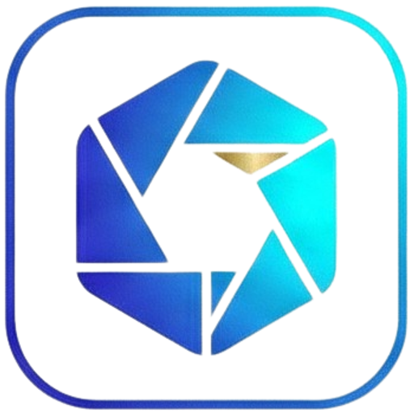

<p align="center">
  
</p>

<h1 align="center">RawDrive</h1>

<p align="center">
  <strong>The Operating System for Professional Photography in India</strong>
  <br />
  <sub>Made in India, Made for India, with Love</sub>
</p>

<p align="center">
  <a href="#features"></a>
  <a href="#tech-stack"></a>
  <a href="#tech-stack"></a>
  <a href="#tech-stack"></a>
  <a href="#tech-stack"></a>
</p>

<p align="center">
  
  
  
  
</p>

<p align="center">
  <a href="#vision">Vision</a> • 
  <a href="#features">Features</a> • 
  <a href="#tech-stack">Tech Stack</a> • 
  <a href="#roadmap">Roadmap</a> • 
  <a href="#getting-started">Getting Started</a>
</p>

---

## 🚀 The Vision: India's Photography Paradigm, Redefined.

Professional photography in India is a unique ecosystem—massive weddings, regional dealer networks, and diverse cultural nuances across 28 states. **RawDrive** isn't just a gallery; it's a unified business engine. It replaces the chaos of 10+ disjointed tools with a single, stunning, AI-powered platform.

> *"We didn't just build a folder. We built a command center for the Indian artist."*

---

## 💎 Why RawDrive Beats Everything Else

| Problem | RawDrive Solution |
| :--- | :--- |
| **Scattered Tools** | **One Unified Vault:** Galleries, CRM, Invoicing, and Marketing in one tab. |
| **English-Only Portals** | **Indic-Native:** Full support for Hindi, Telugu, Tamil, & 10+ Indian languages. |
| **Manual Culling** | **AI Smart Cull:** Gemini-powered aesthetic scoring & blur detection. |
| **Payment Friction** | **Integrated UPI:** One-click PhonePe, Google Pay, & GST-aware billing. |
| **Generic UX** | **Premium Galleries:** PWA-enabled, stunning client experiences that close deals. |

---

## 🔥 Feature Deep-Dive

### 🎨 Stunning Gallery & Client Delivery
*   **Liquid Glass Design:** Premium, high-performance galleries that wow clients at first sight.
*   **Interactive Proofing:** Seamless selection workflows that cut delivery time by 70%.
*   **Cover Design Studio:** 25+ professional layouts for stunning album previews.
*   **PWA Mobility:** Client galleries install as branded Apps on their mobile screens.
*   **"View as Client":** Instant previews to ensure perfection before the link goes out.

### 🧠 AI-Native Intelligence (Gemini Cloud)
*   **Face Recognition:** Instant guest filtering via selfies—no more searching through thousands of photos.
*   **Smart Culling:** Automated detection of blur, closed eyes, and duplicates.
*   **Aesthetic Scoring:** Let the AI identify and highlight your "Hero Shots" instantly.
*   **Scene Auto-Tagging:** Automated categorization (Wedding, Portrait, Landscape, Rituals).

### 💼 Business & Operations Suite
*   **GST-Aware Invoicing:** Compliant contracts and bills designed for the Indian tax code.
*   **CRM 2.0:** Integrated client profiles, deal tracking, and wedding-season calendars.
*   **Payment Hub:** Native UPI integration for faster settlements and payment tracking.
*   **Digital Business Cards:** Personalized `/u/{slug}` cards for modern networking.

### 🌐 Connectivity & Ecosystem
*   **WhatsApp Sync:** Real-time client notifications and delivery links via WhatsApp.
*   **Live Stream:** High-quality, low-latency event streaming via Cloudflare Stream.
*   **Network Marketplaces:** Connect with freelancers, rentals, and gear resellers.
*   **State-First Tenancy:** Built-in regional dealer portal with revenue-sharing dashboards.

---

## 🛠️ The Tech Titan Stack

We use a "Zero-Compromise" architecture to ensure sub-200ms interactivity:

| Layer | Technologies |
| :--- | :--- |
| **Frontend** | React 19, TypeScript 5, Vite 6, Framer Motion |
| **Backend** | Go (Golang) + Chi Router (Planned) |
| **Intelligence** | Google Gemini AI + PGvector Embeddings |
| **Storage** | Cloudflare R2 Edge + Global CDN |
| **Database** | PostgreSQL + Valkey (Memory Cache) |
| **Identity** | face-api.js ML Models |
| **Experience** | i18next (10+ Indic Languages), Tailwind CSS v4 |

---

## 📁 Project Architecture

```
RawDriveDetails/
  ├── frontend/                  ✨ React SPA Product
  │   ├── src/
  │   │   ├── components/        🎨 Domain UI (Gallery, AI, Admin)
  │   │   ├── contexts/          🔄 State (Auth, Lightbox, PWA)
  │   │   ├── hooks/             🪝 Logic (Uploads, Queries)
  │   │   └── data/              📜 Policies & Legal
  │   └── public/                🖼️ Assets, Models, Locales
  ├── shared/                    🏗️ Workspace Packages
  │   └── constants, types, utils, validation
  └── backend/                   ⚡ Go API (In Development)
```

---

## 🗺️ Roadmap to 1.0 Victory

- [x] **M1: The Core Foundation** — Design System & Base UI
- [x] **M2: Indic-Native i18n** — 10+ Languages & Regional Webfonts
- [x] **M3: PWA & Mobile UX** — Installable Client Galleries
- [ ] **M4: The Gemini Brain** — AI Culling & Auto-Curation
- [ ] **M5: Invoicing & GST** — Financial Engine & PhonePe
- [ ] **M6: Live & Dealers** — Cloudflare Stream & Partner Network

---

## 🚀 Getting Started

**Prerequisites:** Node.js 20+, pnpm 9+

```bash
# Clone the repository
git clone https://github.com/veerababumanyam/RD.git
cd RawDriveDetails

# Install the ecosystem
pnpm install

# Launch Development
cd frontend
pnpm dev
```

---

## 🤝 The Authors

| Profile | Name | Role | Contact |
| :--- | :---: | :--- | :--- |
| 🇮🇳 | **Manyam Prasad** | Visionary & Lead Developer | [manyamprasad@gmail.com](mailto:manyamprasad@gmail.com) |
| ⚡ | **CoBolt** | AI-Native Orchestrator | *Enterprise-Grade Delivery* |

---

<p align="center">
  <strong>RawDrive</strong> — Made with ❤️ in India, for the World.
  <br />
  <sub>Designed for Indian workflows • Built on Indian infrastructure • Priced for Indian businesses</sub>
  <br /><br />
  
</p>


