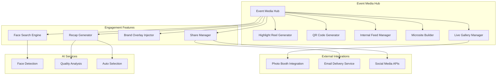

# Design Document: Corporate Event Media

## Overview

The Corporate Event Media system provides specialized tools for corporate event photography including highlight reels, QR code sharing, internal media feeds, event microsites, and attendee engagement features. This positions RawDrive as a Corporate Event Media Platform focused on the unique needs of corporate event photography and internal communications.

## Architecture



## Components and Interfaces

### 1. Highlight Reel Generator

Creates video compilations from event photos.

```typescript
interface HighlightReelGenerator {
  generateReel(config: ReelConfig): Promise<ReelJob>;
  getJobStatus(jobId: string): Promise<ReelJobStatus>;
  editReel(reelId: string, edits: ReelEdits): Promise<Reel>;
  exportReel(reelId: string, format: ExportFormat): Promise<ExportResult>;
}

interface ReelConfig {
  eventId: string;
  photoIds: string[];
  transitionType: 'fade' | 'slide' | 'zoom' | 'dissolve';
  transitionDuration: number; // milliseconds
  photoDuration: number; // milliseconds per photo
  musicTrackId?: string;
  brandOverlay: BrandOverlayConfig;
}

interface BrandOverlayConfig {
  logoUrl?: string;
  eventName: string;
  position: 'top-left' | 'top-right' | 'bottom-left' | 'bottom-right';
  opacity: number; // 0-1
  introSlide?: boolean;
  outroSlide?: boolean;
}

type ExportFormat = {
  aspectRatio: '16:9' | '9:16' | '1:1' | '4:5';
  resolution: '720p' | '1080p' | '4k';
  codec: 'h264' | 'h265';
};
```

### 2. QR Code Generator

Creates scannable QR codes for event galleries.

```typescript
interface QRCodeGenerator {
  generateQR(config: QRConfig): Promise<QRCode>;
  customizeQR(qrId: string, style: QRStyle): Promise<QRCode>;
  generateSignage(qrId: string, template: SignageTemplate): Promise<SignageResult>;
  trackScan(qrId: string, scanData: ScanData): Promise<void>;
  getAnalytics(qrId: string): Promise<QRAnalytics>;
}

interface QRConfig {
  targetUrl: string;
  eventId: string;
  expiresAt?: Date;
  passwordProtected: boolean;
}

interface QRStyle {
  foregroundColor: string;
  backgroundColor: string;
  logoUrl?: string;
  logoSize: number; // percentage of QR size
  cornerRadius: number;
  errorCorrection: 'L' | 'M' | 'Q' | 'H';
}

interface SignageTemplate {
  size: 'A4' | 'A3' | 'banner';
  orientation: 'portrait' | 'landscape';
  callToAction: string;
  eventBranding: boolean;
  instructions: string;
}

interface QRAnalytics {
  totalScans: number;
  uniqueScans: number;
  scansByDate: Record<string, number>;
  scansByLocation: Record<string, number>;
  deviceBreakdown: Record<string, number>;
}
```

### 3. Internal Feed Manager

Manages social-media-style internal content feed.

```typescript
interface InternalFeedManager {
  getFeed(userId: string, options: FeedOptions): Promise<PaginatedFeed>;
  approveContent(contentId: string, approverId: string): Promise<void>;
  addReaction(contentId: string, userId: string, reaction: ReactionType): Promise<void>;
  addComment(contentId: string, userId: string, comment: string): Promise<Comment>;
  shareInternally(contentId: string, userId: string, recipients: string[]): Promise<void>;
  getEngagementMetrics(contentId: string): Promise<EngagementMetrics>;
}

interface FeedOptions {
  eventIds?: string[];
  contentTypes?: ('photo' | 'video' | 'highlight_reel')[];
  sortBy: 'recent' | 'trending' | 'engagement';
  limit: number;
  cursor?: string;
}

interface FeedItem {
  id: string;
  type: 'photo' | 'video' | 'highlight_reel';
  eventId: string;
  eventName: string;
  caption?: string;
  thumbnailUrl: string;
  contentUrl: string;
  createdAt: Date;
  approvedAt?: Date;
  engagement: EngagementMetrics;
}

interface EngagementMetrics {
  views: number;
  likes: number;
  comments: number;
  shares: number;
}

type ReactionType = 'like' | 'love' | 'celebrate' | 'insightful';
```

### 4. Event Microsite Builder

Creates branded landing pages for event media.

```typescript
interface MicrositeBuilder {
  createMicrosite(config: MicrositeConfig): Promise<Microsite>;
  updateMicrosite(micrositeId: string, updates: Partial<MicrositeConfig>): Promise<Microsite>;
  publishMicrosite(micrositeId: string): Promise<PublishResult>;
  getMicrositeAnalytics(micrositeId: string): Promise<MicrositeAnalytics>;
}

interface MicrositeConfig {
  eventId: string;
  template: 'minimal' | 'gallery' | 'timeline' | 'magazine';
  branding: {
    logoUrl: string;
    primaryColor: string;
    secondaryColor: string;
    bannerImageUrl?: string;
  };
  sections: MicrositeSection[];
  accessControl: {
    public: boolean;
    requireRegistration: boolean;
    password?: string;
  };
  customDomain?: string;
}

interface MicrositeSection {
  type: 'gallery' | 'highlight_reel' | 'downloads' | 'registration' | 'text';
  title: string;
  content: Record<string, any>;
  order: number;
}
```

### 5. Face Search Engine

Enables attendees to find photos of themselves.

```typescript
interface FaceSearchEngine {
  searchByFace(selfieImage: Buffer, eventId: string): Promise<FaceSearchResult>;
  indexEventPhotos(eventId: string): Promise<IndexingJob>;
  getIndexingStatus(eventId: string): Promise<IndexingStatus>;
}

interface FaceSearchResult {
  matches: FaceMatch[];
  searchId: string;
  processingTimeMs: number;
}

interface FaceMatch {
  photoId: string;
  thumbnailUrl: string;
  confidence: number; // 0-1
  faceLocation: BoundingBox;
}

interface BoundingBox {
  x: number;
  y: number;
  width: number;
  height: number;
}
```

### 6. Live Gallery Manager

Manages real-time updating galleries during events.

```typescript
interface LiveGalleryManager {
  enableLiveMode(galleryId: string): Promise<void>;
  disableLiveMode(galleryId: string): Promise<void>;
  getLiveStatus(galleryId: string): Promise<LiveStatus>;
  subscribeToUpdates(galleryId: string, callback: (photo: Photo) => void): Unsubscribe;
}

interface LiveStatus {
  isLive: boolean;
  startedAt?: Date;
  photoCount: number;
  lastUploadAt?: Date;
  viewerCount: number;
}
```

## Data Models

### Event Media Schema

```sql
-- Highlight Reels
CREATE TABLE highlight_reels (
  id UUID PRIMARY KEY DEFAULT gen_random_uuid(),
  event_id UUID NOT NULL REFERENCES events(id),
  name VARCHAR(255) NOT NULL,
  status VARCHAR(20) DEFAULT 'draft',
  config JSONB NOT NULL,
  video_url VARCHAR(500),
  thumbnail_url VARCHAR(500),
  duration_seconds INTEGER,
  created_by UUID REFERENCES users(id),
  created_at TIMESTAMP DEFAULT NOW(),
  updated_at TIMESTAMP DEFAULT NOW()
);

CREATE TABLE highlight_reel_photos (
  reel_id UUID REFERENCES highlight_reels(id) ON DELETE CASCADE,
  photo_id UUID REFERENCES photos(id),
  position INTEGER NOT NULL,
  duration_ms INTEGER,
  PRIMARY KEY (reel_id, photo_id)
);

-- QR Codes
CREATE TABLE qr_codes (
  id UUID PRIMARY KEY DEFAULT gen_random_uuid(),
  event_id UUID NOT NULL REFERENCES events(id),
  gallery_id UUID REFERENCES galleries(id),
  target_url VARCHAR(500) NOT NULL,
  style JSONB DEFAULT '{}',
  expires_at TIMESTAMP,
  password_hash VARCHAR(255),
  created_at TIMESTAMP DEFAULT NOW()
);

CREATE TABLE qr_scans (
  id UUID PRIMARY KEY DEFAULT gen_random_uuid(),
  qr_id UUID NOT NULL REFERENCES qr_codes(id),
  scanned_at TIMESTAMP DEFAULT NOW(),
  ip_address INET,
  user_agent TEXT,
  location_country VARCHAR(2),
  location_city VARCHAR(100)
);

-- Internal Feed
CREATE TABLE feed_items (
  id UUID PRIMARY KEY DEFAULT gen_random_uuid(),
  organization_id UUID NOT NULL REFERENCES organizations(id),
  event_id UUID NOT NULL REFERENCES events(id),
  content_type VARCHAR(20) NOT NULL,
  content_id UUID NOT NULL,
  caption TEXT,
  approved_at TIMESTAMP,
  approved_by UUID REFERENCES users(id),
  created_at TIMESTAMP DEFAULT NOW()
);

CREATE TABLE feed_reactions (
  feed_item_id UUID REFERENCES feed_items(id) ON DELETE CASCADE,
  user_id UUID REFERENCES users(id),
  reaction_type VARCHAR(20) NOT NULL,
  created_at TIMESTAMP DEFAULT NOW(),
  PRIMARY KEY (feed_item_id, user_id)
);

CREATE TABLE feed_comments (
  id UUID PRIMARY KEY DEFAULT gen_random_uuid(),
  feed_item_id UUID NOT NULL REFERENCES feed_items(id) ON DELETE CASCADE,
  user_id UUID NOT NULL REFERENCES users(id),
  content TEXT NOT NULL,
  created_at TIMESTAMP DEFAULT NOW()
);

-- Event Microsites
CREATE TABLE microsites (
  id UUID PRIMARY KEY DEFAULT gen_random_uuid(),
  event_id UUID NOT NULL REFERENCES events(id),
  slug VARCHAR(100) UNIQUE NOT NULL,
  custom_domain VARCHAR(255),
  template VARCHAR(50) NOT NULL,
  config JSONB NOT NULL,
  is_published BOOLEAN DEFAULT false,
  published_at TIMESTAMP,
  created_at TIMESTAMP DEFAULT NOW(),
  updated_at TIMESTAMP DEFAULT NOW()
);

CREATE TABLE microsite_visits (
  id UUID PRIMARY KEY DEFAULT gen_random_uuid(),
  microsite_id UUID NOT NULL REFERENCES microsites(id),
  visited_at TIMESTAMP DEFAULT NOW(),
  ip_address INET,
  user_agent TEXT,
  referrer VARCHAR(500)
);

-- Scheduled Releases
CREATE TABLE scheduled_releases (
  id UUID PRIMARY KEY DEFAULT gen_random_uuid(),
  content_type VARCHAR(20) NOT NULL,
  content_id UUID NOT NULL,
  release_at TIMESTAMP NOT NULL,
  released BOOLEAN DEFAULT false,
  notify_subscribers BOOLEAN DEFAULT true,
  created_at TIMESTAMP DEFAULT NOW()
);

-- Attendee Registrations
CREATE TABLE event_registrations (
  id UUID PRIMARY KEY DEFAULT gen_random_uuid(),
  event_id UUID NOT NULL REFERENCES events(id),
  email VARCHAR(255) NOT NULL,
  name VARCHAR(255),
  registered_at TIMESTAMP DEFAULT NOW(),
  access_granted BOOLEAN DEFAULT true,
  
  UNIQUE (event_id, email)
);
```

## Correctness Properties

*A property is a characteristic or behavior that should hold true across all valid executions of a system-essentially, a formal statement about what the system should do. Properties serve as the bridge between human-readable specifications and machine-verifiable correctness guarantees.*

### Property 1: Highlight reel transition count
*For any* highlight reel with N photos, the generated video SHALL contain exactly N-1 transitions.
**Validates: Requirements 1.2**

### Property 2: Export aspect ratio correctness
*For any* highlight reel export with specified aspect ratio, the output video dimensions SHALL match the requested ratio.
**Validates: Requirements 1.5**

### Property 3: QR code URL encoding
*For any* QR code generated for a gallery, decoding the QR SHALL produce the correct gallery URL.
**Validates: Requirements 2.1, 2.3**

### Property 4: QR expiration enforcement
*For any* QR code with an expiration date, accessing the QR after expiration SHALL return an access denied response.
**Validates: Requirements 2.4**

### Property 5: QR scan counter increment
*For any* QR code scan, the total scan count SHALL increment by exactly 1.
**Validates: Requirements 2.6**

### Property 6: Feed approval visibility
*For any* content item, it SHALL appear in the internal feed only after approval.
**Validates: Requirements 4.2**

### Property 7: Face search matching
*For any* face search with a valid selfie, returned matches SHALL contain photos where the same face is detected with confidence above threshold.
**Validates: Requirements 8.2**

### Property 8: Scheduled release visibility
*For any* content with a scheduled release time, the content SHALL NOT be visible before the release time.
**Validates: Requirements 12.1, 12.2**

### Property 9: Brand overlay presence
*For any* downloaded photo with watermark policy enabled, the output image SHALL contain the configured brand overlay.
**Validates: Requirements 10.1, 10.3**

### Property 10: Registration access control
*For any* gallery requiring registration, unregistered users SHALL NOT be able to view content.
**Validates: Requirements 13.1, 13.4**

## Error Handling

### Video Generation Errors
- **Insufficient Photos**: Require minimum 3 photos for highlight reel
- **Invalid Photo Format**: Skip unsupported formats, log warning
- **Processing Timeout**: Queue for retry, notify user of delay
- **Storage Full**: Alert admin, pause generation

### QR Code Errors
- **Invalid URL**: Validate URL format before generation
- **Logo Too Large**: Resize logo to fit within QR bounds
- **Expired Access**: Display friendly expiration message

### Face Search Errors
- **No Face Detected**: Prompt user to upload clearer selfie
- **Multiple Faces**: Ask user to crop to single face
- **No Matches Found**: Suggest browsing by time/location
- **Index Not Ready**: Show progress, allow retry

### Live Gallery Errors
- **Upload Failure**: Retry with exponential backoff
- **Connection Lost**: Reconnect automatically, show status
- **Rate Limit**: Queue uploads, process in order

## Testing Strategy

### Property-Based Testing
- Use `fast-check` library for property-based tests
- Minimum 100 iterations per property test
- Test format: `**Feature: corporate-event-media, Property {number}: {property_text}**`

### Unit Tests
- Test QR code generation and decoding
- Test highlight reel configuration validation
- Test feed item approval workflow
- Test scheduled release timing logic

### Integration Tests
- Test video generation pipeline end-to-end
- Test face search with sample images
- Test microsite publishing workflow
- Test live gallery real-time updates

### Test Fixtures
- Sample event photos (various sizes, formats)
- Sample face images for search testing
- Brand assets (logos, colors)
- QR code test cases

