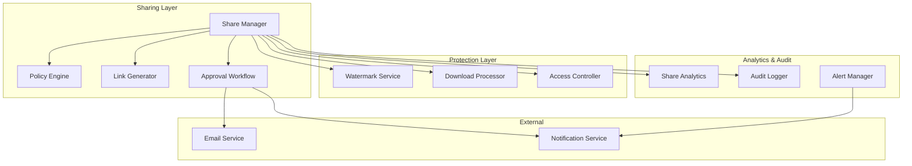

# Design Document: Corporate Sharing and Audit

## Overview

The Corporate Sharing and Audit system provides internal/external sharing controls, download policies with watermarking, content approval workflows, and comprehensive audit trails. This enables organizations to maintain governance over event media distribution while enabling appropriate sharing for corporate communications.

## Architecture



## Components and Interfaces

### 1. Share Manager

Central component for managing all sharing operations.

```typescript
interface ShareManager {
  // Share creation
  createInternalShare(config: InternalShareConfig): Promise<Share>;
  createExternalShare(config: ExternalShareConfig): Promise<Share>;
  
  // Share management
  getShare(shareId: string): Promise<Share>;
  updateShare(shareId: string, updates: ShareUpdates): Promise<Share>;
  revokeShare(shareId: string, reason?: string): Promise<void>;
  extendShare(shareId: string, newExpiration: Date): Promise<Share>;
  
  // Bulk operations
  listShares(filters: ShareFilters): Promise<PaginatedShares>;
  bulkRevoke(shareIds: string[], reason: string): Promise<BulkResult>;
}

interface InternalShareConfig {
  contentIds: string[];
  recipientUserIds: string[];
  permissions: SharePermissions;
  message?: string;
  notifyRecipients: boolean;
}

interface ExternalShareConfig {
  contentIds: string[];
  recipientEmails: string[];
  permissions: SharePermissions;
  expiresAt: Date;
  password?: string;
  maxViews?: number;
  maxDownloads?: number;
  requireRegistration: boolean;
  message?: string;
}

interface SharePermissions {
  canView: boolean;
  canDownload: boolean;
  canShare: boolean;
  downloadResolution?: 'original' | 'high' | 'medium' | 'low';
  applyWatermark: boolean;
}

interface Share {
  id: string;
  type: 'internal' | 'external';
  contentIds: string[];
  createdBy: string;
  createdAt: Date;
  expiresAt?: Date;
  status: 'active' | 'expired' | 'revoked';
  accessUrl: string;
  permissions: SharePermissions;
  analytics: ShareAnalytics;
}
```

### 2. Policy Engine

Evaluates sharing policies and enforces restrictions.

```typescript
interface PolicyEngine {
  // Policy evaluation
  evaluateShare(request: ShareRequest): Promise<PolicyResult>;
  getApplicablePolicies(contentIds: string[], shareType: string): Promise<Policy[]>;
  
  // Policy management
  createPolicy(policy: PolicyConfig): Promise<Policy>;
  updatePolicy(policyId: string, updates: Partial<PolicyConfig>): Promise<Policy>;
  deletePolicy(policyId: string): Promise<void>;
  listPolicies(organizationId: string): Promise<Policy[]>;
}

interface PolicyConfig {
  name: string;
  description: string;
  type: 'internal' | 'external' | 'download';
  conditions: PolicyCondition[];
  actions: PolicyAction[];
  priority: number;
  isEnabled: boolean;
}

interface PolicyCondition {
  field: 'content_classification' | 'user_role' | 'recipient_domain' | 'content_type';
  operator: 'equals' | 'not_equals' | 'in' | 'not_in' | 'matches';
  value: string | string[];
}

interface PolicyAction {
  type: 'allow' | 'deny' | 'require_approval' | 'apply_watermark' | 'limit_resolution';
  config?: Record<string, any>;
}

interface PolicyResult {
  allowed: boolean;
  requiresApproval: boolean;
  appliedPolicies: string[];
  restrictions: PolicyRestriction[];
  denialReason?: string;
}

interface PolicyRestriction {
  type: string;
  config: Record<string, any>;
}
```

### 3. Approval Workflow

Manages approval requests for restricted sharing.

```typescript
interface ApprovalWorkflow {
  // Request management
  createRequest(request: ApprovalRequest): Promise<ApprovalTicket>;
  getRequest(ticketId: string): Promise<ApprovalTicket>;
  listPendingRequests(approverId: string): Promise<ApprovalTicket[]>;
  
  // Approval actions
  approve(ticketId: string, approverId: string, comment?: string): Promise<void>;
  deny(ticketId: string, approverId: string, reason: string): Promise<void>;
  escalate(ticketId: string): Promise<void>;
  
  // Configuration
  getApprovers(organizationId: string): Promise<Approver[]>;
  setApprovers(organizationId: string, approvers: Approver[]): Promise<void>;
}

interface ApprovalRequest {
  requesterId: string;
  shareConfig: ExternalShareConfig;
  justification: string;
  urgency: 'normal' | 'high';
}

interface ApprovalTicket {
  id: string;
  request: ApprovalRequest;
  status: 'pending' | 'approved' | 'denied' | 'escalated' | 'expired';
  assignedTo: string[];
  createdAt: Date;
  decidedAt?: Date;
  decidedBy?: string;
  decision?: 'approved' | 'denied';
  decisionComment?: string;
}

interface Approver {
  userId: string;
  role: 'primary' | 'backup';
  notificationPreferences: {
    email: boolean;
    inApp: boolean;
  };
}
```

### 4. Watermark Service

Applies visible and forensic watermarks to downloads.

```typescript
interface WatermarkService {
  applyWatermark(image: Buffer, config: WatermarkConfig): Promise<Buffer>;
  applyForensicWatermark(image: Buffer, metadata: ForensicMetadata): Promise<Buffer>;
  extractForensicWatermark(image: Buffer): Promise<ForensicMetadata | null>;
}

interface WatermarkConfig {
  type: 'visible' | 'forensic' | 'both';
  visible?: {
    text?: string;
    logoUrl?: string;
    position: 'top-left' | 'top-right' | 'bottom-left' | 'bottom-right' | 'center' | 'tiled';
    opacity: number;
    fontSize?: number;
    color?: string;
  };
  forensic?: ForensicMetadata;
}

interface ForensicMetadata {
  userId: string;
  userEmail: string;
  downloadedAt: Date;
  shareId: string;
  organizationId: string;
}
```

### 5. Share Analytics

Tracks and reports on share usage.

```typescript
interface ShareAnalytics {
  // Tracking
  trackAccess(shareId: string, accessData: AccessData): Promise<void>;
  trackDownload(shareId: string, downloadData: DownloadData): Promise<void>;
  
  // Reporting
  getShareAnalytics(shareId: string): Promise<ShareStats>;
  getOrganizationAnalytics(orgId: string, dateRange: DateRange): Promise<OrgShareStats>;
  exportAnalytics(filters: AnalyticsFilters): Promise<ExportResult>;
  
  // Anomaly detection
  detectAnomalies(shareId: string): Promise<Anomaly[]>;
}

interface AccessData {
  timestamp: Date;
  ipAddress: string;
  userAgent: string;
  geoLocation?: GeoLocation;
  userId?: string;
}

interface ShareStats {
  totalViews: number;
  uniqueViewers: number;
  totalDownloads: number;
  viewsByDate: Record<string, number>;
  viewsByLocation: Record<string, number>;
  topContent: ContentStats[];
  anomalies: Anomaly[];
}

interface Anomaly {
  type: 'unusual_access_pattern' | 'geographic_anomaly' | 'bulk_download' | 'link_sharing';
  severity: 'low' | 'medium' | 'high';
  description: string;
  detectedAt: Date;
  metadata: Record<string, any>;
}
```

### 6. Audit Logger

Comprehensive logging for compliance.

```typescript
interface SharingAuditLogger {
  logShareCreated(share: Share, creator: string): Promise<void>;
  logShareAccessed(shareId: string, accessor: AccessData): Promise<void>;
  logShareDownload(shareId: string, downloader: string, files: string[]): Promise<void>;
  logShareRevoked(shareId: string, revoker: string, reason: string): Promise<void>;
  logPolicyEvaluation(request: ShareRequest, result: PolicyResult): Promise<void>;
  logApprovalDecision(ticket: ApprovalTicket): Promise<void>;
  
  queryLogs(filters: AuditFilters): Promise<PaginatedAuditLogs>;
  exportLogs(filters: AuditFilters, format: 'json' | 'csv'): Promise<ExportResult>;
}
```

## Data Models

### Sharing Schema

```sql
-- Shares
CREATE TABLE shares (
  id UUID PRIMARY KEY DEFAULT gen_random_uuid(),
  organization_id UUID NOT NULL REFERENCES organizations(id),
  type VARCHAR(20) NOT NULL, -- 'internal', 'external'
  created_by UUID NOT NULL REFERENCES users(id),
  created_at TIMESTAMP DEFAULT NOW(),
  expires_at TIMESTAMP,
  status VARCHAR(20) DEFAULT 'active',
  revoked_at TIMESTAMP,
  revoked_by UUID REFERENCES users(id),
  revoke_reason TEXT,
  
  -- Access control
  access_token_hash VARCHAR(64) UNIQUE,
  password_hash VARCHAR(255),
  max_views INTEGER,
  max_downloads INTEGER,
  require_registration BOOLEAN DEFAULT false,
  
  -- Permissions
  can_view BOOLEAN DEFAULT true,
  can_download BOOLEAN DEFAULT false,
  can_share BOOLEAN DEFAULT false,
  download_resolution VARCHAR(20),
  apply_watermark BOOLEAN DEFAULT false,
  
  -- Metadata
  message TEXT,
  
  INDEX idx_shares_org (organization_id),
  INDEX idx_shares_creator (created_by),
  INDEX idx_shares_status (status)
);

-- Share Content
CREATE TABLE share_content (
  share_id UUID REFERENCES shares(id) ON DELETE CASCADE,
  content_type VARCHAR(20) NOT NULL, -- 'photo', 'gallery', 'event'
  content_id UUID NOT NULL,
  PRIMARY KEY (share_id, content_type, content_id)
);

-- Share Recipients
CREATE TABLE share_recipients (
  id UUID PRIMARY KEY DEFAULT gen_random_uuid(),
  share_id UUID NOT NULL REFERENCES shares(id) ON DELETE CASCADE,
  recipient_type VARCHAR(20) NOT NULL, -- 'user', 'email'
  recipient_id UUID, -- for internal users
  recipient_email VARCHAR(255), -- for external
  notified_at TIMESTAMP,
  
  INDEX idx_recipients_share (share_id)
);

-- Share Access Logs
CREATE TABLE share_access_logs (
  id UUID PRIMARY KEY DEFAULT gen_random_uuid(),
  share_id UUID NOT NULL REFERENCES shares(id),
  accessed_at TIMESTAMP DEFAULT NOW(),
  ip_address INET,
  user_agent TEXT,
  geo_country VARCHAR(2),
  geo_city VARCHAR(100),
  user_id UUID REFERENCES users(id),
  access_type VARCHAR(20) NOT NULL, -- 'view', 'download'
  content_id UUID,
  
  INDEX idx_access_share (share_id, accessed_at DESC),
  INDEX idx_access_time (accessed_at DESC)
);

-- Sharing Policies
CREATE TABLE sharing_policies (
  id UUID PRIMARY KEY DEFAULT gen_random_uuid(),
  organization_id UUID NOT NULL REFERENCES organizations(id),
  name VARCHAR(255) NOT NULL,
  description TEXT,
  type VARCHAR(20) NOT NULL, -- 'internal', 'external', 'download'
  conditions JSONB NOT NULL DEFAULT '[]',
  actions JSONB NOT NULL DEFAULT '[]',
  priority INTEGER DEFAULT 0,
  is_enabled BOOLEAN DEFAULT true,
  created_at TIMESTAMP DEFAULT NOW(),
  updated_at TIMESTAMP DEFAULT NOW()
);

-- Domain Restrictions
CREATE TABLE domain_restrictions (
  id UUID PRIMARY KEY DEFAULT gen_random_uuid(),
  organization_id UUID NOT NULL REFERENCES organizations(id),
  domain VARCHAR(255) NOT NULL,
  restriction_type VARCHAR(20) NOT NULL, -- 'allow', 'block'
  created_at TIMESTAMP DEFAULT NOW(),
  
  UNIQUE (organization_id, domain)
);

-- Approval Tickets
CREATE TABLE approval_tickets (
  id UUID PRIMARY KEY DEFAULT gen_random_uuid(),
  organization_id UUID NOT NULL REFERENCES organizations(id),
  requester_id UUID NOT NULL REFERENCES users(id),
  share_config JSONB NOT NULL,
  justification TEXT NOT NULL,
  urgency VARCHAR(20) DEFAULT 'normal',
  status VARCHAR(20) DEFAULT 'pending',
  assigned_to UUID[] NOT NULL,
  created_at TIMESTAMP DEFAULT NOW(),
  decided_at TIMESTAMP,
  decided_by UUID REFERENCES users(id),
  decision VARCHAR(20),
  decision_comment TEXT,
  
  INDEX idx_tickets_org (organization_id),
  INDEX idx_tickets_status (status),
  INDEX idx_tickets_assignee (assigned_to)
);

-- Content Classification
CREATE TABLE content_classifications (
  content_type VARCHAR(20) NOT NULL,
  content_id UUID NOT NULL,
  classification VARCHAR(20) NOT NULL, -- 'public', 'internal', 'restricted'
  classified_by UUID REFERENCES users(id),
  classified_at TIMESTAMP DEFAULT NOW(),
  
  PRIMARY KEY (content_type, content_id)
);

-- Watermark Logs
CREATE TABLE watermark_logs (
  id UUID PRIMARY KEY DEFAULT gen_random_uuid(),
  share_id UUID NOT NULL REFERENCES shares(id),
  content_id UUID NOT NULL,
  user_id UUID NOT NULL REFERENCES users(id),
  watermark_type VARCHAR(20) NOT NULL, -- 'visible', 'forensic', 'both'
  watermark_data JSONB NOT NULL,
  applied_at TIMESTAMP DEFAULT NOW(),
  
  INDEX idx_watermark_share (share_id),
  INDEX idx_watermark_user (user_id)
);
```

## Correctness Properties

*A property is a characteristic or behavior that should hold true across all valid executions of a system-essentially, a formal statement about what the system should do. Properties serve as the bridge between human-readable specifications and machine-verifiable correctness guarantees.*

### Property 1: Expiration enforcement
*For any* share with an expiration date, accessing the share after expiration SHALL return an access denied response.
**Validates: Requirements 3.4, 3.5**

### Property 2: View limit enforcement
*For any* share with a maximum view limit, the (N+1)th access attempt SHALL be denied after N views.
**Validates: Requirements 3.2**

### Property 3: Download limit enforcement
*For any* share with a maximum download limit, the (N+1)th download attempt SHALL be denied after N downloads.
**Validates: Requirements 3.2**

### Property 4: Policy evaluation order
*For any* share request, policies SHALL be evaluated in priority order, and the first matching deny policy SHALL block the share.
**Validates: Requirements 2.4**

### Property 5: Classification-based sharing restriction
*For any* content classified as Internal, external sharing SHALL require approval workflow.
**Validates: Requirements 7.2**

### Property 6: Watermark application
*For any* download with watermark policy enabled, the downloaded file SHALL contain the configured watermark.
**Validates: Requirements 5.4**

### Property 7: Forensic watermark traceability
*For any* forensic watermark applied, extracting the watermark SHALL return the original user identity and timestamp.
**Validates: Requirements 5.5**

### Property 8: Audit log completeness
*For any* share creation, access, download, or revocation, an audit log entry SHALL be created.
**Validates: Requirements 8.1, 8.2, 8.3, 8.4**

### Property 9: Domain restriction enforcement
*For any* share to a blocked domain, the share creation SHALL be denied.
**Validates: Requirements 12.3**

### Property 10: Approval workflow timeout
*For any* approval request without response within 48 hours, the request SHALL be escalated to backup approvers.
**Validates: Requirements 6.6**

### Property 11: Share revocation immediacy
*For any* revoked share, subsequent access attempts SHALL be denied immediately.
**Validates: Requirements 1.6, 10.4**

### Property 12: Analytics counter accuracy
*For any* share access, the view counter SHALL increment by exactly 1.
**Validates: Requirements 9.1**

## Error Handling

### Policy Errors
- **Policy Conflict**: Apply most restrictive policy, log conflict
- **Missing Policy**: Use organization defaults
- **Invalid Condition**: Skip condition, log warning

### Share Errors
- **Expired Share**: Return friendly expiration message
- **Limit Exceeded**: Return limit exceeded message with upgrade option
- **Invalid Password**: Return generic "access denied" (no password hint)
- **Revoked Share**: Return "share no longer available"

### Watermark Errors
- **Processing Failure**: Retry, fall back to visible-only watermark
- **Extraction Failure**: Log error, return null (don't block)

### Approval Errors
- **No Approvers Available**: Auto-escalate to admin
- **Timeout**: Escalate, notify requester of delay

## Testing Strategy

### Property-Based Testing
- Use `fast-check` library for property-based tests
- Minimum 100 iterations per property test
- Test format: `**Feature: corporate-sharing-audit, Property {number}: {property_text}**`

### Unit Tests
- Test policy evaluation logic
- Test watermark application and extraction
- Test share limit enforcement
- Test expiration checking

### Integration Tests
- Test full share creation and access flow
- Test approval workflow end-to-end
- Test analytics tracking accuracy
- Test audit log completeness

### Security Tests
- Test password brute force protection
- Test share token security
- Test domain restriction bypass attempts
- Test watermark tampering detection

