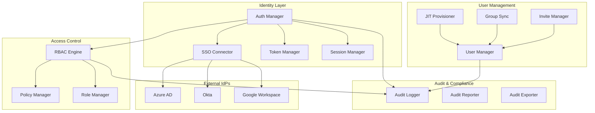

# Design Document: Enterprise Identity Management

## Overview

The Enterprise Identity Management system provides SSO integration with Azure AD and Okta, role-based access control, internal/external user management, and comprehensive audit logging. This enables seamless integration with existing enterprise identity infrastructure while maintaining appropriate access controls for corporate event media.

## Architecture



## Components and Interfaces

### 1. SSO Connector

Handles SAML 2.0 and OIDC authentication flows.

```typescript
interface SSOConnector {
  // Configuration
  configureSAML(config: SAMLConfig): Promise<SAMLMetadata>;
  configureOIDC(config: OIDCConfig): Promise<OIDCMetadata>;
  testConnection(providerId: string): Promise<TestResult>;
  
  // Authentication
  initiateLogin(providerId: string, returnUrl: string): string;
  handleSAMLResponse(samlResponse: string): Promise<AuthResult>;
  handleOIDCCallback(code: string, state: string): Promise<AuthResult>;
  
  // Token management
  validateToken(token: string): Promise<TokenValidation>;
  refreshToken(refreshToken: string): Promise<TokenPair>;
}

interface SAMLConfig {
  entityId: string;
  ssoUrl: string;
  sloUrl?: string;
  certificate: string;
  signatureAlgorithm: 'RSA-SHA256' | 'RSA-SHA512';
  nameIdFormat: 'email' | 'persistent' | 'transient';
  attributeMapping: Record<string, string>;
}

interface OIDCConfig {
  issuer: string;
  clientId: string;
  clientSecret: string;
  discoveryUrl?: string;
  scopes: string[];
  responseType: 'code' | 'id_token';
  claimMapping: Record<string, string>;
}

interface AuthResult {
  success: boolean;
  user?: {
    externalId: string;
    email: string;
    name: string;
    attributes: Record<string, any>;
  };
  error?: {
    code: string;
    message: string;
    details?: any;
  };
  sessionToken?: string;
}
```

### 2. RBAC Engine

Evaluates permissions based on roles and policies.

```typescript
interface RBACEngine {
  // Permission checking
  checkPermission(userId: string, resource: string, action: string): Promise<PermissionResult>;
  getEffectivePermissions(userId: string, scope?: string): Promise<Permission[]>;
  
  // Role management
  assignRole(userId: string, roleId: string, scope?: string): Promise<void>;
  revokeRole(userId: string, roleId: string, scope?: string): Promise<void>;
  getUserRoles(userId: string): Promise<RoleAssignment[]>;
  
  // Cache management
  invalidateUserCache(userId: string): Promise<void>;
}

interface PermissionResult {
  allowed: boolean;
  reason: string;
  matchedRole?: string;
  matchedPolicy?: string;
}

interface Role {
  id: string;
  name: string;
  description: string;
  permissions: Permission[];
  isBuiltIn: boolean;
}

interface Permission {
  resource: string;
  actions: string[];
  conditions?: PermissionCondition[];
}

interface RoleAssignment {
  roleId: string;
  roleName: string;
  scope: 'global' | 'event' | 'gallery';
  scopeId?: string;
  assignedAt: Date;
  assignedBy: string;
}

// Built-in roles
const BUILT_IN_ROLES = {
  VIEWER: {
    permissions: ['view:gallery', 'view:photo', 'download:photo']
  },
  CONTRIBUTOR: {
    permissions: ['view:*', 'upload:photo', 'edit:own']
  },
  EVENT_MANAGER: {
    permissions: ['view:*', 'upload:*', 'edit:*', 'share:*', 'manage:event']
  },
  ADMINISTRATOR: {
    permissions: ['*']
  }
};
```

### 3. Session Manager

Manages user sessions with security controls.

```typescript
interface SessionManager {
  createSession(userId: string, metadata: SessionMetadata): Promise<Session>;
  validateSession(sessionId: string): Promise<SessionValidation>;
  terminateSession(sessionId: string): Promise<void>;
  terminateAllUserSessions(userId: string): Promise<number>;
  getActiveSessions(userId: string): Promise<Session[]>;
  
  // Security
  bindSessionToContext(sessionId: string, context: SessionContext): Promise<void>;
  detectAnomalousAccess(sessionId: string, context: SessionContext): Promise<AnomalyResult>;
}

interface Session {
  id: string;
  userId: string;
  createdAt: Date;
  expiresAt: Date;
  lastActivityAt: Date;
  ipAddress: string;
  userAgent: string;
  deviceFingerprint?: string;
}

interface SessionContext {
  ipAddress: string;
  userAgent: string;
  geoLocation?: {
    country: string;
    city: string;
  };
}

interface SessionConfig {
  maxDuration: number; // seconds
  idleTimeout: number; // seconds
  maxConcurrentSessions: number;
  bindToIp: boolean;
  requireMfaForNewDevice: boolean;
}
```

### 4. Audit Logger

Comprehensive logging for compliance.

```typescript
interface AuditLogger {
  log(event: AuditEvent): Promise<void>;
  query(filters: AuditFilters): Promise<PaginatedAuditLogs>;
  export(filters: AuditFilters, format: ExportFormat): Promise<ExportResult>;
  getRetentionPolicy(): RetentionPolicy;
}

interface AuditEvent {
  correlationId: string;
  timestamp: Date;
  eventType: AuditEventType;
  userId?: string;
  resourceType: string;
  resourceId: string;
  action: string;
  result: 'success' | 'failure' | 'denied';
  metadata: Record<string, any>;
  ipAddress?: string;
  userAgent?: string;
}

type AuditEventType = 
  | 'authentication'
  | 'authorization'
  | 'data_access'
  | 'data_modification'
  | 'configuration_change'
  | 'share_event'
  | 'download_event';

interface AuditFilters {
  startDate?: Date;
  endDate?: Date;
  userId?: string;
  eventTypes?: AuditEventType[];
  resourceType?: string;
  resourceId?: string;
  result?: string;
  limit?: number;
  cursor?: string;
}

type ExportFormat = 'json' | 'csv' | 'cef'; // CEF = Common Event Format for SIEM
```

### 5. JIT Provisioner

Handles Just-In-Time user provisioning.

```typescript
interface JITProvisioner {
  provisionUser(ssoAttributes: SSOAttributes): Promise<User>;
  updateUserFromSSO(userId: string, ssoAttributes: SSOAttributes): Promise<User>;
  getProvisioningRules(): ProvisioningRule[];
  setProvisioningRules(rules: ProvisioningRule[]): Promise<void>;
}

interface SSOAttributes {
  externalId: string;
  email: string;
  name: string;
  department?: string;
  title?: string;
  manager?: string;
  groups?: string[];
  customAttributes?: Record<string, any>;
}

interface ProvisioningRule {
  id: string;
  name: string;
  condition: {
    attribute: string;
    operator: 'equals' | 'contains' | 'matches';
    value: string;
  };
  actions: {
    assignRole?: string;
    grantEventAccess?: string[];
    setUserType?: 'internal' | 'external';
  };
  priority: number;
}
```

### 6. Group Sync

Synchronizes IdP groups with RawDrive roles.

```typescript
interface GroupSync {
  configureSync(config: GroupSyncConfig): Promise<void>;
  runSync(): Promise<SyncResult>;
  getSyncStatus(): Promise<SyncStatus>;
  getGroupMappings(): Promise<GroupMapping[]>;
}

interface GroupSyncConfig {
  providerId: string;
  syncInterval: number; // minutes
  groupMappings: GroupMapping[];
  removeOrphanedAssignments: boolean;
}

interface GroupMapping {
  externalGroupId: string;
  externalGroupName: string;
  roleId: string;
  scope?: string;
}

interface SyncResult {
  startedAt: Date;
  completedAt: Date;
  usersCreated: number;
  usersUpdated: number;
  usersDisabled: number;
  rolesAssigned: number;
  rolesRevoked: number;
  errors: SyncError[];
}
```

## Data Models

### Identity Schema

```sql
-- SSO Configurations
CREATE TABLE sso_configurations (
  id UUID PRIMARY KEY DEFAULT gen_random_uuid(),
  organization_id UUID NOT NULL REFERENCES organizations(id),
  provider_type VARCHAR(20) NOT NULL, -- 'saml', 'oidc'
  provider_name VARCHAR(50) NOT NULL, -- 'azure_ad', 'okta', 'google'
  config JSONB NOT NULL,
  is_enabled BOOLEAN DEFAULT true,
  created_at TIMESTAMP DEFAULT NOW(),
  updated_at TIMESTAMP DEFAULT NOW(),
  
  UNIQUE (organization_id, provider_name)
);

-- Roles
CREATE TABLE roles (
  id UUID PRIMARY KEY DEFAULT gen_random_uuid(),
  organization_id UUID REFERENCES organizations(id), -- NULL for built-in
  name VARCHAR(100) NOT NULL,
  description TEXT,
  permissions JSONB NOT NULL DEFAULT '[]',
  is_built_in BOOLEAN DEFAULT false,
  created_at TIMESTAMP DEFAULT NOW(),
  updated_at TIMESTAMP DEFAULT NOW()
);

-- Role Assignments
CREATE TABLE role_assignments (
  id UUID PRIMARY KEY DEFAULT gen_random_uuid(),
  user_id UUID NOT NULL REFERENCES users(id),
  role_id UUID NOT NULL REFERENCES roles(id),
  scope_type VARCHAR(20) DEFAULT 'global', -- 'global', 'event', 'gallery'
  scope_id UUID,
  assigned_by UUID REFERENCES users(id),
  assigned_at TIMESTAMP DEFAULT NOW(),
  expires_at TIMESTAMP,
  
  UNIQUE (user_id, role_id, scope_type, scope_id)
);

-- Sessions
CREATE TABLE user_sessions (
  id UUID PRIMARY KEY DEFAULT gen_random_uuid(),
  user_id UUID NOT NULL REFERENCES users(id),
  session_token_hash VARCHAR(64) NOT NULL,
  created_at TIMESTAMP DEFAULT NOW(),
  expires_at TIMESTAMP NOT NULL,
  last_activity_at TIMESTAMP DEFAULT NOW(),
  ip_address INET,
  user_agent TEXT,
  device_fingerprint VARCHAR(64),
  is_active BOOLEAN DEFAULT true,
  
  INDEX idx_sessions_user (user_id),
  INDEX idx_sessions_token (session_token_hash)
);

-- External User Invitations
CREATE TABLE user_invitations (
  id UUID PRIMARY KEY DEFAULT gen_random_uuid(),
  organization_id UUID NOT NULL REFERENCES organizations(id),
  email VARCHAR(255) NOT NULL,
  invited_by UUID NOT NULL REFERENCES users(id),
  role_id UUID NOT NULL REFERENCES roles(id),
  scope_type VARCHAR(20),
  scope_id UUID,
  token_hash VARCHAR(64) NOT NULL,
  expires_at TIMESTAMP NOT NULL,
  accepted_at TIMESTAMP,
  created_at TIMESTAMP DEFAULT NOW()
);

-- Audit Logs
CREATE TABLE audit_logs (
  id UUID PRIMARY KEY DEFAULT gen_random_uuid(),
  correlation_id UUID NOT NULL,
  organization_id UUID REFERENCES organizations(id),
  timestamp TIMESTAMP DEFAULT NOW(),
  event_type VARCHAR(50) NOT NULL,
  user_id UUID,
  resource_type VARCHAR(50),
  resource_id UUID,
  action VARCHAR(50) NOT NULL,
  result VARCHAR(20) NOT NULL,
  metadata JSONB DEFAULT '{}',
  ip_address INET,
  user_agent TEXT,
  
  INDEX idx_audit_org_time (organization_id, timestamp DESC),
  INDEX idx_audit_user (user_id, timestamp DESC),
  INDEX idx_audit_resource (resource_type, resource_id, timestamp DESC)
) PARTITION BY RANGE (timestamp);

-- Create monthly partitions
CREATE TABLE audit_logs_2025_01 PARTITION OF audit_logs
  FOR VALUES FROM ('2025-01-01') TO ('2025-02-01');

-- Group Sync State
CREATE TABLE group_sync_state (
  organization_id UUID PRIMARY KEY REFERENCES organizations(id),
  last_sync_at TIMESTAMP,
  last_sync_result JSONB,
  next_sync_at TIMESTAMP,
  is_syncing BOOLEAN DEFAULT false
);
```

## Correctness Properties

*A property is a characteristic or behavior that should hold true across all valid executions of a system-essentially, a formal statement about what the system should do. Properties serve as the bridge between human-readable specifications and machine-verifiable correctness guarantees.*

### Property 1: SAML signature validation
*For any* SAML assertion with an invalid signature, the SSO connector SHALL reject the authentication attempt.
**Validates: Requirements 15.1, 15.2**

### Property 2: SAML timestamp validation
*For any* SAML assertion with NotBefore in the future or NotOnOrAfter in the past, the SSO connector SHALL reject the authentication.
**Validates: Requirements 15.3**

### Property 3: OIDC issuer validation
*For any* ID token, the issuer claim SHALL match the configured issuer URL.
**Validates: Requirements 16.1**

### Property 4: OIDC signature validation
*For any* ID token, the signature SHALL be validated against the JWKS endpoint keys.
**Validates: Requirements 16.2**

### Property 5: Permission union for multiple roles
*For any* user with multiple roles, the effective permissions SHALL be the union of all role permissions.
**Validates: Requirements 17.2**

### Property 6: Scoped permission enforcement
*For any* role scoped to a specific event, permissions SHALL only apply to that event's resources.
**Validates: Requirements 17.3**

### Property 7: Permission cache invalidation
*For any* role assignment change, the user's permission cache SHALL be invalidated immediately.
**Validates: Requirements 17.5**

### Property 8: Audit log completeness
*For any* authentication, authorization, or data access event, an audit log entry SHALL be created with correlation ID.
**Validates: Requirements 18.1, 18.2, 18.3**

### Property 9: Audit log immutability
*For any* audit log entry, modification or deletion SHALL be prevented.
**Validates: Requirements 18.5**

### Property 10: Session token security
*For any* session token, it SHALL be generated using cryptographically secure random generation with minimum 256 bits of entropy.
**Validates: Requirements 20.2**

### Property 11: Concurrent session limit
*For any* user exceeding the maximum concurrent session limit, the oldest session SHALL be terminated.
**Validates: Requirements 20.4**

### Property 12: JIT attribute mapping
*For any* JIT-provisioned user, all configured SSO attributes SHALL be mapped to the user profile.
**Validates: Requirements 3.2**

## Error Handling

### SSO Errors
- **Invalid Signature**: Reject authentication, log security event
- **Expired Assertion**: Reject with clear error, suggest retry
- **Missing Required Claims**: Reject, log missing claims
- **IdP Unavailable**: Show friendly error, suggest retry later

### RBAC Errors
- **Permission Denied**: Return 403 with required permission
- **Role Not Found**: Return 404, log error
- **Invalid Scope**: Return 400 with valid scope options

### Session Errors
- **Session Expired**: Redirect to login with return URL
- **Session Hijack Detected**: Terminate session, alert user
- **Concurrent Limit Exceeded**: Terminate oldest, notify user

### Audit Errors
- **Write Failure**: Queue for retry, alert if persistent
- **Export Timeout**: Chunk export, provide progress

## Testing Strategy

### Property-Based Testing
- Use `fast-check` library for property-based tests
- Minimum 100 iterations per property test
- Test format: `**Feature: enterprise-identity-management, Property {number}: {property_text}**`

### Unit Tests
- Test SAML assertion parsing and validation
- Test OIDC token validation
- Test permission evaluation logic
- Test session lifecycle management

### Integration Tests
- Test full SSO flow with mock IdP
- Test group sync with mock directory
- Test audit log export formats
- Test session binding and anomaly detection

### Security Tests
- Test SAML replay attack prevention
- Test token tampering detection
- Test session fixation prevention
- Test brute force protection

