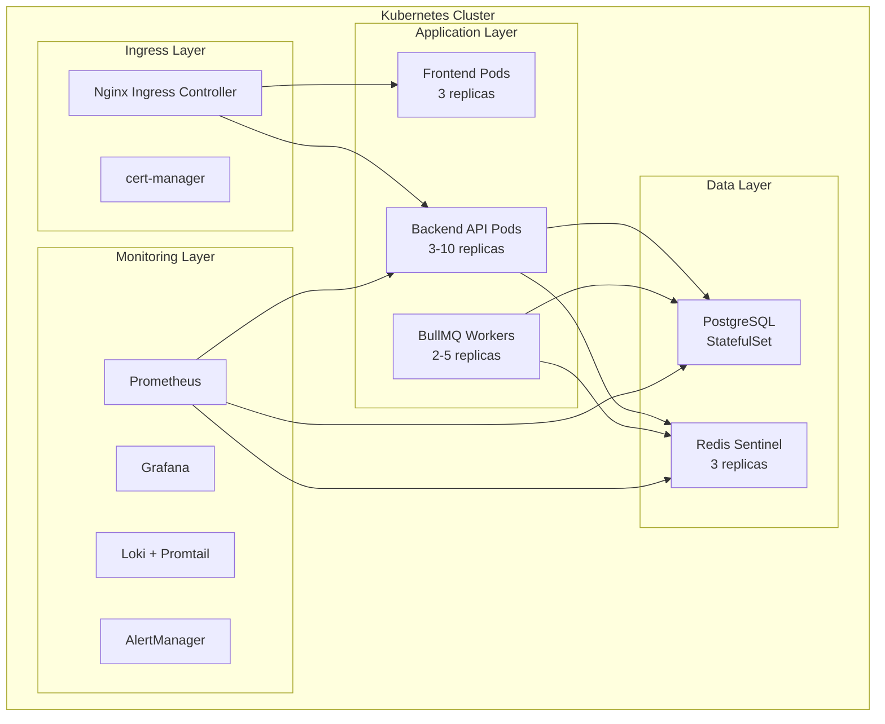
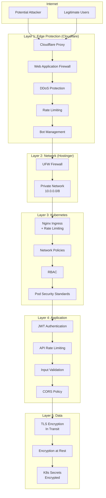

# Design Document: Kubernetes HA Deployment on Hostinger KVM

## Overview

This document provides a comprehensive architecture design for deploying RawDrive on self-managed Kubernetes clusters using Hostinger KVM4 servers. The design supports scaling from 10 initial users to 100,000 users within one year while maintaining high availability and cost efficiency.

## Architecture

### High-Level Architecture Diagram

```mermaid
graph TB
    subgraph "Internet"
        Users[Users/Clients]
        CDN[Cloudflare CDN]
    end

    subgraph "Hostinger KVM Cluster"
        subgraph "Control Plane (3 nodes)"
            CP1[Control Plane 1<br/>KVM4: 4vCPU, 8GB]
            CP2[Control Plane 2<br/>KVM4: 4vCPU, 8GB]
            CP3[Control Plane 3<br/>KVM4: 4vCPU, 8GB]
            HAProxy[HAProxy/kube-vip<br/>Virtual IP]
        end

        subgraph "Worker Nodes (2-25 nodes)"
            W1[Worker 1<br/>KVM4: 4vCPU, 8GB]
            W2[Worker 2<br/>KVM4: 4vCPU, 8GB]
            WN[Worker N...]
        end

        subgraph "Storage Layer"
            Longhorn[Longhorn<br/>Distributed Storage]
            LocalNVMe[Local NVMe<br/>200GB per node]
        end
    end

    subgraph "External Services"
        R2[Cloudflare R2<br/>Object Storage]
        AI[AI Inference Service (self-hosted OSS models)]
        Stripe[Stripe Payments]
    end

    Users --> CDN
    CDN --> HAProxy
    HAProxy --> CP1 & CP2 & CP3
    CP1 & CP2 & CP3 --> W1 & W2 & WN
    W1 & W2 & WN --> Longhorn
    Longhorn --> LocalNVMe
    W1 & W2 & WN --> R2
    W1 & W2 & WN --> AI
    W1 & W2 & WN --> Stripe
```

### Kubernetes Cluster Architecture



## Components and Interfaces

### 1. Control Plane Components

| Component | Purpose | Configuration |
|-----------|---------|---------------|
| kube-apiserver | API endpoint for cluster | 3 replicas, load balanced |
| etcd | Cluster state storage | Stacked topology, 3 nodes |
| kube-scheduler | Pod scheduling | Active-passive HA |
| kube-controller-manager | Controller loops | Active-passive HA |
| HAProxy/kube-vip | API load balancing | Virtual IP failover |

### 2. Worker Node Components

| Component | Purpose | Resource Allocation |
|-----------|---------|---------------------|
| kubelet | Node agent | System reserved |
| kube-proxy | Network proxy | iptables/IPVS mode |
| containerd | Container runtime | Default configuration |
| Calico | CNI networking | 128Mi memory limit |

### 3. Application Components

| Service | Replicas | CPU Request | Memory Request | Storage |
|---------|----------|-------------|----------------|---------|
| Backend API | 3-10 | 500m | 512Mi | - |
| Frontend (Nginx) | 3 | 100m | 128Mi | - |
| BullMQ Workers | 2-5 | 250m | 256Mi | - |
| PostgreSQL | 1 (primary) | 1000m | 2Gi | 50Gi PVC |
| Redis Sentinel | 3 | 250m | 512Mi | 10Gi PVC |

### 4. Infrastructure Components

| Component | Purpose | Deployment |
|-----------|---------|------------|
| Nginx Ingress | Traffic routing | DaemonSet on workers |
| cert-manager | TLS certificates | Deployment (3 replicas) |
| Longhorn | Distributed storage | DaemonSet on workers |
| MetalLB | Load balancer | DaemonSet (if needed) |

## Data Models

### Server Sizing Model

```typescript
interface KVM4Server {
  vCPU: 4;
  ramGB: 8;
  storageGB: 200;  // NVMe SSD
  bandwidthTB: 8;
  monthlyPriceUSD: 15.99;  // Hostinger KVM4 pricing
}

interface ClusterSizing {
  phase: 'initial' | 'growth' | 'scale' | 'enterprise';
  userCount: number;
  controlPlaneNodes: number;
  workerNodes: number;
  totalServers: number;
  estimatedMonthlyCost: number;
}
```

### Scaling Phases

| Phase | Users | Total KVM8 Servers | Est. Monthly Cost |
|-------|-------|-------------------|-------------------|
| Initial | 10-100 | 5 | ~$150 |
| Growth | 100-1,000 | 7 | ~$210 |
| Scale | 1,000-10,000 | 11 | ~$330 |
| Enterprise | 10,000-100,000 | 20 | ~$600 |

### Resource Calculation Model

```typescript
interface KVM8Server {
  vCPU: 8;
  ramGB: 16;
  storageGB: 400;  // NVMe SSD
  bandwidthTB: 8;
  monthlyPriceUSD: 30;
}

interface ResourceCalculation {
  // Per user estimates (active concurrent)
  cpuPerUser: 0.01;      // 10 millicores per concurrent user
  memoryPerUser: 20;     // 20MB per concurrent user
  storagePerUser: 100;   // 100MB average photo storage
  
  // Concurrency ratio
  concurrentRatio: 0.05; // 5% of total users concurrent
}

// Example: 10,000 users
// Concurrent: 500 users
// CPU needed: 500 * 0.01 = 5 cores (easily handled by 11 KVM8s)
// Memory needed: 500 * 20MB = 10GB (176GB available)
// Storage: 10,000 * 100MB = 1TB (on Cloudflare R2)
```

### Initial 5-Node Cluster Layout

```
┌─────────────────────────────────────────────────────────────────────────┐
│                        KUBERNETES CLUSTER (5 KVM8)                       │
├─────────────────────────────────────────────────────────────────────────┤
│                                                                          │
│  ┌──────────────┐  ┌──────────────┐  ┌──────────────┐                   │
│  │   NODE 1     │  │   NODE 2     │  │   NODE 3     │                   │
│  │   KVM8       │  │   KVM8       │  │   KVM8       │                   │
│  │ 8vCPU/16GB   │  │ 8vCPU/16GB   │  │ 8vCPU/16GB   │                   │
│  ├──────────────┤  ├──────────────┤  ├──────────────┤                   │
│  │ Control Plane│  │ Control Plane│  │ Control Plane│                   │
│  │ + etcd       │  │ + etcd       │  │ + etcd       │                   │
│  │ + Worker     │  │ + Worker     │  │ + Worker     │                   │
│  ├──────────────┤  ├──────────────┤  ├──────────────┤                   │
│  │ Backend API  │  │ Backend API  │  │ Backend API  │                   │
│  │ Frontend     │  │ Frontend     │  │ Frontend     │                   │
│  │ BullMQ Worker│  │ Prometheus   │  │ Grafana      │                   │
│  │ Ingress      │  │ Ingress      │  │ Ingress      │                   │
│  └──────────────┘  └──────────────┘  └──────────────┘                   │
│                                                                          │
│  ┌──────────────┐  ┌──────────────┐                                     │
│  │   NODE 4     │  │   NODE 5     │                                     │
│  │   KVM8       │  │   KVM8       │                                     │
│  │ 8vCPU/16GB   │  │ 8vCPU/16GB   │                                     │
│  ├──────────────┤  ├──────────────┤                                     │
│  │ Worker (DB)  │  │ Worker (DB)  │                                     │
│  ├──────────────┤  ├──────────────┤                                     │
│  │ PostgreSQL   │  │ PostgreSQL   │                                     │
│  │ (Primary)    │  │ (Replica)    │                                     │
│  │ Redis Master │  │ Redis Replica│                                     │
│  │ Loki         │  │ Backup Jobs  │                                     │
│  └──────────────┘  └──────────────┘                                     │
│                                                                          │
└─────────────────────────────────────────────────────────────────────────┘
```

## Correctness Properties

*A property is a characteristic or behavior that should hold true across all valid executions of a system-essentially, a formal statement about what the system should do. Properties serve as the bridge between human-readable specifications and machine-verifiable correctness guarantees.*

### Property 1: Control Plane Quorum Maintenance
*For any* control plane configuration with N nodes (where N is odd), if fewer than (N/2 + 1) nodes fail simultaneously, the cluster SHALL maintain operational state and accept API requests.
**Validates: Requirements 2.1, 2.2, 2.3**

### Property 2: Pod Distribution Anti-Affinity
*For any* deployment with replicas > 1 and anti-affinity rules configured, no two pods of the same deployment SHALL be scheduled on the same worker node when sufficient nodes are available.
**Validates: Requirements 3.1, 3.6**

### Property 3: Horizontal Pod Autoscaler Response
*For any* HPA-enabled deployment, when average CPU utilization exceeds the target threshold for the stabilization window, the replica count SHALL increase within 30 seconds.
**Validates: Requirements 8.1, 8.2**

### Property 4: Persistent Volume Data Durability
*For any* StatefulSet with PersistentVolumeClaims, if a pod is deleted and rescheduled, the new pod SHALL have access to the same persistent data as the previous pod.
**Validates: Requirements 5.1, 5.3, 5.4**

### Property 5: Ingress TLS Certificate Validity
*For any* Ingress resource with TLS configuration managed by cert-manager, the TLS certificate SHALL be renewed before expiration (at least 30 days prior).
**Validates: Requirements 4.3**

### Property 6: Backup Restoration Integrity
*For any* Velero backup, restoring the backup to a new cluster SHALL result in all backed-up resources being recreated with identical specifications.
**Validates: Requirements 9.1, 9.3**

### Property 7: Network Policy Isolation
*For any* namespace with network policies applied, pods in that namespace SHALL only accept traffic from sources explicitly allowed by the policies.
**Validates: Requirements 7.3**

### Property 8: Rolling Update Zero Downtime
*For any* Deployment update with rolling update strategy, at least minAvailable pods SHALL remain ready throughout the update process.
**Validates: Requirements 10.2**

## Error Handling

### Node Failure Scenarios

| Scenario | Detection | Response | Recovery Time |
|----------|-----------|----------|---------------|
| Worker node failure | kubelet heartbeat timeout (40s) | Pod rescheduling | < 5 minutes |
| Control plane node failure | HAProxy health check | Traffic redirect | < 30 seconds |
| etcd node failure | Raft consensus | Quorum maintained | Immediate |
| Storage node failure | Longhorn replication | Data rebuild | < 30 minutes |

### Application Failure Handling

```yaml
# Liveness and Readiness Probes
livenessProbe:
  httpGet:
    path: /api/health
    port: 3002
  initialDelaySeconds: 30
  periodSeconds: 10
  failureThreshold: 3

readinessProbe:
  httpGet:
    path: /api/health
    port: 3002
  initialDelaySeconds: 5
  periodSeconds: 5
  failureThreshold: 3
```

### Database Failure Handling

- **PostgreSQL**: Automated failover with pg_basebackup for standby
- **Redis**: Sentinel-managed failover with 3-node quorum
- **Backup**: Automated daily backups to Cloudflare R2

## Testing Strategy

### Dual Testing Approach

This design requires both unit testing and property-based testing:

1. **Unit Tests**: Verify specific Kubernetes manifest configurations
2. **Property-Based Tests**: Verify universal properties across all cluster states

### Property-Based Testing Framework

- **Framework**: fast-check (JavaScript/TypeScript)
- **Minimum Iterations**: 100 per property test
- **Test Location**: `/tests/infrastructure/`

### Unit Testing Requirements

| Test Category | Coverage Target | Tools |
|---------------|-----------------|-------|
| Helm chart validation | 100% | helm lint, kubeval |
| Network policy testing | 90% | NetworkPolicy simulator |
| RBAC policy testing | 100% | kubectl auth can-i |
| Backup/restore testing | 100% | Velero CLI |

### Integration Testing

| Test | Frequency | Method |
|------|-----------|--------|
| Cluster health check | Continuous | Prometheus alerts |
| Failover testing | Monthly | Chaos engineering |
| Backup restoration | Quarterly | DR drill |
| Load testing | Before scaling | k6/Locust |

### Property Test Annotations

Each property-based test MUST include:
```typescript
/**
 * **Feature: kubernetes-ha-deployment, Property 1: Control Plane Quorum Maintenance**
 * **Validates: Requirements 2.1, 2.2, 2.3**
 */
```


## Detailed Server Sizing and Cost Analysis

### Hostinger KVM8 Specifications (Selected)

| Specification | Value |
|---------------|-------|
| vCPU | 8 cores |
| RAM | 16 GB |
| Storage | 400 GB NVMe SSD |
| Bandwidth | 8 TB/month |
| Price | ~$30/month |

### Phase 1: Initial Deployment (10-100 Users)

**Total Servers: 5 KVM8 - All-in-One HA Configuration**

| Node | Role | Purpose | Resources |
|------|------|---------|-----------|
| node1 | Control Plane + Worker | API server, etcd, scheduler + workloads | 8 vCPU, 16GB |
| node2 | Control Plane + Worker | API server, etcd, scheduler + workloads | 8 vCPU, 16GB |
| node3 | Control Plane + Worker | API server, etcd, scheduler + workloads | 8 vCPU, 16GB |
| node4 | Worker (Database) | PostgreSQL primary, Redis master | 8 vCPU, 16GB |
| node5 | Worker (Database) | PostgreSQL replica, Redis replica | 8 vCPU, 16GB |

**Resource Allocation per Node:**
- Control Plane overhead: ~3GB RAM, 1 vCPU (on nodes 1-3)
- Available for workloads: ~13GB RAM, 7 vCPU per node
- Total cluster capacity: 80GB RAM, 40 vCPU
- Database nodes: Full 16GB available for PostgreSQL/Redis

**Estimated Monthly Cost: 5 × $30 = ~$150/month**

### Phase 2: Growth (100-1,000 Users)

**Total Servers: 7 KVM8**

| Role | Count | Purpose |
|------|-------|---------|
| Control Plane + Worker | 3 | Unchanged |
| Worker (Database) | 2 | Unchanged |
| Worker (App) | 2 | Additional application capacity |

**Resource Allocation:**
- Total workload capacity: 112GB RAM, 56 vCPU
- Backend replicas: 6-8
- Database: Dedicated nodes with replication

**Estimated Monthly Cost: ~$210/month**

### Phase 3: Scale (1,000-10,000 Users)

**Total Servers: 11 KVM8**

| Role | Count | Purpose |
|------|-------|---------|
| Control Plane + Worker | 3 | Unchanged |
| Worker (App) | 5 | Application workloads |
| Worker (DB) | 3 | PostgreSQL cluster (1 primary + 2 replicas) |

**Resource Allocation:**
- Total workload capacity: 176GB RAM, 88 vCPU
- Backend replicas: 10-12
- PostgreSQL: Primary + 2 read replicas with streaming replication
- Redis Cluster: 6 nodes (3 masters, 3 replicas)

**Estimated Monthly Cost: ~$330/month**

### Phase 4: Enterprise (10,000-100,000 Users)

**Total Servers: 20 KVM8**

| Role | Count | Purpose |
|------|-------|---------|
| Control Plane (dedicated) | 3 | Dedicated control plane |
| Worker (App) | 12 | Application workloads |
| Worker (DB) | 3 | PostgreSQL cluster |
| Worker (Cache) | 2 | Redis cluster |

**Resource Allocation:**
- Total workload capacity: 320GB RAM, 160 vCPU
- Backend replicas: 20+
- PostgreSQL: Primary + 2 read replicas with PgBouncer
- Redis Cluster: 6 nodes with sharding

**Estimated Monthly Cost: ~$600/month**

## Kubernetes Cluster Bootstrap (kubeadm)

### Prerequisites on All Nodes

```bash
#!/bin/bash
# install-prerequisites.sh

# Disable swap
sudo swapoff -a
sudo sed -i '/ swap / s/^\(.*\)$/#\1/g' /etc/fstab

# Load kernel modules
cat <<EOF | sudo tee /etc/modules-load.d/k8s.conf
overlay
br_netfilter
EOF

sudo modprobe overlay
sudo modprobe br_netfilter

# Sysctl params
cat <<EOF | sudo tee /etc/sysctl.d/k8s.conf
net.bridge.bridge-nf-call-iptables  = 1
net.bridge.bridge-nf-call-ip6tables = 1
net.ipv4.ip_forward                 = 1
EOF

sudo sysctl --system

# Install containerd
sudo apt-get update
sudo apt-get install -y containerd
sudo mkdir -p /etc/containerd
containerd config default | sudo tee /etc/containerd/config.toml
sudo sed -i 's/SystemdCgroup = false/SystemdCgroup = true/g' /etc/containerd/config.toml
sudo systemctl restart containerd

# Install kubeadm, kubelet, kubectl
sudo apt-get install -y apt-transport-https ca-certificates curl gpg
curl -fsSL https://pkgs.k8s.io/core:/stable:/v1.29/deb/Release.key | sudo gpg --dearmor -o /etc/apt/keyrings/kubernetes-apt-keyring.gpg
echo 'deb [signed-by=/etc/apt/keyrings/kubernetes-apt-keyring.gpg] https://pkgs.k8s.io/core:/stable:/v1.29/deb/ /' | sudo tee /etc/apt/sources.list.d/kubernetes.list
sudo apt-get update
sudo apt-get install -y kubelet kubeadm kubectl
sudo apt-mark hold kubelet kubeadm kubectl
```

### Control Plane Initialization (First Node)

```yaml
# kubeadm-config.yaml
apiVersion: kubeadm.k8s.io/v1beta3
kind: ClusterConfiguration
kubernetesVersion: v1.29.0
controlPlaneEndpoint: "LOAD_BALANCER_IP:6443"
networking:
  podSubnet: "10.244.0.0/16"
  serviceSubnet: "10.96.0.0/12"
etcd:
  local:
    dataDir: /var/lib/etcd
apiServer:
  certSANs:
    - "LOAD_BALANCER_IP"
    - "cp1.rawdrive.local"
    - "cp2.rawdrive.local"
    - "cp3.rawdrive.local"
---
apiVersion: kubeadm.k8s.io/v1beta3
kind: InitConfiguration
localAPIEndpoint:
  advertiseAddress: "CONTROL_PLANE_1_IP"
  bindPort: 6443
```

```bash
# Initialize first control plane
sudo kubeadm init --config=kubeadm-config.yaml --upload-certs

# Save join commands for other nodes
```

### HAProxy Configuration for Control Plane

```haproxy
# /etc/haproxy/haproxy.cfg
global
    log /dev/log local0
    maxconn 4096
    daemon

defaults
    log global
    mode tcp
    option tcplog
    timeout connect 10s
    timeout client 30s
    timeout server 30s

frontend kubernetes-api
    bind *:6443
    default_backend kubernetes-api-backend

backend kubernetes-api-backend
    balance roundrobin
    option tcp-check
    server cp1 CP1_IP:6443 check fall 3 rise 2
    server cp2 CP2_IP:6443 check fall 3 rise 2
    server cp3 CP3_IP:6443 check fall 3 rise 2
```

### Join Additional Control Plane Nodes

```bash
# On CP2 and CP3
sudo kubeadm join LOAD_BALANCER_IP:6443 \
  --token <token> \
  --discovery-token-ca-cert-hash sha256:<hash> \
  --control-plane \
  --certificate-key <certificate-key>
```

### Join Worker Nodes

```bash
# On worker nodes
sudo kubeadm join LOAD_BALANCER_IP:6443 \
  --token <token> \
  --discovery-token-ca-cert-hash sha256:<hash>
```

## Helm Charts Structure

### RawDrive Application Chart

```
rawdrive/
├── Chart.yaml
├── values.yaml
├── values-production.yaml
├── templates/
│   ├── _helpers.tpl
│   ├── namespace.yaml
│   ├── configmap.yaml
│   ├── secret.yaml
│   ├── backend-deployment.yaml
│   ├── backend-service.yaml
│   ├── backend-hpa.yaml
│   ├── frontend-deployment.yaml
│   ├── frontend-service.yaml
│   ├── worker-deployment.yaml
│   ├── postgresql-statefulset.yaml
│   ├── postgresql-service.yaml
│   ├── redis-statefulset.yaml
│   ├── redis-service.yaml
│   ├── ingress.yaml
│   ├── networkpolicy.yaml
│   └── pdb.yaml
└── charts/
    ├── postgresql/
    └── redis/
```

### Backend Deployment Manifest

```yaml
# templates/backend-deployment.yaml
apiVersion: apps/v1
kind: Deployment
metadata:
  name: {{ include "rawdrive.fullname" . }}-backend
  labels:
    {{- include "rawdrive.labels" . | nindent 4 }}
    app.kubernetes.io/component: backend
spec:
  replicas: {{ .Values.backend.replicas }}
  selector:
    matchLabels:
      {{- include "rawdrive.selectorLabels" . | nindent 6 }}
      app.kubernetes.io/component: backend
  template:
    metadata:
      labels:
        {{- include "rawdrive.selectorLabels" . | nindent 8 }}
        app.kubernetes.io/component: backend
    spec:
      affinity:
        podAntiAffinity:
          preferredDuringSchedulingIgnoredDuringExecution:
            - weight: 100
              podAffinityTerm:
                labelSelector:
                  matchLabels:
                    app.kubernetes.io/component: backend
                topologyKey: kubernetes.io/hostname
      containers:
        - name: backend
          image: "{{ .Values.backend.image.repository }}:{{ .Values.backend.image.tag }}"
          ports:
            - containerPort: 3002
          env:
            - name: NODE_ENV
              value: production
            - name: POSTGRES_HOST
              value: {{ include "rawdrive.fullname" . }}-postgresql
            - name: REDIS_HOST
              value: {{ include "rawdrive.fullname" . }}-redis
          envFrom:
            - secretRef:
                name: {{ include "rawdrive.fullname" . }}-secrets
          resources:
            requests:
              cpu: {{ .Values.backend.resources.requests.cpu }}
              memory: {{ .Values.backend.resources.requests.memory }}
            limits:
              cpu: {{ .Values.backend.resources.limits.cpu }}
              memory: {{ .Values.backend.resources.limits.memory }}
          livenessProbe:
            httpGet:
              path: /api/health
              port: 3002
            initialDelaySeconds: 30
            periodSeconds: 10
          readinessProbe:
            httpGet:
              path: /api/health
              port: 3002
            initialDelaySeconds: 5
            periodSeconds: 5
```

### Horizontal Pod Autoscaler

```yaml
# templates/backend-hpa.yaml
apiVersion: autoscaling/v2
kind: HorizontalPodAutoscaler
metadata:
  name: {{ include "rawdrive.fullname" . }}-backend
spec:
  scaleTargetRef:
    apiVersion: apps/v1
    kind: Deployment
    name: {{ include "rawdrive.fullname" . }}-backend
  minReplicas: {{ .Values.backend.autoscaling.minReplicas }}
  maxReplicas: {{ .Values.backend.autoscaling.maxReplicas }}
  metrics:
    - type: Resource
      resource:
        name: cpu
        target:
          type: Utilization
          averageUtilization: 70
    - type: Resource
      resource:
        name: memory
        target:
          type: Utilization
          averageUtilization: 80
  behavior:
    scaleDown:
      stabilizationWindowSeconds: 300
      policies:
        - type: Percent
          value: 10
          periodSeconds: 60
    scaleUp:
      stabilizationWindowSeconds: 0
      policies:
        - type: Percent
          value: 100
          periodSeconds: 15
```

### Values Configuration

```yaml
# values-production.yaml
namespace: rawdrive

backend:
  replicas: 3
  image:
    repository: registry.rawdrive.com/backend
    tag: latest
  resources:
    requests:
      cpu: 500m
      memory: 512Mi
    limits:
      cpu: 2000m
      memory: 2Gi
  autoscaling:
    enabled: true
    minReplicas: 3
    maxReplicas: 10

frontend:
  replicas: 3
  image:
    repository: registry.rawdrive.com/frontend
    tag: latest
  resources:
    requests:
      cpu: 100m
      memory: 128Mi
    limits:
      cpu: 500m
      memory: 256Mi

worker:
  replicas: 2
  image:
    repository: registry.rawdrive.com/backend
    tag: latest
  resources:
    requests:
      cpu: 250m
      memory: 256Mi
    limits:
      cpu: 1000m
      memory: 1Gi

postgresql:
  enabled: true
  primary:
    resources:
      requests:
        cpu: 1000m
        memory: 2Gi
      limits:
        cpu: 2000m
        memory: 4Gi
    persistence:
      size: 50Gi
      storageClass: longhorn

redis:
  enabled: true
  architecture: replication
  sentinel:
    enabled: true
  master:
    resources:
      requests:
        cpu: 250m
        memory: 512Mi
    persistence:
      size: 10Gi
      storageClass: longhorn

ingress:
  enabled: true
  className: nginx
  annotations:
    cert-manager.io/cluster-issuer: letsencrypt-prod
    nginx.ingress.kubernetes.io/rate-limit: "100"
    nginx.ingress.kubernetes.io/rate-limit-window: "1m"
  hosts:
    - host: app.rawdrive.com
      paths:
        - path: /
          pathType: Prefix
  tls:
    - secretName: rawdrive-tls
      hosts:
        - app.rawdrive.com
```

## Monitoring Stack Deployment

### Prometheus Stack (kube-prometheus-stack)

```bash
# Install Prometheus stack via Helm
helm repo add prometheus-community https://prometheus-community.github.io/helm-charts
helm repo update

helm install prometheus prometheus-community/kube-prometheus-stack \
  --namespace monitoring \
  --create-namespace \
  --set prometheus.prometheusSpec.retention=30d \
  --set prometheus.prometheusSpec.storageSpec.volumeClaimTemplate.spec.storageClassName=longhorn \
  --set prometheus.prometheusSpec.storageSpec.volumeClaimTemplate.spec.resources.requests.storage=50Gi \
  --set grafana.persistence.enabled=true \
  --set grafana.persistence.storageClassName=longhorn \
  --set grafana.persistence.size=10Gi
```

### Loki Stack for Logging

```bash
# Install Loki stack
helm repo add grafana https://grafana.github.io/helm-charts
helm repo update

helm install loki grafana/loki-stack \
  --namespace monitoring \
  --set loki.persistence.enabled=true \
  --set loki.persistence.storageClassName=longhorn \
  --set loki.persistence.size=50Gi \
  --set promtail.enabled=true
```

## Backup and Disaster Recovery

### Velero Installation

```bash
# Install Velero with S3-compatible backend (Cloudflare R2)
velero install \
  --provider aws \
  --plugins velero/velero-plugin-for-aws:v1.8.0 \
  --bucket rawdrive-backups \
  --secret-file ./credentials-velero \
  --backup-location-config region=auto,s3ForcePathStyle=true,s3Url=https://<account-id>.r2.cloudflarestorage.com \
  --snapshot-location-config region=auto \
  --use-volume-snapshots=false
```

### Backup Schedule

```yaml
# velero-schedule.yaml
apiVersion: velero.io/v1
kind: Schedule
metadata:
  name: rawdrive-daily-backup
  namespace: velero
spec:
  schedule: "0 2 * * *"  # Daily at 2 AM
  template:
    includedNamespaces:
      - rawdrive
      - monitoring
    excludedResources:
      - events
      - pods
    ttl: 720h  # 30 days retention
    storageLocation: default
    volumeSnapshotLocations:
      - default
```

### PostgreSQL Backup Strategy (WAL Archiving to Cloudflare R2)

**Backup Architecture:**
```
┌─────────────────────────────────────────────────────────────────┐
│                    POSTGRESQL BACKUP FLOW                        │
├─────────────────────────────────────────────────────────────────┤
│                                                                  │
│  PostgreSQL Primary                                              │
│  ┌─────────────────┐                                            │
│  │ WAL Segments    │──── Continuous ────► Cloudflare R2         │
│  │ (every 5 min)   │     (pgbackrest)     /wal-archive/         │
│  └─────────────────┘                                            │
│           │                                                      │
│           ▼                                                      │
│  ┌─────────────────┐                                            │
│  │ Base Backup     │──── Daily ─────────► Cloudflare R2         │
│  │ (full dump)     │     (pgbackrest)     /base-backups/        │
│  └─────────────────┘                                            │
│                                                                  │
│  Recovery Options:                                               │
│  • Point-in-Time Recovery (PITR) to any moment                  │
│  • RPO: < 5 minutes (WAL archive interval)                      │
│  • RTO: < 1 hour (restore from R2)                              │
│                                                                  │
└─────────────────────────────────────────────────────────────────┘
```

**pgBackRest Configuration for R2:**

```yaml
# pgbackrest-configmap.yaml
apiVersion: v1
kind: ConfigMap
metadata:
  name: pgbackrest-config
  namespace: rawdrive
data:
  pgbackrest.conf: |
    [global]
    repo1-type=s3
    repo1-s3-endpoint=<account-id>.r2.cloudflarestorage.com
    repo1-s3-bucket=rawdrive-backups
    repo1-s3-region=auto
    repo1-path=/postgresql
    repo1-retention-full=7
    repo1-retention-diff=14
    repo1-cipher-type=aes-256-cbc
    
    # WAL archiving settings
    archive-async=y
    archive-push-queue-max=4GiB
    
    # Compression
    compress-type=zst
    compress-level=3
    
    [rawdrive]
    pg1-path=/var/lib/postgresql/data
```

**PostgreSQL StatefulSet with WAL Archiving:**

```yaml
# postgresql-statefulset.yaml (backup-enabled)
apiVersion: apps/v1
kind: StatefulSet
metadata:
  name: postgresql
  namespace: rawdrive
spec:
  serviceName: postgresql
  replicas: 1
  selector:
    matchLabels:
      app: postgresql
  template:
    spec:
      containers:
        - name: postgresql
          image: postgres:16
          env:
            - name: POSTGRES_PASSWORD
              valueFrom:
                secretKeyRef:
                  name: rawdrive-secrets
                  key: POSTGRES_PASSWORD
            - name: PGBACKREST_CONFIG
              value: /etc/pgbackrest/pgbackrest.conf
          args:
            - -c
            - archive_mode=on
            - -c
            - archive_command=pgbackrest --stanza=rawdrive archive-push %p
            - -c
            - wal_level=replica
            - -c
            - max_wal_senders=3
          volumeMounts:
            - name: data
              mountPath: /var/lib/postgresql/data
            - name: pgbackrest-config
              mountPath: /etc/pgbackrest
            - name: r2-credentials
              mountPath: /etc/pgbackrest/credentials
      volumes:
        - name: pgbackrest-config
          configMap:
            name: pgbackrest-config
        - name: r2-credentials
          secret:
            secretName: r2-credentials
  volumeClaimTemplates:
    - metadata:
        name: data
      spec:
        accessModes: ["ReadWriteOnce"]
        storageClassName: longhorn
        resources:
          requests:
            storage: 100Gi
```

**Backup CronJobs:**

```yaml
# Full backup - Daily at 2 AM
apiVersion: batch/v1
kind: CronJob
metadata:
  name: postgresql-full-backup
  namespace: rawdrive
spec:
  schedule: "0 2 * * *"
  jobTemplate:
    spec:
      template:
        spec:
          containers:
            - name: backup
              image: pgbackrest/pgbackrest:latest
              command:
                - pgbackrest
                - --stanza=rawdrive
                - --type=full
                - backup
              envFrom:
                - secretRef:
                    name: r2-credentials
              volumeMounts:
                - name: pgbackrest-config
                  mountPath: /etc/pgbackrest
          restartPolicy: OnFailure
          volumes:
            - name: pgbackrest-config
              configMap:
                name: pgbackrest-config
---
# Incremental backup - Every 6 hours
apiVersion: batch/v1
kind: CronJob
metadata:
  name: postgresql-incr-backup
  namespace: rawdrive
spec:
  schedule: "0 */6 * * *"
  jobTemplate:
    spec:
      template:
        spec:
          containers:
            - name: backup
              image: pgbackrest/pgbackrest:latest
              command:
                - pgbackrest
                - --stanza=rawdrive
                - --type=incr
                - backup
              envFrom:
                - secretRef:
                    name: r2-credentials
              volumeMounts:
                - name: pgbackrest-config
                  mountPath: /etc/pgbackrest
          restartPolicy: OnFailure
          volumes:
            - name: pgbackrest-config
              configMap:
                name: pgbackrest-config
```

**R2 Credentials Secret:**

```yaml
apiVersion: v1
kind: Secret
metadata:
  name: r2-credentials
  namespace: rawdrive
type: Opaque
stringData:
  AWS_ACCESS_KEY_ID: "<R2_ACCESS_KEY>"
  AWS_SECRET_ACCESS_KEY: "<R2_SECRET_KEY>"
  PGBACKREST_REPO1_S3_KEY: "<R2_ACCESS_KEY>"
  PGBACKREST_REPO1_S3_KEY_SECRET: "<R2_SECRET_KEY>"
```

**Restore Procedure:**

```bash
# Point-in-Time Recovery to specific timestamp
pgbackrest --stanza=rawdrive \
  --type=time \
  --target="2024-12-12 10:30:00" \
  restore

# Restore latest backup
pgbackrest --stanza=rawdrive restore
```

## Network Policies

```yaml
# network-policy.yaml
apiVersion: networking.k8s.io/v1
kind: NetworkPolicy
metadata:
  name: backend-network-policy
  namespace: rawdrive
spec:
  podSelector:
    matchLabels:
      app.kubernetes.io/component: backend
  policyTypes:
    - Ingress
    - Egress
  ingress:
    - from:
        - namespaceSelector:
            matchLabels:
              name: ingress-nginx
        - podSelector:
            matchLabels:
              app.kubernetes.io/component: frontend
      ports:
        - protocol: TCP
          port: 3002
  egress:
    - to:
        - podSelector:
            matchLabels:
              app.kubernetes.io/component: postgresql
      ports:
        - protocol: TCP
          port: 5432
    - to:
        - podSelector:
            matchLabels:
              app.kubernetes.io/component: redis
      ports:
        - protocol: TCP
          port: 6379
    - to:
        - namespaceSelector: {}
          podSelector:
            matchLabels:
              k8s-app: kube-dns
      ports:
        - protocol: UDP
          port: 53
    # Allow external API calls (Cloudflare R2, AI inference service, Stripe)
    - to:
        - ipBlock:
            cidr: 0.0.0.0/0
            except:
              - 10.0.0.0/8
              - 172.16.0.0/12
              - 192.168.0.0/16
      ports:
        - protocol: TCP
          port: 443
```

## Deployment Checklist

### Pre-Deployment

- [ ] Provision 5 KVM4 servers from Hostinger
- [ ] Configure private networking between servers
- [ ] Set up DNS records for cluster endpoints
- [ ] Generate SSL certificates or configure cert-manager
- [ ] Create Cloudflare R2 bucket for backups and photos
- [ ] Prepare secrets (database passwords, API keys)

### Cluster Bootstrap

- [ ] Install prerequisites on all nodes
- [ ] Configure HAProxy for control plane load balancing
- [ ] Initialize first control plane node
- [ ] Join additional control plane nodes
- [ ] Join worker nodes
- [ ] Install Calico CNI
- [ ] Verify cluster health

### Application Deployment

- [ ] Install Longhorn storage
- [ ] Install Nginx Ingress Controller
- [ ] Install cert-manager
- [ ] Deploy PostgreSQL StatefulSet
- [ ] Deploy Redis Sentinel
- [ ] Deploy RawDrive application
- [ ] Configure Ingress with TLS
- [ ] Verify application health

### Monitoring Setup

- [ ] Install Prometheus stack
- [ ] Install Loki stack
- [ ] Configure Grafana dashboards
- [ ] Set up AlertManager notifications
- [ ] Verify metrics collection

### Backup Configuration

- [ ] Install Velero
- [ ] Configure backup schedules
- [ ] Test backup and restore
- [ ] Document recovery procedures


## Backup Architecture Diagram

**🔄 FULLY AUTOMATED - ZERO MANUAL EFFORT REQUIRED**

All backups run automatically via Kubernetes-native scheduling. After initial deployment, no human intervention is needed.

```mermaid
graph TB
    subgraph "Kubernetes Cluster"
        subgraph "Data Sources"
            PG[PostgreSQL Primary]
            PGR[PostgreSQL Replica]
            Redis[Redis Master]
            etcd[etcd Cluster]
            K8sRes[K8s Resources]
        end

        subgraph "Backup Agents (Auto-Scheduled)"
            pgBackRest[pgBackRest Sidecar<br/>WAL Archiving<br/>🔄 Continuous]
            Velero[Velero Schedule<br/>Secrets Backup<br/>🔄 Daily 2 AM]
            etcdBackup[etcd CronJob<br/>Cluster State<br/>🔄 Every 6 hours]
        end
    end

    subgraph "Cloudflare R2 (External)"
        subgraph "PostgreSQL Backups"
            WAL[/wal-archive/<br/>Continuous WAL]
            BaseBackup[/base-backups/<br/>Daily Full + Incremental]
        end

        subgraph "Cluster Backups"
            VeleroBackup[/velero/<br/>Daily K8s Backup]
            etcdSnap[/etcd-snapshots/<br/>6-hourly Snapshots]
        end

        subgraph "Application Data"
            Photos[/photos/<br/>User Photos]
            Thumbnails[/thumbnails/<br/>Image Thumbnails]
        end
    end

    PG -->|WAL Segments<br/>Every 5 min| pgBackRest
    PG -->|Full/Incr Backup<br/>Daily/6-hourly| pgBackRest
    pgBackRest -->|S3 API| WAL
    pgBackRest -->|S3 API| BaseBackup

    K8sRes -->|Daily 2 AM| Velero
    Velero -->|S3 API| VeleroBackup

    etcd -->|Every 6 hours| etcdBackup
    etcdBackup -->|S3 API| etcdSnap

    PG -.->|Streaming<br/>Replication| PGR
```

### Fully Automated Backup Summary

| Data Type | Tool | Automation Method | Schedule | Manual Effort |
|-----------|------|-------------------|----------|---------------|
| PostgreSQL WAL | pgBackRest | Sidecar container (always running) | Continuous (~5 min) | **Zero** |
| PostgreSQL Full | pgBackRest | Kubernetes CronJob | Daily (2 AM) | **Zero** |
| PostgreSQL Incr | pgBackRest | Kubernetes CronJob | Every 6 hours | **Zero** |
| K8s Secrets | Velero | Velero Schedule CR | Daily (2 AM) | **Zero** |
| etcd Snapshots | Shell script | Kubernetes CronJob | Every 6 hours | **Zero** |
| User Photos | Application | Direct upload to R2 | Real-time | **Zero** |
| Old backup cleanup | All tools | Built-in retention policies | Automatic | **Zero** |

### Automation Components

**1. pgBackRest Sidecar (PostgreSQL)**
- Runs as a sidecar container alongside PostgreSQL pod
- Automatically archives WAL segments every 5 minutes
- CronJobs trigger full/incremental backups on schedule
- Retention cleanup is automatic (7-day full, 14-day incremental)

**2. Velero Schedule (Secrets/ConfigMaps)**
- Kubernetes-native Schedule custom resource
- Runs daily at 2 AM automatically
- 30-day retention with automatic cleanup
- AlertManager alerts if backup fails

**3. etcd Snapshot CronJob**
- Kubernetes CronJob runs every 6 hours
- Uploads encrypted snapshot to R2
- 7-day retention with automatic cleanup

**4. Failure Alerting (Automatic)**
- AlertManager monitors all backup jobs
- Alertmanager email/webhook notification if any backup fails
- No manual monitoring required

### Backup Retention (Automatic Cleanup)

| Backup Type | Retention | Cleanup Method |
|-------------|-----------|----------------|
| PostgreSQL WAL | 14 days | pgBackRest `repo1-retention-archive` |
| PostgreSQL Full | 7 days | pgBackRest `repo1-retention-full` |
| PostgreSQL Incr | 14 days | pgBackRest `repo1-retention-diff` |
| Velero backups | 30 days | Velero `ttl: 720h` |
| etcd snapshots | 7 days | CronJob cleanup script |

### GitHub vs Kubernetes Backup Strategy

**Important:** Not everything needs K8s backup. Use GitOps (GitHub + Helm) as the primary source of truth for application manifests.

#### What GitHub Repository Covers (No K8s Backup Needed)

| Resource Type | Recovery Method | Notes |
|---------------|-----------------|-------|
| Application code | `git pull` | Source of truth |
| Helm charts | `helm upgrade` | Declarative manifests |
| Deployments | Redeploy from Helm | Stateless, recreatable |
| Services | Redeploy from Helm | Stateless, recreatable |
| Ingress rules | Redeploy from Helm | Stateless, recreatable |
| NetworkPolicies | Redeploy from Helm | Stateless, recreatable |
| RBAC (base) | Redeploy from Helm | Template-based |
| Docker images | Container registry | ghcr.io or Docker Hub |

#### What Requires K8s Backup (Velero)

| Resource Type | Why Backup? | Recovery Without Backup |
|---------------|-------------|-------------------------|
| **Secrets** | Contains passwords, API keys | Manual recreation (painful) |
| **ConfigMaps** (runtime) | Environment-specific values | Manual recreation |
| **TLS Certificates** | Let's Encrypt certs | Re-issue (rate limited) |
| **PVCs metadata** | Volume bindings | Data loss risk |
| **CRDs** (cert-manager) | Certificate resources | Re-request certs |

#### Velero Backup Scope (Optimized)

```yaml
# velero-schedule.yaml (optimized)
apiVersion: velero.io/v1
kind: Schedule
metadata:
  name: rawdrive-secrets-backup
  namespace: velero
spec:
  schedule: "0 2 * * *"  # Daily at 2 AM
  template:
    includedNamespaces:
      - rawdrive
      - cert-manager
    includedResources:
      - secrets
      - configmaps
      - certificates
      - clusterissuers
      - persistentvolumeclaims
    excludedResources:
      - pods
      - replicasets
      - events
      - deployments        # Redeploy from Helm
      - services           # Redeploy from Helm
      - ingresses          # Redeploy from Helm
      - statefulsets       # Redeploy from Helm
    ttl: 720h  # 30 days retention
```

#### Recovery Strategy by Scenario

| Scenario | Recovery Steps |
|----------|----------------|
| **Single pod crash** | Automatic (K8s self-healing) |
| **Node failure** | Automatic pod rescheduling |
| **Namespace deleted** | 1. Restore secrets from Velero<br/>2. `helm upgrade` to redeploy apps |
| **Cluster destroyed** | 1. Bootstrap new cluster (kubeadm)<br/>2. Restore etcd snapshot<br/>3. Restore secrets from Velero<br/>4. Restore PostgreSQL from pgBackRest<br/>5. `helm upgrade` to redeploy apps |
| **Database corruption** | PITR from pgBackRest (< 5 min RPO) |

#### What NOT to Backup

| Resource | Reason |
|----------|--------|
| Pods | Ephemeral, recreated by controllers |
| ReplicaSets | Managed by Deployments |
| Events | Diagnostic only, not needed |
| Monitoring data | Ephemeral metrics (30-day retention in Prometheus) |
| Logs | Ephemeral (stored in Loki with retention) |
| Application manifests | Source of truth is GitHub |

**Key Principle:** If it can be recreated from Git + Helm, don't back it up. Focus backup resources on:
1. **Data** (PostgreSQL, user photos)
2. **Secrets** (can't be in Git)
3. **Cluster state** (etcd)

## Security Architecture

### Security Layers Diagram



### DDoS Protection Strategy

**Multi-Layer DDoS Mitigation:**

```
┌─────────────────────────────────────────────────────────────────────────┐
│                        DDoS PROTECTION LAYERS                            │
├─────────────────────────────────────────────────────────────────────────┤
│                                                                          │
│  LAYER 1: Cloudflare (plan includes DDoS protection)                   │
│  ┌─────────────────────────────────────────────────────────────────┐   │
│  │ • Anycast network absorbs volumetric attacks                     │   │
│  │ • Automatic DDoS mitigation (L3/L4/L7)                          │   │
│  │ • Rate limiting: 100 requests/minute per IP                      │   │
│  │ • Bot detection and Turnstile challenges                          │   │
│  │ • Geographic blocking (optional)                                 │   │
│  │ • Under Attack Mode (5-second delay page)                        │   │
│  └─────────────────────────────────────────────────────────────────┘   │
│                              ▼                                           │
│  LAYER 2: Hostinger Firewall (UFW)                                      │
│  ┌─────────────────────────────────────────────────────────────────┐   │
│  │ • Allow only Cloudflare IPs to ports 80/443                      │   │
│  │ • SSH only from specific IPs (your office/VPN)                   │   │
│  │ • Block all other inbound traffic                                │   │
│  │ • Rate limit SSH connections                                     │   │
│  └─────────────────────────────────────────────────────────────────┘   │
│                              ▼                                           │
│  LAYER 3: Nginx Ingress Rate Limiting                                   │
│  ┌─────────────────────────────────────────────────────────────────┐   │
│  │ • Global: 100 req/min per IP                                     │   │
│  │ • Auth endpoints: 10 req/min per IP                              │   │
│  │ • Upload endpoints: 20 req/min per IP                            │   │
│  │ • Connection limits: 100 concurrent per IP                       │   │
│  └─────────────────────────────────────────────────────────────────┘   │
│                              ▼                                           │
│  LAYER 4: Application Rate Limiting (express-rate-limit)                │
│  ┌─────────────────────────────────────────────────────────────────┐   │
│  │ • Per-user rate limits (Redis-backed)                            │   │
│  │ • Plan-based limits (workspace tier / trial status)               │   │
│  │ • Endpoint-specific limits                                       │   │
│  └─────────────────────────────────────────────────────────────────┘   │
│                                                                          │
└─────────────────────────────────────────────────────────────────────────┘
```

### Cloudflare Configuration

```yaml
# Cloudflare settings (via dashboard or API)
cloudflare:
  # Proxy all traffic through Cloudflare
  proxy: true
  
  # SSL/TLS
  ssl_mode: full_strict  # End-to-end encryption
  min_tls_version: "1.2"
  
  # Security
  security_level: medium  # Or "high" during attacks
  challenge_ttl: 3600
  browser_check: true
  
  # DDoS
  ddos_protection: automatic
  
  # Rate Limiting Rules (Free tier: 1 rule)
  rate_limiting:
    - name: "API Rate Limit"
      expression: "(http.request.uri.path contains \"/api/\")"
      action: block
      period: 60
      requests_per_period: 100
  
  # Firewall Rules
  firewall_rules:
    - name: "Block Bad Bots"
      expression: "(cf.client.bot) or (cf.threat_score gt 30)"
      action: challenge
    
    - name: "Block Countries (optional)"
      expression: "(ip.geoip.country in {\"CN\" \"RU\" \"KP\"})"
      action: block
  
  # Page Rules
  page_rules:
    - url: "*.rawdrive.com/api/*"
      settings:
        cache_level: bypass
        security_level: high
```

### UFW Firewall Configuration

```bash
#!/bin/bash
# firewall-setup.sh - Run on all nodes

# Reset UFW
sudo ufw --force reset

# Default policies
sudo ufw default deny incoming
sudo ufw default allow outgoing

# Allow SSH (restrict to your IP in production)
sudo ufw allow from YOUR_OFFICE_IP to any port 22

# Allow Cloudflare IPs only for HTTP/HTTPS
# Cloudflare IPv4 ranges
for ip in 173.245.48.0/20 103.21.244.0/22 103.22.200.0/22 103.31.4.0/22 \
          141.101.64.0/18 108.162.192.0/18 190.93.240.0/20 188.114.96.0/20 \
          197.234.240.0/22 198.41.128.0/17 162.158.0.0/15 104.16.0.0/13 \
          104.24.0.0/14 172.64.0.0/13 131.0.72.0/22; do
    sudo ufw allow from $ip to any port 80
    sudo ufw allow from $ip to any port 443
done

# Allow internal cluster communication (private network)
sudo ufw allow from 10.0.0.0/8

# Allow Kubernetes ports (internal only)
sudo ufw allow from 10.0.0.0/8 to any port 6443  # API server
sudo ufw allow from 10.0.0.0/8 to any port 2379:2380/tcp  # etcd
sudo ufw allow from 10.0.0.0/8 to any port 10250  # kubelet
sudo ufw allow from 10.0.0.0/8 to any port 10251  # scheduler
sudo ufw allow from 10.0.0.0/8 to any port 10252  # controller

# Enable UFW
sudo ufw --force enable
sudo ufw status verbose
```

### Nginx Ingress Security Annotations

```yaml
# ingress-secure.yaml
apiVersion: networking.k8s.io/v1
kind: Ingress
metadata:
  name: rawdrive-ingress
  namespace: rawdrive
  annotations:
    # Rate Limiting
    nginx.ingress.kubernetes.io/limit-rps: "10"
    nginx.ingress.kubernetes.io/limit-connections: "100"
    nginx.ingress.kubernetes.io/limit-rpm: "100"
    
    # Security Headers
    nginx.ingress.kubernetes.io/configuration-snippet: |
      add_header X-Frame-Options "SAMEORIGIN" always;
      add_header X-Content-Type-Options "nosniff" always;
      add_header X-XSS-Protection "1; mode=block" always;
      add_header Referrer-Policy "strict-origin-when-cross-origin" always;
      add_header Content-Security-Policy "default-src 'self'; script-src 'self' 'unsafe-inline'; style-src 'self' 'unsafe-inline'; img-src 'self' data: https:; font-src 'self' data:;" always;
      add_header Permissions-Policy "geolocation=(), microphone=(), camera=()" always;
    
    # SSL/TLS
    nginx.ingress.kubernetes.io/ssl-redirect: "true"
    nginx.ingress.kubernetes.io/force-ssl-redirect: "true"
    
    # Request Size Limits
    nginx.ingress.kubernetes.io/proxy-body-size: "500m"
    
    # Timeouts
    nginx.ingress.kubernetes.io/proxy-connect-timeout: "60"
    nginx.ingress.kubernetes.io/proxy-read-timeout: "60"
    nginx.ingress.kubernetes.io/proxy-send-timeout: "60"
    
    # ModSecurity WAF (optional)
    nginx.ingress.kubernetes.io/enable-modsecurity: "true"
    nginx.ingress.kubernetes.io/modsecurity-snippet: |
      SecRuleEngine On
      SecRule ARGS "@contains <script>" "id:1,deny,status:403"
spec:
  ingressClassName: nginx
  tls:
    - hosts:
        - app.rawdrive.com
      secretName: rawdrive-tls
  rules:
    - host: app.rawdrive.com
      http:
        paths:
          - path: /
            pathType: Prefix
            backend:
              service:
                name: rawdrive-frontend
                port:
                  number: 80
          - path: /api
            pathType: Prefix
            backend:
              service:
                name: rawdrive-backend
                port:
                  number: 3002
```

### Auth Endpoint Rate Limiting (Stricter)

```yaml
# ingress-auth.yaml
apiVersion: networking.k8s.io/v1
kind: Ingress
metadata:
  name: rawdrive-auth-ingress
  namespace: rawdrive
  annotations:
    # Stricter rate limiting for auth endpoints
    nginx.ingress.kubernetes.io/limit-rps: "1"
    nginx.ingress.kubernetes.io/limit-rpm: "10"
    nginx.ingress.kubernetes.io/limit-connections: "10"
spec:
  ingressClassName: nginx
  rules:
    - host: app.rawdrive.com
      http:
        paths:
          - path: /api/v1/auth
            pathType: Prefix
            backend:
              service:
                name: rawdrive-backend
                port:
                  number: 3002
```

### Pod Security Standards

```yaml
# pod-security-policy.yaml
apiVersion: v1
kind: Namespace
metadata:
  name: rawdrive
  labels:
    pod-security.kubernetes.io/enforce: restricted
    pod-security.kubernetes.io/audit: restricted
    pod-security.kubernetes.io/warn: restricted
---
# Security Context for Backend Pods
apiVersion: apps/v1
kind: Deployment
metadata:
  name: rawdrive-backend
spec:
  template:
    spec:
      securityContext:
        runAsNonRoot: true
        runAsUser: 1000
        runAsGroup: 1000
        fsGroup: 1000
        seccompProfile:
          type: RuntimeDefault
      containers:
        - name: backend
          securityContext:
            allowPrivilegeEscalation: false
            readOnlyRootFilesystem: true
            capabilities:
              drop:
                - ALL
          volumeMounts:
            - name: tmp
              mountPath: /tmp
            - name: cache
              mountPath: /app/.cache
      volumes:
        - name: tmp
          emptyDir: {}
        - name: cache
          emptyDir: {}
```

### Secrets Management

```yaml
# sealed-secrets or external-secrets for production
# Example with Kubernetes Secrets (encrypted at rest)
apiVersion: v1
kind: Secret
metadata:
  name: rawdrive-secrets
  namespace: rawdrive
type: Opaque
stringData:
  # Database
  POSTGRES_PASSWORD: "${POSTGRES_PASSWORD}"
  
  # Redis
  REDIS_PASSWORD: "${REDIS_PASSWORD}"
  
  # JWT
  JWT_SECRET: "${JWT_SECRET}"
  SESSION_SECRET: "${SESSION_SECRET}"
  
  # AI inference (self-hosted)
  AI_INFERENCE_ENDPOINT: "${AI_INFERENCE_ENDPOINT}"
  AI_INFERENCE_TOKEN: "${AI_INFERENCE_TOKEN}"
  STRIPE_SECRET_KEY: "${STRIPE_SECRET_KEY}"
  
  # Cloudflare R2
  R2_ACCESS_KEY_ID: "${R2_ACCESS_KEY_ID}"
  R2_SECRET_ACCESS_KEY: "${R2_SECRET_ACCESS_KEY}"
```

### Security Checklist

- [ ] **Edge Protection**
  - [ ] Enable Cloudflare proxy (orange cloud)
  - [ ] Configure SSL/TLS to Full (Strict)
  - [ ] Enable DDoS protection
  - [ ] Set up rate limiting rules
  - [ ] Configure firewall rules for bad bots

- [ ] **Network Security**
  - [ ] Configure UFW on all nodes
  - [ ] Allow only Cloudflare IPs for HTTP/HTTPS
  - [ ] Restrict SSH access to specific IPs
  - [ ] Use private network for inter-node communication

- [ ] **Kubernetes Security**
  - [ ] Enable Pod Security Standards (restricted)
  - [ ] Configure Network Policies
  - [ ] Set up RBAC with least privilege
  - [ ] Enable audit logging
  - [ ] Scan images with Trivy

- [ ] **Application Security**
  - [ ] Enable HTTPS only (redirect HTTP)
  - [ ] Configure security headers (CSP, HSTS, etc.)
  - [ ] Implement rate limiting at all layers
  - [ ] Validate and sanitize all inputs
  - [ ] Use parameterized queries (prevent SQL injection)

- [ ] **Data Security**
  - [ ] Encrypt secrets at rest (etcd encryption)
  - [ ] Use TLS for all internal communication
  - [ ] Encrypt backups (AES-256)
  - [ ] Implement proper access controls
