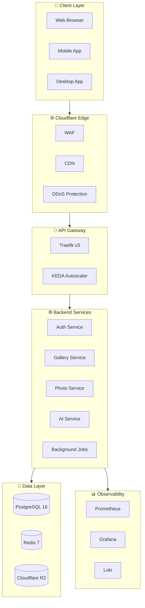

# RawDrive Architecture Quick Reference

**Last Updated**: January 6, 2026

## System Overview

RawDrive is a multi-tenant SaaS platform built on a modern, scalable architecture designed for 20,000+ photographers with high performance, reliability, and security.



## Architecture Layers

### 1. Client Layer
- Web browsers, mobile apps, desktop applications
- HTTPS/TLS 1.3 encrypted connections

### 2. Cloudflare Edge
- **WAF**: Web Application Firewall blocks malicious traffic
- **DDoS Protection**: Automatic mitigation of attacks
- **CDN**: Global content delivery network
- **Rate Limiting**: Per-IP and per-user limits
- **Bot Management**: Challenge pages for suspicious traffic

### 3. Frontend Layer
- **Framework**: React 19 + TypeScript + Vite
- **Styling**: Tailwind CSS + Framer Motion
- **Shared Packages**: pnpm workspaces (`@rawdrive/shared-*`)
- **Deployment**: Hostinger VPS / Kubernetes
- **Build**: Optimized production builds with code splitting

### 4. API Gateway & Ingress
- **API Gateway**: Traefik v3 (Kubernetes IngressRoute CRDs)
- **Autoscaling**: KEDA with Traefik metrics (request rate, latency)
- **Authentication**: JWT + OAuth middleware
- **Rate Limiting**: Per-endpoint limits via Traefik middleware
- **TLS**: Automatic Let's Encrypt via Traefik
- **Request Tracing**: X-Request-ID for tracking
- **Health Endpoints**:
  - `GET /health` → Basic health check
  - `GET /ready` → Kubernetes readiness probe
  - `GET /metrics` → Prometheus metrics endpoint

#### KEDA Scaling Configuration
| Metric | Threshold | Action |
|--------|-----------|--------|
| HTTP RPS | >100 req/s | Scale up |
| P95 Latency | >500ms | Scale up |
| Queue Depth | >500 jobs | Scale up workers |
| CPU Usage | >70% | Scale up |

### 5. Backend Services
- **Runtime**: Python 3.11 + FastAPI + SQLAlchemy
- **Shared Types**: Generated Pydantic models from TypeScript (`app.shared.*`)
- **Scaling**: All services KEDA-enabled for production autoscaling
- **Services** (each independently scalable):
  - Auth Service (JWT, OAuth, MFA) - scales on auth request rate
  - Gallery Service (CRUD, sharing) - scales on API requests
  - Photo Service (upload, processing) - scales on upload queue depth
  - Album Service (design, export) - scales on export jobs
  - Client Service (management) - scales on API requests
  - Booking Service (calendar, scheduling) - scales on booking load
  - Payment Service (Razorpay, Stripe) - scales on transaction rate
  - AI Service (Gemini, embeddings) - scales on AI queue depth
  - Email Service (SendGrid) - scales on email queue
  - Background Jobs (Celery) - scales on job queue depth

### 6. Data Layer

#### PostgreSQL Database
- **Version**: 16+
- **Features**: ACID compliance, pgvector for embeddings
- **Security**: Encrypted connections, RLS for multi-tenancy
- **Backups**: Automated, encrypted, point-in-time recovery

#### Redis Cache
- **Version**: 7
- **Purpose**: Sessions, cache, pub/sub messaging
- **Mode**: Cluster for high availability
- **TTL**: Automatic key expiration

#### Cloudflare R2 Storage
- **Purpose**: Object storage for photos/videos
- **Features**: S3-compatible API, no egress fees
- **CDN**: Integrated global delivery
- **Backup**: BYOS options (Google Drive, Dropbox, S3, Azure)

### 7. Background Jobs
- **Python Jobs**: Celery + Redis (backend processing)
- **Node.js Jobs**: BullMQ (frontend/service workers)
- **Tasks**:
  - Photo processing (thumbnails, derivatives)
  - AI analysis (quality scoring, face detection)
  - Email delivery (transactional, newsletters)
  - Webhook delivery (event notifications)
  - Scheduled tasks (cleanup, reports)
  - Type generation (TS → Python sync)

### 8. Observability Layer

#### Metrics (Prometheus)
- Request count by endpoint
- Request latency (p50, p95, p99)
- Error rate by status code
- Database query latency
- Cache hit/miss ratio
- Background job processing time

#### Dashboards (Grafana)
- System health overview
- Performance metrics
- Error tracking
- Custom business metrics

#### Logs (Loki)
- Structured JSON logging
- Log levels: DEBUG, INFO, WARN, ERROR
- Request/response logging
- Error stack traces
- 1-year retention

#### Traces (Tempo/Jaeger)
- Distributed request tracing
- End-to-end latency analysis
- Service dependency mapping
- Performance bottleneck identification

#### Error Tracking (Sentry/GlitchTip)
- Exception aggregation
- Error grouping and deduplication
- Release tracking
- Performance monitoring

### 9. External Integrations

#### AI Providers
- **Primary**: Google Gemini (text + vision)
- **Fallback**: OpenAI, Anthropic
- **Enterprise**: Azure OpenAI, Azure AI Foundry
- **Self-Hosted**: Ollama, LM Studio

#### Payment Gateways
- **Primary**: Razorpay (India-first, UPI support)
- **Alternative**: Stripe

#### Email Service
- **Provider**: SendGrid
- **Features**: Transactional templates, webhooks

#### Authentication
- **OAuth**: Google, GitHub
- **Enterprise**: SAML/OIDC (Azure AD)

#### Storage (BYOS)
- **Google Drive**: OAuth integration
- **Dropbox**: OAuth integration
- **AWS S3**: IAM credentials
- **Azure Blob**: Connection string

### 10. Shared Packages Layer (pnpm Monorepo)

RawDrive uses a **pnpm workspace monorepo** for cross-platform type sharing:

| Package | Purpose | Key Exports |
|---------|---------|-------------|
| `@rawdrive/shared-types` | Domain types & enums | `InvitationStatus`, `GalleryStatus`, `GradientConfiguration` |
| `@rawdrive/shared-constants` | Configuration values | `API_BASE`, `STORAGE`, `AI_THRESHOLDS`, `PAGINATION` |
| `@rawdrive/shared-validation` | Validation schemas | `isValidHexColor`, `hexColorSchema`, `sanitizeHtml` |
| `@rawdrive/shared-utils` | Utility functions | `formatRelativeDate`, `formatFileSize`, `truncate` |

**Type Generation Pipeline**:
- TypeScript is the **single source of truth**
- JSON Schema generated via `ts-json-schema-generator`
- Python Pydantic models generated via `datamodel-codegen`
- Generated modules copied to `backend/src/app/shared/` and `services/*/src/shared/`

**Key Files**:
- `pnpm-workspace.yaml` - Workspace configuration
- `scripts/generate-python-types.ts` - TS→Python generator
- `packages/*/src/` - TypeScript source files
- `backend/src/app/shared/` - Generated Python modules

## Key Architectural Principles

### Multi-Tenancy
- **Isolation**: `workspace_id` on all customer data tables
- **Security**: PostgreSQL Row-Level Security (RLS)
- **Enforcement**: Backend middleware validates workspace access
- **Never Trust**: Client-provided workspace_id always verified

### Security
- **Defense in Depth**: Multiple layers of protection
- **Encryption**: TLS 1.3 in transit, AES-256 at rest
- **Authentication**: JWT (15-min) + Refresh tokens (7-day)
- **Authorization**: RBAC with workspace scoping
- **Audit Logging**: All sensitive actions tracked

### Performance
- **Caching**: Redis for sessions, cache, rate limiting
- **CDN**: Cloudflare for global content delivery
- **Optimization**: Image derivatives, lazy loading
- **Monitoring**: P95 latency target <300ms

### Scalability (KEDA-First Architecture)
- **Autoscaling**: All production components use KEDA for event-driven scaling
- **Horizontal**: Automatic pod scaling based on real-time metrics
- **Vertical**: Resource requests/limits per service tier
- **Database**: Read replicas for scaling queries
- **Async**: Background workers scale with queue depth
- **Zero-to-N**: Services can scale to zero when idle (cost optimization)

#### Per-Component KEDA Scalers
| Component | Scaler Type | Trigger Metric |
|-----------|-------------|----------------|
| API Services | Prometheus | HTTP requests/sec |
| Photo Workers | Redis | Queue length |
| AI Workers | Prometheus | Pending jobs |
| Email Workers | Redis | Email queue depth |
| Celery Workers | Redis | Task queue length |

### Reliability
- **Uptime Target**: 99.9% for core services
- **Failover**: Automatic pod restart on failure
- **Backups**: Encrypted, offsite, tested regularly
- **Disaster Recovery**: Point-in-time recovery capability

## Deployment Architecture

### Development
- **Local**: Docker Compose (PostgreSQL, Redis, Minio)
- **Database**: Local PostgreSQL with seed data
- **Storage**: Minio (S3-compatible local storage)

### Staging
- **Infrastructure**: Kubernetes namespace
- **Database**: Separate staging database
- **Storage**: Cloudflare R2 staging bucket
- **Monitoring**: Full observability stack

### Production
- **Infrastructure**: Hostinger VPS + Kubernetes (kubeadm)
- **Database**: PostgreSQL with replication
- **Storage**: Cloudflare R2 production bucket
- **Monitoring**: Full observability with alerting

## Technology Stack Summary

| Layer | Technology | Version |
|-------|-----------|---------|
| **Frontend** | React | 19+ |
| **Frontend Build** | Vite | Latest |
| **Frontend Styling** | Tailwind CSS | 3.3+ |
| **Backend Runtime** | Python | 3.11+ |
| **Backend Framework** | FastAPI | 0.115+ |
| **Language** | TypeScript/Python | 5.2+/3.11+ |
| **Package Manager** | pnpm | 8+ |
| **Database** | PostgreSQL | 16+ |
| **Cache** | Redis | 7+ |
| **ORM** | SQLAlchemy | 2.0+ |
| **Validation** | Zod/Pydantic | 4.2+/2.7+ |
| **Job Queue** | Celery | 5.3+ |
| **Image Processing** | Sharp | Latest |
| **Logging** | Winston | 3.10+ |
| **Security** | Helmet.js | 7+ |
| **Rate Limiting** | express-rate-limit | 6.7+ |
| **Metrics** | Prometheus | Latest |
| **Dashboards** | Grafana | Latest |
| **Logs** | Loki | Latest |
| **Traces** | Tempo/Jaeger | Latest |
| **Errors** | Sentry/GlitchTip | Latest |
| **Container** | Docker | Latest |
| **Orchestration** | Kubernetes | 1.27+ |
| **Ingress** | Traefik | v3.0 |
| **Autoscaler** | KEDA | Latest |
| **SSL/TLS** | cert-manager | Latest |
| **Edge** | Cloudflare | - |

## Performance Targets

| Metric | Target |
|--------|--------|
| **Page Load** | P95 <300ms |
| **API Response** | P95 <300ms |
| **Database Query** | <100ms (with indexing) |
| **Image Delivery** | <2s on 4G |
| **Uptime** | 99.9% |
| **Error Rate** | <1% |

## Security Checklist

- [x] HTTPS/TLS 1.3 everywhere
- [x] OWASP Top 10 protections
- [x] Multi-tenant isolation via workspace_id
- [x] Signed URLs for media access (1-hour TTL)
- [x] Rate limiting on all endpoints
- [x] Audit logging for sensitive actions
- [x] Encryption at rest and in transit
- [ ] GDPR and CCPA compliance
- [ ] Regular security audits
- [ ] Penetration testing quarterly

## Monitoring & Alerting

### Key Metrics to Monitor
- Request latency (p50, p95, p99)
- Error rate by endpoint
- Database connection pool usage
- Redis memory usage
- Disk space usage
- CPU and memory utilization
- Background job queue depth
- Cache hit ratio

### Alert Thresholds
- Error rate >1%
- P95 latency >500ms
- Database connections >80%
- Redis memory >80%
- Disk space <10%
- Pod restart rate >5/hour
- Job queue depth >1000

## Related Documentation

- **Detailed Tech Stack**: `docs/project/01-TECH_STACK.md`
- **Security Requirements**: `docs/project/02-SECURITY_REQUIREMENTS.md`
- **API Contracts**: `docs/project/03-API_CONTRACTS.md`
- **Data Model**: `docs/project/04-DATA_MODEL.md`
- **Development Roadmap**: `docs/project/roadmap.md`
- **Technical Specifications**: `docs/TechnicalSpecs/`
- **Feature Documentation**: `docs/Features/`

## Quick Links

- **Architecture Diagram**: See `docs/project/01-TECH_STACK.md` for ASCII and Mermaid diagrams
- **API Documentation**: See `docs/project/03-API_CONTRACTS.md`
- **Database Schema**: See `docs/project/04-DATA_MODEL.md`
- **Deployment Guide**: See infrastructure documentation
- **Security Policy**: See `docs/project/02-SECURITY_REQUIREMENTS.md`

## Getting Started

1. **Local Development**: 
   ```bash
   # Full stack
   docker compose -f infrastructure/docker/docker-compose.yml up -d
   cd frontend && pnpm dev
   
   # OR backend-only
   docker compose -f infrastructure/docker/docker-compose.dev.yml up -d
   ```
2. **Database Setup**: 
   ```bash
   docker compose -f infrastructure/docker/docker-compose.yml exec backend alembic upgrade head
   docker compose -f infrastructure/docker/docker-compose.yml exec backend python seed_user.py
   ```
3. **Run Tests**: 
   ```bash
   cd frontend && pnpm test
   docker compose -f infrastructure/docker/docker-compose.yml exec backend pytest
   ```
4. **Build**: `cd frontend && pnpm build`
5. **Deploy**: Push to main branch (GitHub Actions handles CI/CD)

## Common Developer Commands

```bash
# Type generation (TS → Python)
pnpm run generate:types

# Database migrations
alembic revision --autogenerate -m "description"
alembic upgrade head
alembic downgrade -1

# View logs
docker compose logs -f backend
docker compose logs -f --tail=100 traefik

# Restart specific service
docker compose restart backend

# Clear Redis cache
docker compose exec redis redis-cli FLUSHALL
```

## Environment Variables Reference

| Variable | Required | Description |
|----------|----------|-------------|
| `DATABASE_URL` | ✅ | PostgreSQL connection string |
| `REDIS_URL` | ✅ | Redis connection string |
| `JWT_SECRET` | ✅ | Secret key for JWT signing |
| `JWT_REFRESH_SECRET` | ✅ | Secret for refresh tokens |
| `R2_ACCESS_KEY_ID` | ✅ | Cloudflare R2 access key |
| `R2_SECRET_ACCESS_KEY` | ✅ | Cloudflare R2 secret |
| `SENDGRID_API_KEY` | ✅ | SendGrid email API key |
| `GOOGLE_CLIENT_ID` | ⚪ | Google OAuth client ID |
| `RAZORPAY_KEY_ID` | ⚪ | Razorpay payment key |
| `GEMINI_API_KEY` | ⚪ | Google Gemini AI API key |

## Troubleshooting Quick Reference

| Issue | Likely Cause | Solution |
|-------|--------------|----------|
| DB connection refused | Container not running | `docker compose -f docker-compose.db.yml ps` |
| Redis timeout | Wrong REDIS_URL | Verify `REDIS_URL` in `.env` |
| CORS errors | Middleware config | Check Traefik CORS middleware |
| 401 Unauthorized | Expired JWT | Clear cookies, re-login |
| 403 Forbidden | Workspace mismatch | Verify `workspace_id` in token |
| 500 on upload | R2 credentials | Check R2 keys in `.env` |
| Type errors | Stale types | Run `pnpm run generate:types` |
| Slow queries | Missing index | Check `EXPLAIN ANALYZE` output |

## Support & Questions

For questions about the architecture:
1. Check the detailed documentation in `docs/project/`
2. Review technical specifications in `docs/TechnicalSpecs/`
3. Check feature documentation in `docs/Features/`
4. Consult the team's architecture decision records

---

**Version**: 1.2
**Last Updated**: January 6, 2026
**Maintained By**: Engineering Team
