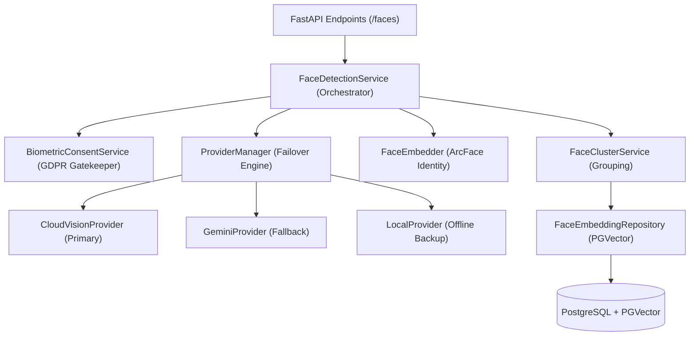

# Technical Specification: Google Cloud Vision FaceID Solution

## 1. Executive Summary
The RawDrive FaceID solution is a high-performance, privacy-conscious facial recognition and organization system. It utilizes a **hybrid AI architecture** that leverages Google Cloud Vision for advanced detection and a local ArcFace model for secure biometric identity generation.

## 2. High-Level Architecture
The system is built as a multi-layered service within the RawDrive backend, favoring loose coupling and high availability.

### Component Relationship

## 3. Component Deep Dive

### 3.1 FaceDetectionService (The Orchestrator)
The master service that coordinates the entire processing pipeline.
- **Responsibilities**: Job management, workspace-level setting enforcement, and pipeline sequencing.
- **Privacy Gate**: Blocks all processing until `is_face_detection_allowed(workspace_id)` returns `True`.

### 3.2 CloudVisionProvider (The Detector)
Integrates with Google Cloud Vision API (`google-cloud-vision`).
- **Features Used**:
    - `FACE_DETECTION`: 30+ facial landmarks, head pose (pan, tilt, roll), and emotional likelihoods.
    - `LABEL_DETECTION`: Used for secondary tagging and scene context.
- **Failover**: If the API is unreachable, the `ProviderManager` automatically routes requests to the `GeminiProvider` or `LocalProvider`.

### 3.3 FaceEmbedder (The Identity Generator)
Local AI model for biometric fingerprinting.
- **Model**: [InsightFace ArcFace (Buffalo_L)](https://github.com/deepinsight/insightface).
- **Output**: 512-dimensional unit vector (embedding) per face.
- **Security**: Embeddings are generated locally using OpenCV DNN. Biometric identity data never leaves the RawDrive infrastructure.

### 3.4 FaceClusterService (The Organizer)
Manages the relationship between faces and identities.
- **Mechanism**: Centroid-based clustering.
- **Centroid**: The average embedding of all faces in a group, representing a person's "canonical" face.
- **Logic**: Uses cosine similarity to find the best-matching person. If similarity > 0.7, the face is added to the group and the centroid is recalculated.

## 4. Sequence of Operations

1.  **Ingestion**: A photo is uploaded or scheduled for processing.
2.  **Consent**: System verifies biometric consent.
3.  **Detection**: `CloudVisionProvider` identifies one or more face bounding boxes and attributes.
4.  **Identity**: For each detected face, a 112x112 crop is passed to the `FaceEmbedder`.
5.  **Persistence**: The face record, bounding box, metadata (smile, pose), and 512-d embedding are stored in PostgreSQL.
6.  **Grouping**: `FaceClusterService` identifies if this face belongs to an existing person or if a new group should be created.

## 5. Data Privacy & Compliance (GDPR)
- **Article 9 Compliance**: Biometric data is classified as "Special Category Data". RawDrive requires explicit, granular consent before enabling these features.
- **Consent Logs**: Every grant/withdrawal of consent is logged with the user ID and timestamp for audit purposes.
- **Retention**: When consent is withdrawn, users can trigger a cascade delete of all biometric embeddings and face groups.

## 6. Technical Specifications
| Feature | Specification |
| :--- | :--- |
| **Embedding Dimension** | 512 Floats |
| **Similarity Metric** | Cosine Similarity (via PGVector) |
| **Primary Model** | ArcFace (w600k_r50.onnx) |
| **Vector Storage** | `vector(512)` type in PostgreSQL |
| **Detection Provider** | Google Cloud Vision API v1 |

## 7. Setup & Configuration
- **Admin Settings**: Providers can be enabled/disabled per workspace.
- **Failover Threshold**: Default 5 consecutive failures triggers a temporary circuit breaker open on the provider.
- **Environment**: Requires `GOOGLE_APPLICATION_CREDENTIALS` for Cloud Vision or a service account JSON stored in the DB.
