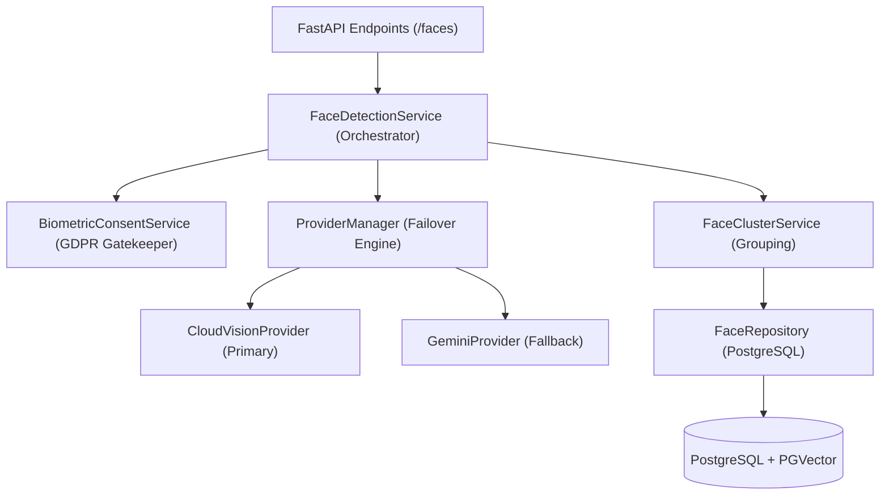

# Technical Specification: Google Cloud Vision FaceID Solution

**Version:** 1.0.0
**Last Updated:** 2026-04-04
**Status:** Production

---

## Table of Contents

1. [Executive Summary](#1-executive-summary)
2. [High-Level Architecture](#2-high-level-architecture)
3. [Component Deep Dive](#3-component-deep-dive)
4. [Upload & Face Detection Flow](#4-upload--face-detection-flow)
5. [Gallery Face Management](#5-gallery-face-management)
6. [Public Gallery Face Search](#6-public-gallery-face-search)
7. [Download Flow](#7-download-flow)
8. [Data Privacy & Compliance (GDPR)](#8-data-privacy--compliance-gdpr)
9. [Database Schema](#9-database-schema)
10. [API Reference](#10-api-reference)
11. [Configuration](#11-configuration)
12. [Technical Specifications](#12-technical-specifications)
13. [Performance Optimization](#13-performance-optimization)
14. [Troubleshooting](#14-troubleshooting)
15. [Integration Checklist](#15-faceids-page--end-to-end-integration-checklist)
16. [Future Enhancements](#16-future-enhancements)

---

## 1. Executive Summary

The RawDrive FaceID solution is a high-performance, privacy-conscious facial recognition and organization system. It uses **Google Cloud Vision** as the sole AI provider for face detection, attribute analysis, and identity grouping. No local biometric models are used.

**Key Capabilities:**
- Automatically detect faces in uploaded photos via Google Cloud Vision API
- Cluster similar faces into groups representing the same person
- Search photos by face similarity (authenticated and public)
- Allow public gallery visitors to find their photos using face identification

---

## 2. High-Level Architecture

The system is built as a multi-layered service within the RawDrive backend, favoring loose coupling and high availability.

### Component Relationship



### System Architecture

```
┌─────────────────────────────────────────────────────────────────────────────┐
│                              FACEID ARCHITECTURE                             │
├─────────────────────────────────────────────────────────────────────────────┤
│                                                                             │
│  ┌─────────────┐      ┌──────────────┐      ┌─────────────────────────┐   │
│  │   Upload    │──────▶│ Face Detection│──────▶│   Google Cloud Vision   │   │
│  │   Service   │      │   Worker     │      │   (Detection + Data)    │   │
│  └─────────────┘      └──────────────┘      └─────────────────────────┘   │
│                                │                        │                   │
│                                ▼                        ▼                   │
│  ┌──────────────────────────────────────────────────────────────────────┐  │
│  │                         PostgreSQL Database                           │  │
│  │  ┌──────────┐  ┌─────────────┐  ┌──────────────┐  ┌─────────────┐  │  │
│  │  │  faces   │  │ face_groups │  │face_assignments│ │   assets    │  │  │
│  │  └──────────┘  └─────────────┘  └──────────────┘  └─────────────┘  │  │
│  └──────────────────────────────────────────────────────────────────────┘  │
│                                │                                           │
│                                ▼                                           │
│  ┌──────────────────────────────────────────────────────────────────────┐  │
│  │                         API Layer                                     │  │
│  │  ┌──────────────┐  ┌──────────────┐  ┌─────────────────────────┐  │  │
│  │  │/faces/*      │  │/face-groups/*│  │/public/galleries/*/    │  │  │
│  │  │              │  │              │  │  face-search           │  │  │
│  │  └──────────────┘  └──────────────┘  └─────────────────────────┘  │  │
│  └──────────────────────────────────────────────────────────────────────┘  │
│                                │                                           │
│                                ▼                                           │
│  ┌──────────────────────────────────────────────────────────────────────┐  │
│  │                         Frontend (Client)                             │  │
│  │  ┌──────────────────┐  ┌──────────────────┐  ┌────────────────────┐ │  │
│  │  │  FaceDiscovery   │  │  PeoplePanel     │  │  Face Tagging      │ │  │
│  │  │  Component       │  │  Component       │  │  Overlay           │ │  │
│  │  └──────────────────┘  └──────────────────┘  └────────────────────┘ │  │
│  └──────────────────────────────────────────────────────────────────────┘  │
│                                                                             │
└─────────────────────────────────────────────────────────────────────────────┘
```

---

## 3. Component Deep Dive

### 3.1 FaceDetectionService (The Orchestrator)

The master service that coordinates the entire processing pipeline.
- **Responsibilities**: Job management, workspace-level setting enforcement, and pipeline sequencing.
- **Privacy Gate**: Blocks all processing until `is_face_detection_allowed(workspace_id)` returns `True`.

### 3.2 CloudVisionProvider (The Detector & Identity Source)

Integrates with Google Cloud Vision API (`google-cloud-vision`).
- **Features Used**:
    - `FACE_DETECTION`: 30+ facial landmarks, head pose (pan, tilt, roll), emotional likelihoods, and bounding box coordinates.
    - `LABEL_DETECTION`: Used for secondary tagging and scene context.
- **Identity Data**: Face landmark geometry, attributes, and feature vectors returned by the API serve as the basis for face grouping and matching.
- **Failover**: If the API is unreachable, the `ProviderManager` automatically routes requests to the `GeminiProvider`.

### 3.3 FaceClusterService (The Organizer)

Manages the relationship between faces and identities using Google Vision annotations.
- **Mechanism**: Clustering using face annotations from Cloud Vision stored as vectors in PostgreSQL with pgvector.
- **Logic**: Compares face data using cosine similarity. Faces with similarity >= threshold (0.85) are grouped into the same person. If no match, a new group is created with the face as its representative.

### 3.4 BiometricConsentService (GDPR Gatekeeper)

- Blocks all face processing until explicit consent is granted per workspace.
- Logs every grant/withdrawal with user ID, IP, user agent, and timestamp.
- Supports cascade delete of all face data on consent withdrawal.

---

## 4. Upload & Face Detection Flow

### 4.1 Upload Session Creation

**File:** `backend/src/app/services/upload_service.py`

```
User uploads photo
        ↓
POST /api/v1/workspaces/{workspace_id}/uploads
        ↓
create_upload_session(workspace_id, gallery_id, filename, ...)
        ↓
Validate file type and size
        ↓
Check storage limit
        ↓
Generate upload session in database
        ↓
Return upload_url and expires_at
```

### 4.2 Upload Processing

```
File uploaded to R2 (direct or proxy)
        ↓
process_proxy_upload() / process_large_upload()
        ↓
Create asset record:
    - asset_id (UUID)
    - workspace_id, gallery_id
    - original_object_key
    - status = 'processing'
        ↓
Encrypt and store original file
        ↓
Enqueue background jobs:
    - asset.process (thumbnail generation)
    - asset.extract_metadata (EXIF, dimensions, GPS)
    - face_detection (Google Cloud Vision) ⭐
    - content_detection (AI tagging)
        ↓
Update asset status → 'active'
```

### 4.3 Face Detection Job

**File:** `backend/src/app/services/face_detection_service.py`

```python
# Queued job payload
{
    "task_type": "face_detection",
    "payload": {
        "photo_id": str(asset_id),
        "workspace_id": str(workspace_id),
        "priority": 0,
        "client_metadata": {...}
    },
    "priority": TaskPriority.NORMAL,
    "max_retries": 3
}
```

**Background Worker Processing:**

```
Face Detection Worker
        ↓
Fetch asset from storage
        ↓
Call Google Cloud Vision API (FACE_DETECTION)
        ↓
Parse response:
    - Bounding boxes (x, y, width, height as %)
    - Detection confidence (0-1)
    - 30+ facial landmarks
    - Emotional likelihoods
    - Head pose (pan, tilt, roll)
    - Blurriness/underexposed flags
        ↓
Crop and generate face thumbnails (small/medium/large)
        ↓
Store in faces table:
    - id, workspace_id, photo_id
    - bounding_box (JSONB)
    - confidence (DECIMAL)
    - landmarks and attributes (JSONB)
    - provider ('cloud_vision')
    - thumbnail_urls (JSONB)
        ↓
Trigger auto-clustering (if enabled)
```

### 4.4 Auto-Clustering

**File:** `backend/src/app/services/face_cluster_service.py`

```
Face detected via Google Cloud Vision
        ↓
Calculate similarity to existing face group centroids
        ↓
If similarity ≥ threshold (0.85):
    Assign to existing group
    Update group centroid
    Increment face_count
        ↓
Else (no match):
    Create new face group
    Set representative_face_id = this face
    face_count = 1
```

---

## 5. Gallery Face Management

### 5.1 List Faces in Gallery

**Endpoint:** `GET /api/v1/galleries/{gallery_id}/faces`

**File:** `backend/src/app/api/v1/faces.py:89`

```python
# Response
{
    "data": [
        {
            "id": "uuid",
            "photo_id": "uuid",
            "face_group_id": "uuid | null",
            "bounding_box": {"x": 10.5, "y": 20.3, "width": 15.2, "height": 18.7},
            "confidence": 0.95,
            "thumbnail_urls": {"small": "...", "medium": "...", "large": "..."},
            "created_at": "2026-01-23T10:00:00Z"
        }
    ],
    "meta": {
        "page": 1,
        "limit": 50,
        "total": 123,
        "total_pages": 3
    }
}
```

### 5.2 List Face Groups in Gallery

**Endpoint:** `GET /api/v1/workspaces/{workspace_id}/face-groups/gallery/{gallery_id}`

**File:** `backend/src/app/api/v1/face_groups.py:170`

```python
# Response
{
    "data": [
        {
            "id": "uuid",
            "name": "John Doe" | null,
            "person_id": "uuid | null",
            "representative_face_id": "uuid",
            "representative_thumbnail_url": "https://...",
            "face_count": 45,
            "gallery_photo_count": 23,
            "gallery_face_count": 28,
            "created_at": "2026-01-23T10:00:00Z"
        }
    ],
    "meta": {
        "page": 1,
        "limit": 50,
        "total": 12,
        "total_pages": 1
    }
}
```

### 5.3 Face Group Operations

#### Merge Face Groups

**Endpoint:** `POST /api/v1/face-groups/merge`

```python
# Request
{
    "source_group_id": "uuid",
    "target_group_id": "uuid"
}
# Result: All faces from source reassigned to target. Source group deleted. Target centroid recalculated.
```

#### Multi-Merge Face Groups

**Endpoint:** `POST /api/v1/workspaces/{workspace_id}/face-groups/multi-merge`

```python
# Request
{
    "source_group_ids": ["uuid1", "uuid2", "uuid3"],
    "target_group_id": "uuid4",
    "representative_face_id": "uuid | null",
    "name": "Merged Person Name | null"
}
# Result: All sources merged into target. Audit log entry created (SOC2 compliance).
```

#### Split Face Group

**Endpoint:** `POST /api/v1/face-groups/{group_id}/split`

```python
# Request
{
    "face_ids": ["uuid1", "uuid2"],
    "new_group_name": "Different Person | null"
}
# Result: Specified faces moved to new group. Both group centroids recalculated.
```

#### Name Face Group

**Endpoint:** `PUT /api/v1/workspaces/{workspace_id}/face-groups/{group_id}/name`

```python
# Request
{
    "person_id": "uuid | null",
    "person_name": "Jane Doe | null"
}
# Result: Face group linked to person. Enables search by person name.
```

---

## 6. Public Gallery Face Search

### 6.1 Client-Side Flow

**Frontend Component:** `frontend/src/components/features/gallery/FaceDiscovery.tsx`

```
Public visitor opens gallery
        ↓
Click "Find Your Photos" button
        ↓
Grant camera permission
        ↓
Take selfie OR upload reference photo
        ↓
Send reference photo to server
        ↓
Server runs Google Cloud Vision detection on reference
        ↓
Server matches against gallery faces
        ↓
Return matching photos
```

### 6.2 Server-Side Similarity Search

**Endpoint:** `POST /api/v1/public/galleries/{gallery_id}/face-search`

**File:** `backend/src/app/api/v1/public_galleries.py:374-480`

#### Security Checks (in order)

```python
# 1. Verify gallery exists and is public
response = await httpx.get(f"{GALLERY_SERVICE_URL}/api/v1/public/galleries/{gallery_id}")

# 2. Check face_search_enabled flag
if not gallery.get("face_search_enabled", True):
    raise AppError("Face search is not available for this gallery")

# 3. Enforce biometric consent (COM-001)
await consent_service.check_public_search_consent(workspace_id)

# 4. Apply rate limiting (SEC-001)
await check_face_search_rate_limit(workspace_id, rate_limit_repo)
```

#### Similarity Query (pgvector)

```sql
SELECT DISTINCT ON (f.photo_id)
    f.photo_id as asset_id,
    1 - (f.embedding <=> $1) as similarity,
    f.id as face_id,
    f.thumbnail_urls
FROM faces f
JOIN gallery_assets ga ON f.photo_id = ga.asset_id
JOIN assets a ON ga.asset_id = a.asset_id
WHERE ga.gallery_id = $2
AND ga.workspace_id = $3
AND ga.visible = TRUE
AND a.deleted = FALSE
AND f.embedding IS NOT NULL
AND (f.embedding <=> $1) <= $4  -- Max distance = 1 - threshold
ORDER BY f.photo_id, f.embedding <=> $1 ASC
LIMIT $5
```

**Key Points:**
- Uses pgvector cosine distance operator (`<=>`)
- `1 - distance` = similarity (0-1)
- `DISTINCT ON (photo_id)` ensures one result per photo
- Filters by `visible=TRUE` and `deleted=FALSE`
- Respects workspace isolation

#### Response Schema

```python
class FaceSearchResponse(BaseModel):
    matches: list[FaceSearchMatch]
    total_searched: int
    query_time_ms: float
```

**Example Response:**

```json
{
    "matches": [
        {
            "photo_id": "550e8400-e29b-41d4-a716-446655440000",
            "similarity": 0.92,
            "thumbnail_url": "/api/v1/public/galleries/abc-123/assets/550e8400.../thumbnail"
        }
    ],
    "total_searched": 1234,
    "query_time_ms": 45.2
}
```

---

## 7. Download Flow

### 7.1 Important Clarification

**There is NO direct "download using faceid" endpoint.**

The flow is:
```
Face Search Results → Select Photos → Download via Standard Gallery API
```

### 7.2 Download Options

After finding photos via face search, users can:

- **Mark Favorites:** `POST /api/v1/public/galleries/{gallery_id}/assets/{asset_id}/favorite`
- **Mark for Selection:** `POST /api/v1/public/galleries/{gallery_id}/assets/{asset_id}/selection`
- **Get Filtered Assets:** `GET /api/v1/public/galleries/{gallery_id}/assets/filtered`
  - Query params: `filter_type`, `sub_gallery_id`, `emotion`, `min_emotion_confidence`

### 7.3 Download Endpoints

**Endpoint:** `GET /api/v1/public/galleries/{gallery_id}/assets/{asset_id}/{variant}`

**Variants:** `thumbnail`, `preview`, `original` (subject to download policy)

**Download Policy Enforcement:**

```python
policy = gallery.download_policy
if policy == "view_only":
    raise AppError("Downloads not allowed")
elif policy == "web_only":
    return web_quality_variant
elif policy == "watermarked_only":
    return watermarked_variant
elif policy == "original_allowed":
    return original_variant
```

---

## 8. Data Privacy & Compliance (GDPR)

### Biometric Consent System

**Table:** `workspace_biometric_settings`

| Column | Type | Default | Description |
|--------|------|---------|-------------|
| `consent_status` | VARCHAR(20) | 'pending' | `pending` / `granted` / `withdrawn` |
| `face_detection_enabled` | BOOLEAN | FALSE | Master switch for face features |
| `public_face_search_enabled` | BOOLEAN | FALSE | Allow public gallery face search |
| `consented_at` | TIMESTAMP | NULL | When consent was granted |
| `consent_ip` | VARCHAR(45) | NULL | IP address of consent |
| `consent_user_agent` | TEXT | NULL | Browser of consent |
| `withdrawn_at` | TIMESTAMP | NULL | When consent was revoked |
| `withdrawal_reason` | TEXT | NULL | Reason for withdrawal |

### Compliance Requirements

- **Article 9 Compliance**: Biometric data is classified as "Special Category Data". RawDrive requires explicit, granular consent before enabling these features.
- **Consent Logs**: Every grant/withdrawal of consent is logged with the user ID and timestamp for audit purposes.
- **Retention**: When consent is withdrawn, users can trigger a cascade delete of all face records and face groups.
- **Data Residency**: All face detection is processed via Google Cloud Vision API. No local biometric models are used. Data handling follows Google Cloud's data processing terms.

### Rate Limiting

**File:** `backend/src/app/api/dependencies/face_rate_limit.py`

```python
RateLimitType.FACE_SEARCH: ("face_search_rpm", 60)    # 60 requests/minute
RateLimitType.FACE_DETECT: ("face_detect_rpm", 10)     # 10 requests/minute
RateLimitType.FACE_BULK: ("face_bulk_rpm", 30)         # 30 operations/minute
```

- Redis-backed token bucket, per-workspace counters
- Headers: `X-RateLimit-Limit`, `X-RateLimit-Remaining`, `X-RateLimit-Reset`

### Multi-Tenant Isolation

**ALL database queries include `workspace_id`:**

```python
# GOOD - Always include workspace_id
result = await db.execute(
    select(Face).where(
        Face.workspace_id == workspace_id,
        Face.id == face_id
    )
)
```

**Storage isolation:**
```
workspaces/{workspace_id}/galleries/{gallery_id}/original/{asset_id}/file.jpg
workspaces/{workspace_id}/faces/{face_id}/medium.jpg
```

---

## 9. Database Schema

### faces Table

```sql
CREATE TABLE faces (
    id UUID PRIMARY KEY DEFAULT gen_random_uuid(),
    workspace_id UUID NOT NULL REFERENCES workspaces(workspace_id),
    photo_id UUID NOT NULL REFERENCES assets(asset_id),
    face_group_id UUID REFERENCES face_groups(id),

    -- Face detection data (from Google Cloud Vision)
    bounding_box JSONB NOT NULL,
    confidence DECIMAL(3,2) NOT NULL CHECK (confidence BETWEEN 0 AND 1),
    embedding vector(512),
    provider VARCHAR(20) NOT NULL CHECK (provider IN ('cloud_vision', 'gemini')),
    detection_metadata JSONB DEFAULT '{}',

    -- Thumbnails
    thumbnail_urls JSONB DEFAULT '{"small": null, "medium": null, "large": null}',

    -- Timestamps
    created_at TIMESTAMP WITH TIME ZONE DEFAULT NOW(),
    updated_at TIMESTAMP WITH TIME ZONE DEFAULT NOW(),

    CONSTRAINT faces_workspace_check CHECK (workspace_id IS NOT NULL),
    CONSTRAINT faces_photo_check CHECK (photo_id IS NOT NULL)
);

-- Indexes
CREATE INDEX idx_faces_workspace_photo ON faces(workspace_id, photo_id);
CREATE INDEX idx_faces_face_group ON faces(face_group_id) WHERE face_group_id IS NOT NULL;
CREATE INDEX idx_faces_embedding_cosine ON faces USING ivfflat(embedding vector_cosine_ops) WITH (lists = 100);
```

### face_groups Table

```sql
CREATE TABLE face_groups (
    id UUID PRIMARY KEY DEFAULT gen_random_uuid(),
    workspace_id UUID NOT NULL REFERENCES workspaces(workspace_id),

    name VARCHAR(255),
    person_id UUID REFERENCES people(id),
    representative_face_id UUID REFERENCES faces(id),
    centroid vector(512),
    face_count INTEGER NOT NULL DEFAULT 0,

    created_at TIMESTAMP WITH TIME ZONE DEFAULT NOW(),
    updated_at TIMESTAMP WITH TIME ZONE DEFAULT NOW(),

    CONSTRAINT face_groups_workspace_check CHECK (workspace_id IS NOT NULL)
);

CREATE INDEX idx_face_groups_workspace ON face_groups(workspace_id);
CREATE INDEX idx_face_groups_person ON face_groups(person_id) WHERE person_id IS NOT NULL;
```

### face_assignments Table (Audit Trail)

```sql
CREATE TABLE face_assignments (
    id UUID PRIMARY KEY DEFAULT gen_random_uuid(),
    workspace_id UUID NOT NULL,
    face_id UUID NOT NULL REFERENCES faces(id),
    face_group_id UUID REFERENCES face_groups(id),

    assignment_type VARCHAR(20) NOT NULL,  -- 'auto' | 'manual' | 'merge' | 'split'
    assigned_by_user_id UUID REFERENCES users(id),
    similarity_score DECIMAL(3,2),

    assigned_at TIMESTAMP WITH TIME ZONE DEFAULT NOW(),

    CONSTRAINT face_assignments_face_check CHECK (face_id IS NOT NULL)
);

CREATE INDEX idx_face_assignments_face ON face_assignments(face_id);
CREATE INDEX idx_face_assignments_group ON face_assignments(face_group_id);
```

---

## 10. API Reference

### Face Detection Endpoints

| Method | Endpoint | Description | Auth | Consent |
|--------|----------|-------------|------|---------|
| GET | `/api/v1/galleries/{gallery_id}/faces` | List faces in gallery | workspace_access | Yes |
| GET | `/api/v1/photos/{photo_id}/faces` | List faces in photo | workspace_access | Yes |
| GET | `/api/v1/faces/{face_id}` | Get face details | workspace_access | Yes |
| POST | `/api/v1/faces/{face_id}/identify` | Assign face to group | workspace_access | Yes |
| POST | `/api/v1/faces/bulk-assign` | Bulk assign faces | workspace_access (30rpm) | Yes |

### Face Group Endpoints

| Method | Endpoint | Description | Auth | Consent |
|--------|----------|-------------|------|---------|
| GET | `/api/v1/workspaces/{wid}/face-groups` | List all face groups | workspace_access | Yes |
| GET | `/api/v1/workspaces/{wid}/face-groups/gallery/{gid}` | List gallery face groups | workspace_access | No |
| POST | `/api/v1/workspaces/{wid}/face-groups` | Create face group | workspace_access | Yes |
| GET | `/api/v1/face-groups/{group_id}` | Get face group | workspace_access | Yes |
| PUT | `/api/v1/face-groups/{group_id}` | Update face group | workspace_access | No |
| PUT | `/api/v1/workspaces/{wid}/face-groups/{gid}/name` | Name face group | workspace_access | No |
| DELETE | `/api/v1/face-groups/{group_id}` | Delete face group | workspace_access | No |
| POST | `/api/v1/face-groups/merge` | Merge face groups | workspace_access | No |
| POST | `/api/v1/workspaces/{wid}/face-groups/multi-merge` | Multi-merge groups | workspace_access (30rpm) | Yes |
| POST | `/api/v1/face-groups/{group_id}/split` | Split face group | workspace_access (30rpm) | Yes |

### Public Gallery Endpoints

| Method | Endpoint | Description | Auth | Consent |
|--------|----------|-------------|------|---------|
| POST | `/api/v1/public/galleries/{gid}/face-search` | Face search | None (60rpm) | Yes (COM-001) |

### Biometric Consent Endpoints

| Method | Endpoint | Description |
|--------|----------|-------------|
| POST | `/api/v1/workspaces/{wid}/biometric-consent` | Grant consent |
| GET | `/api/v1/workspaces/{wid}/biometric-consent` | Get consent status |
| DELETE | `/api/v1/workspaces/{wid}/biometric-consent?cascade_delete=false` | Withdraw consent |

---

## 11. Configuration

### Environment Variables

```bash
# AI Provider — Google Cloud Vision only
AI_PROVIDER=cloud_vision
GOOGLE_APPLICATION_CREDENTIALS=/path/to/service-account.json

# Vector Database
POSTGRES_URL=postgresql://...
PGVECTOR_ENABLED=true

# Face Detection Settings
FACE_DETECTION_CONFIDENCE_THRESHOLD=0.7
FACE_CLUSTERING_THRESHOLD=0.85

# Rate Limiting
REDIS_URL=redis://localhost:6379/0
DEFAULT_FACE_SEARCH_RPM=60
DEFAULT_FACE_DETECT_RPM=10
```

### Workspace Settings

- **Admin Settings**: Providers can be enabled/disabled per workspace.
- **Failover Threshold**: Default 5 consecutive failures triggers a temporary circuit breaker open on the provider.
- **No Local Models**: No ONNX runtimes, OpenCV DNN, or local AI dependencies are required.

### Gallery Settings

| Column | Type | Default | Description |
|--------|------|---------|-------------|
| `face_search_enabled` | BOOLEAN | TRUE | Per-gallery face search override |
| `download_policy` | VARCHAR(20) | 'watermarked_only' | Download access control |

---

## 12. Technical Specifications

| Feature | Specification |
| :--- | :--- |
| **Detection Provider** | Google Cloud Vision API v1 |
| **Fallback Provider** | Gemini API |
| **Similarity Metric** | Cosine Similarity (via PGVector) |
| **Vector Storage** | `vector(512)` type in PostgreSQL |
| **Landmarks Per Face** | 30+ (from Cloud Vision FACE_DETECTION) |
| **Clustering Threshold** | 0.85 cosine similarity |
| **Face Search Threshold** | 0.6 default (configurable 0.0-1.0) |

---

## 13. Performance Optimization

### Caching Strategy

**Redis Cache Keys:**
```
face_group_list:{workspace_id}:{page}:{limit}:{order_by}:{order_desc}
face_group_detail:{workspace_id}:{group_id}
gallery_face_groups:{workspace_id}:{gallery_id}:{page}:{limit}
faces_in_group:{workspace_id}:{group_id}:{limit}:{offset}
merge_suggestions:{workspace_id}:{threshold}:{limit}
```

**Cache Invalidation:** On face group merge/split, face assignment changes, group name updates, or manual invalidation via API.

### Database Indexes

```sql
CREATE INDEX idx_faces_workspace_photo ON faces(workspace_id, photo_id);
CREATE INDEX idx_faces_embedding_cosine ON faces USING ivfflat(embedding vector_cosine_ops) WITH (lists = 100);
CREATE INDEX idx_gallery_assets_gallery_visible ON gallery_assets(gallery_id, visible) WHERE visible = TRUE;
CREATE INDEX idx_faces_gallery_search ON faces(photo_id, embedding, thumbnail_urls) WHERE embedding IS NOT NULL;
```

### Vector Search Optimization

1. **pgvector ivfflat index** — Use for < 1M faces
2. **Milvus** — Use for > 1M faces (distributed)
3. **Dimensionality reduction** — Consider PCA for 256-dim
4. **Quantization** — Binary quantization for faster search

---

## 14. Troubleshooting

### Face Search Returns No Results

- Biometric consent not granted
- Face search disabled for gallery
- No faces detected in gallery photos
- Threshold too high (try 0.5 or 0.6)

### Rate Limit Errors (429)

```python
# Check current limits
GET /api/v1/workspaces/{workspace_id}/face-rate-limits

# Increase limits
PUT /api/v1/workspaces/{workspace_id}/face-rate-limits
{ "face_search_rpm": 120 }
```

---

## 15. FaceIDs Page — End-to-End Integration Checklist

### 1. Frontend → API base URL

- **With full Docker stack (Traefik on port 80):**
  `frontend/.env.development`: `VITE_API_URL=http://localhost`
- **Backend only (Docker backend on 8000, no Traefik):**
  `frontend/.env`: `VITE_API_URL=http://localhost:8000`

### 2. Backend

- Backend is running (`rawdrive-backend` container).
- Face routes mounted: `face_groups_router` at `/api/v1`.
- List endpoint: `GET /api/v1/workspaces/{workspace_id}/face-groups` returns 200. Does **not** require biometric consent.

### 3. Auth & JWT

- User logged in; `apiClient` sends `Authorization: Bearer <access_token>`.
- Backend validates JWT and `require_workspace_access`.

### 4. Database

- Tables exist: `face_groups`, `faces`. Run migrations: `alembic upgrade head`.
- Empty list (200 with `data: []`) is valid when no faces detected yet.

### 5. Traefik (if used)

- `api-router-local` has `PathPrefix(/api)` → `backend-service` → `http://backend:8000`.

### 6. Deep Dive Verification

| Layer | What to verify |
|-------|----------------|
| **Backend route** | `GET /api/v1/workspaces/{workspace_id}/face-groups` on `face_groups_router` |
| **Auth** | JWT validated by `require_workspace_access` |
| **Biometric consent** | List endpoint does **not** require consent; write endpoints may |
| **Database** | Migrations: `0025_create_faces_table`, `0026_create_face_groups_table`, etc. |
| **Redis cache** | List response cached; backend normalizes `total_pages` when reading |

**Verify request reaches backend:** Check logs for `list_face_groups called` with workspace_id.

### 7. Gallery FaceID Panel

- **API:** `getGalleryFaceGroups(workspaceId, galleryId)` → `GET /api/v1/workspaces/{workspace_id}/face-groups/gallery/{gallery_id}`
- **Cluster ungrouped:** `POST /api/v1/workspaces/{workspace_id}/face-groups/cluster-ungrouped` (no consent required)

---

## 16. Future Enhancements

1. **Face Recognition** — Named face search, person-centric gallery views, face-based album auto-creation
2. **Advanced Clustering** — Temporal clustering, location-based clustering, age progression detection
3. **Privacy Enhancements** — On-device face processing (WebAssembly), zero-knowledge proof of search
4. **Performance** — Real-time face detection in video, incremental clustering (online learning)

---

## References

- **PRD:** `.claude/PRD.md` (Section: Face Detection and Identification)
- **Best Practices:** `.claude/reference/ai-ml-best-practices.md`
- **Security:** `.claude/reference/security-best-practices.md`
- **API Standards:** `.claude/reference/api-standards.md`

---

**Document Maintained By:** RawDrive Development Team
**Last Review:** 2026-04-04
