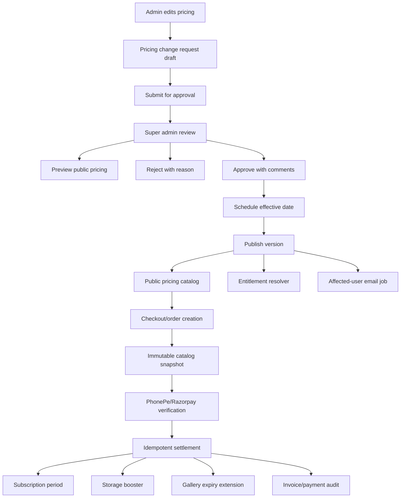

# Pricing, Plans, Billing, Storage, and Expiry — End-to-End Mechanism

Status: Requirements and implementation blueprint  
Last updated: 2026-06-06  
Current implementation status: Partial

## Executive Status

The complete end-to-end mechanism is **not fully in place yet**.

Implemented and verified:

- Existing subscription catalog backfill foundation.
- Migration `171_subscription_catalog_backfill_foundation`.
- Approved baseline `subscription_plan_versions`.
- Subscription snapshot fields.
- Backfill CLI.
- Backfill service tests.
- Backend test suite passed.
- Migration-number guard passed.

Not fully implemented yet:

- Admin plan create/archive/reorder workflow.
- Admin approval and super-admin publish workflow.
- Pricing preview mode.
- Dynamic public pricing catalog for event packs, expiry packs, and boosters.
- Unified billing orders.
- Same-plan renewal and expiry extension checkout.
- Storage booster checkout and quota integration.
- Gallery expiry extension checkout.
- Email-only affected-user notifications.
- Admin pricing analytics.
- Frontend wireframes/pages for all new flows.
- End-to-end Playwright coverage.

This document defines the complete mechanism needed to make the system seamless.

## Goals

- Admins manage all pricing and package data from one governed admin surface.
- Admin edits do not affect production until super-admin approval.
- Public pricing renders only approved, effective catalog versions.
- Checkout uses immutable catalog snapshots so billing history never changes.
- User storage allocation, package expiry, renewal, add-ons, and plan changes are
  all driven by the same entitlement model.
- Users are informed by email only when their account is affected.
- All flows are auditable, testable, and safe to roll out behind feature flags.

## Current Code Reality

### Admin Plans

Current routes:

- `GET /api/v1/admin/plans`
- `PUT /api/v1/admin/plans/{tier}`

Current limitations:

- Existing plans can be edited.
- No create.
- No archive/delete.
- No reorder endpoint.
- No approval queue.
- No preview mode.
- No impact analysis.
- Current `PUT` changes the live row directly.

Relevant files:

- `backend/internal/handler/admin_plans.go`
- `backend/internal/handler/admin_routes.go`
- `frontend/src/app/(dashboard)/admin/plans/page.tsx`
- `frontend/src/lib/api/admin.ts`

### Public Pricing

Current route:

- `GET /api/v1/plans`

Current limitations:

- Public subscription cards partially use backend plan data.
- Event upload options and expiry add-ons still have hardcoded frontend values.
- No `pricing-catalog` endpoint for subscription plans plus products.
- No preview data source.

Relevant files:

- `backend/internal/handler/admin_plans.go`
- `frontend/src/components/pricing/PricingContent.tsx`
- `frontend/src/lib/plans.ts`
- `frontend/src/hooks/use-plan-catalog.ts`

### Subscription Checkout

Current routes:

- `GET /api/v1/workspace/subscription`
- `GET /api/v1/workspace/subscription/payment-providers`
- `POST /api/v1/workspace/subscription/upgrade`
- `POST /api/v1/workspace/subscription/verify`

Current limitations:

- Upgrade-only.
- Same-tier renewal is not supported.
- Downgrade scheduling is not supported.
- Storage boosters are not supported.
- Gallery expiry extensions are not supported.
- Payment orders are specific to subscription upgrades.
- Invoice/payment snapshotting is not unified.

Relevant files:

- `backend/internal/handler/subscription_handler.go`
- `backend/internal/handler/subscription_upgrade_handler.go`
- `frontend/src/app/(dashboard)/settings/plans/page.tsx`
- `frontend/src/app/(dashboard)/settings/plans/choose-payment/page.tsx`

### Storage Allocation

Current limitations:

- Storage quota is partly synced from plan rows and partly resolved through
  static plan helper fallbacks.
- Storage boosters are not integrated.
- Safe quota reduction is not implemented.

Relevant files:

- `backend/internal/service/storage_accounting_service.go`
- `backend/internal/middleware/quota.go`
- `backend/internal/workspace/handler.go`
- `frontend/src/app/(dashboard)/settings/storage/page.tsx`

## Target Architecture



## Database Requirements

### Already Implemented

- `subscription_plan_versions`
- `subscriptions.plan_version_id`
- `subscriptions.catalog_snapshot`
- `subscriptions.catalog_backfilled_at`
- `subscriptions.catalog_backfill_source`

### Required New Tables

#### `pricing_change_requests`

Purpose: Govern all admin catalog changes.

Fields:

- `id`
- `request_type`
- `status`
- `submitted_by`
- `submitted_at`
- `approved_by`
- `approved_at`
- `rejected_by`
- `rejected_at`
- `rejection_reason`
- `approval_comment`
- `effective_from`
- `before_state jsonb`
- `after_state jsonb`
- `impact_summary jsonb`
- `email_preview jsonb`
- `published_at`
- `created_at`
- `updated_at`

Statuses:

- `draft`
- `pending_approval`
- `approved`
- `rejected`
- `scheduled`
- `published`
- `cancelled`

#### `pricing_audit_events`

Purpose: Timeline per plan/product.

Events:

- draft created
- edited
- submitted
- approved
- rejected
- scheduled
- published
- archived
- rollback version published
- email batch queued
- email batch sent

#### `billing_products`

Purpose: Catalog identity for non-subscription products.

Product types:

- `event_upload`
- `gallery_extension`
- `storage_booster`
- `upload_credit_pack`
- `streaming_pack`

#### `billing_product_versions`

Purpose: Versioned product pricing and behavior.

Examples:

- Event upload: price, active days, retention days.
- Gallery extension: price, extra days.
- Storage booster: price, added quota bytes, recurrence.

#### `billing_orders`

Purpose: Unified payment order table.

Fields:

- `id`
- `workspace_id`
- `user_id`
- `order_type`
- `target_type`
- `target_id`
- `catalog_snapshot jsonb`
- `amount_paise`
- `currency`
- `provider`
- `provider_order_id`
- `provider_payment_id`
- `status`
- `idempotency_key`
- `created_at`
- `paid_at`
- `failed_at`
- `metadata jsonb`

#### `workspace_storage_boosters`

Purpose: Active recurring storage add-ons.

Fields:

- `id`
- `workspace_id`
- `billing_product_version_id`
- `quota_bytes`
- `status`
- `started_at`
- `expires_at`
- `cancelled_at`
- `source_order_id`

#### `pricing_email_batches`

Purpose: Email-only notification audit.

Fields:

- `id`
- `pricing_change_request_id`
- `template_key`
- `template_version`
- `recipient_count`
- `status`
- `queued_at`
- `sent_at`
- `failed_count`
- `metadata jsonb`

## Backend APIs

### Public APIs

#### `GET /api/v1/pricing-catalog`

Returns:

- approved subscription plans
- event upload packs
- gallery extension packs
- storage boosters
- public metadata

Rules:

- Exclude drafts.
- Exclude rejected changes.
- Exclude archived products.
- Exclude future-effective versions.
- Sort by approved rank.

#### `GET /api/v1/plans`

Compatibility endpoint backed by the same catalog service.

### Admin APIs

#### `GET /api/v1/admin/pricing-catalog`

Returns full admin catalog:

- live versions
- drafts
- pending changes
- archived products
- impact counts

#### `POST /api/v1/admin/pricing-change-requests`

Creates a draft.

#### `PATCH /api/v1/admin/pricing-change-requests/{id}`

Updates draft content.

#### `POST /api/v1/admin/pricing-change-requests/{id}/submit`

Admin submits for super-admin approval.

#### `POST /api/v1/admin/pricing-change-requests/{id}/approve`

Super admin approves with comment.

#### `POST /api/v1/admin/pricing-change-requests/{id}/reject`

Super admin rejects with required reason.

#### `GET /api/v1/admin/pricing-change-requests/{id}/preview-catalog`

Returns the exact catalog that public pricing would render if published.

#### `POST /api/v1/admin/pricing-change-requests/{id}/publish`

Publishes immediately or schedules the approved change.

#### `GET /api/v1/admin/pricing-analytics`

Returns:

- active subscribers per plan
- MRR
- ARR
- storage booster revenue
- expiry extension revenue
- churn risk
- pending renewal failures

### User Billing APIs

#### `GET /api/v1/workspace/subscription`

Extend response with:

- `plan_version_id`
- `catalog_snapshot`
- `billing_interval`
- `expires_at`
- `renewal_status`
- `pending_change`
- `entitlements`
- `active_storage_boosters`

#### `POST /api/v1/billing/orders`

Creates an order for:

- subscription upgrade
- same-plan renewal
- scheduled downgrade
- storage booster purchase
- gallery expiry extension
- event upload pack

#### `POST /api/v1/billing/orders/{id}/verify`

Verifies provider payment and settles the order.

Existing subscription upgrade routes remain wrappers during migration.

## Frontend Routing

### Public

#### `/pricing`

Must render from `GET /api/v1/pricing-catalog`.

Sections:

- Starter/free plan.
- Pay-per-event packs.
- Subscription plans.
- Gallery extension packs.
- Storage boosters.
- FAQ from approved catalog metadata where possible.

No hardcoded prices for public products.

### Admin

#### `/admin/plans`

Becomes the pricing command center.

Tabs:

- Subscription Plans
- Event Packs
- Expiry Extensions
- Storage Boosters
- Approval Queue
- Audit Timeline
- Analytics

### User Settings

#### `/settings/subscription`

Shows:

- current plan
- current version
- expiry
- renewal status
- pending downgrade
- payment status
- active add-ons

#### `/settings/plans`

Supports:

- upgrade
- renew current plan
- schedule downgrade

#### `/settings/plans/choose-payment`

Must support unified billing order types, not only subscription upgrade.

#### `/settings/storage`

Shows:

- actual usage
- base quota
- booster quota
- safe-reduction warnings
- buy/cancel storage booster actions

#### Gallery Owner Page

Near-expiry and expired gallery owner states must show:

- extend 30 days
- extend 90 days
- archive/download option if enabled

## Wireframes

### Admin Pricing Command Center

```text
+--------------------------------------------------------------+
| Pricing & Plans                                      Preview |
| Manage governed pricing, packages, storage, and expiry terms |
+--------------------------------------------------------------+
| Subscription Plans | Event Packs | Extensions | Boosters     |
| Approval Queue     | Audit       | Analytics                 |
+--------------------------------------------------------------+
| Plan/Product List                                           |
| [drag/reorder] Starter      Active    Version 3    Edit      |
| [drag/reorder] Creator      Active    Version 2    Edit      |
| [drag/reorder] Pro          Active    Version 2    Edit      |
| [drag/reorder] Studio       Active    Version 1    Edit      |
+--------------------------------------------------------------+
| Change Draft Panel                                          |
| Before / After Diff                                         |
| Impact: users, revenue, over-quota, pending renewals        |
| Email preview: affected recipients                          |
| [Save Draft] [Submit for Approval]                          |
+--------------------------------------------------------------+
```

### Super-Admin Approval

```text
+--------------------------------------------------------------+
| Pending Pricing Change                                      |
+--------------------------------------------------------------+
| Submitted by: admin@example.com                             |
| Effective date: 2026-07-01                                  |
| Notice period: 30 days                                      |
+--------------------------------------------------------------+
| Diff                                                        |
| Price: Rs. 999 -> Rs. 1199                                  |
| Storage: 300GB -> 250GB                                     |
| Public rank: 3 -> 2                                         |
+--------------------------------------------------------------+
| Impact                                                       |
| Affected users: 148                                         |
| Over quota after change: 12                                 |
| Estimated MRR impact: +Rs. 29,600                           |
+--------------------------------------------------------------+
| Email Preview                                                |
| Subject, template, recipient count                          |
+--------------------------------------------------------------+
| [Preview Public Pricing] [Reject] [Approve] [Schedule]       |
+--------------------------------------------------------------+
```

### User Subscription Page

```text
+--------------------------------------------------------------+
| Subscription                                                 |
+--------------------------------------------------------------+
| Current plan: Pro Photographer                               |
| Billing: Monthly                                             |
| Expires: 2026-07-06                                          |
| Storage: 245GB / 300GB base + 50GB booster                   |
+--------------------------------------------------------------+
| Actions                                                      |
| [Renew current plan] [Upgrade] [Schedule downgrade]          |
| [Buy storage]                                                |
+--------------------------------------------------------------+
| Pending changes                                              |
| Downgrade to Creator scheduled for next renewal              |
+--------------------------------------------------------------+
```

### Storage Booster Page

```text
+--------------------------------------------------------------+
| Storage                                                      |
+--------------------------------------------------------------+
| Used: 245GB                                                  |
| Base quota: 300GB                                            |
| Booster quota: 50GB                                          |
| Total quota: 350GB                                           |
+--------------------------------------------------------------+
| Add storage                                                  |
| +50GB  Rs.300/mo   [Buy]                                    |
| +250GB Rs.1000/mo  [Buy]                                    |
| +1TB   Rs.3500/mo  [Buy]                                    |
+--------------------------------------------------------------+
```

## Entitlement Resolver

Add `EntitlementService.ResolveWorkspaceEntitlements(workspaceID)`.

Inputs:

- active subscription plan version
- active storage boosters
- admin overrides
- grace state

Outputs:

- base quota bytes
- booster quota bytes
- total quota bytes
- gallery limit
- client limit
- team member limit
- monthly upload credits
- feature flags
- billing hold state

All quota and feature gates must call this service.

## Payment Settlement

Settlement must be idempotent.

Flow:

1. Create `billing_orders` row.
2. Store immutable catalog snapshot.
3. Create provider order.
4. Verify provider callback or redirect.
5. Lock order row.
6. Confirm expected amount and provider identifiers.
7. Write invoice/payment records.
8. Apply effect:
   - subscription upgrade
   - renewal extension
   - scheduled downgrade
   - storage booster activation
   - gallery expiry extension
9. Mark order paid.
10. Queue email.

## Email-Only Notifications

Users are notified by email only.

Email events:

- approved price change affecting the user
- quota/limit change affecting the user
- plan archive or replacement
- renewal reminder
- payment success
- payment failure
- storage booster activation/cancel
- gallery extension purchase
- account enters billing hold

No proactive in-app notification system is required for this requirement.

## Safe Reduction Guard

When a plan or entitlement reduction lowers quota:

- Existing data remains readable.
- Users over the new limit are identified before approval.
- Super admin sees over-quota impact.
- Email notice is sent to affected users.
- Mutating actions can be blocked only after configured notice/grace period.
- Users are guided to reduce storage, renew, upgrade, or buy booster storage.

## Admin Analytics

Required metrics:

- active subscribers per plan
- monthly recurring revenue
- annual recurring revenue
- storage booster revenue
- expiry extension revenue
- event-pack revenue
- churn risk
- pending renewal failures
- over-quota users
- upcoming expiry cohorts
- revenue impact of pending catalog change

## Testing Requirements

### Backend

- Migration uniqueness.
- Migration contract tests.
- Change-request lifecycle.
- Super-admin approval permissions.
- Preview catalog generation.
- Public catalog filtering and sorting.
- Immutable snapshot creation.
- Billing order idempotency.
- PhonePe/Razorpay mocked verification.
- Subscription upgrade, renewal, and scheduled downgrade.
- Storage booster activation/cancel.
- Gallery expiry extension.
- Entitlement resolver.
- Safe reduction guard.
- Email recipient selection.
- Analytics query correctness.

### Frontend

- Admin create/edit/archive/reorder.
- Approval queue.
- Diff and impact panel.
- Public pricing preview.
- Public `/pricing` rendering from catalog.
- User renew/upgrade/downgrade.
- Storage booster purchase.
- Gallery extension purchase.
- Email preview recipient count.

### E2E

Run Playwright inside Docker.

Critical flow:

```text
Admin creates draft
Admin submits
Super admin previews public pricing
Super admin approves
Change publishes
Affected-user email batch queues
Public pricing updates
User checks out
Payment verifies
Subscription/storage entitlement updates
```

## Delivery Slices

Per RawDrive rules, this must not ship as one mega-diff.

### Slice 1 — Backfill Foundation

Status: Implemented.

- Migration 171.
- Backfill CLI.
- Baseline plan versions.
- Subscription snapshots.

### Slice 2 — Change Requests and Approval Backend

- `pricing_change_requests`.
- `pricing_audit_events`.
- Admin submit/approve/reject/publish APIs.
- Super-admin permission checks.
- Required comments and rejection reasons.

### Slice 3 — Admin Pricing Command Center UI

- Replace direct-save plan UI.
- Draft editor.
- Approval queue.
- Diff panel.
- Impact panel.
- Audit timeline.

### Slice 4 — Preview and Public Pricing Catalog

- `GET /api/v1/pricing-catalog`.
- `GET /admin/.../preview-catalog`.
- `/pricing` reads dynamic catalog.
- Remove hardcoded public event/add-on prices.

### Slice 5 — Unified Billing Orders

- `billing_orders`.
- Immutable snapshots.
- Gateway verification wrappers.
- Existing upgrade routes route through billing order service.

### Slice 6 — Subscription Renewal and Downgrade

- Same-plan renewal.
- Scheduled downgrade.
- Expiry extension by payment.
- Billing status.

### Slice 7 — Entitlements and Storage Boosters

- Entitlement resolver.
- Storage booster catalog.
- Purchase/cancel UI.
- Quota integration.

### Slice 8 — Gallery Expiry Extensions

- Extension product catalog.
- Owner gallery CTA.
- Checkout and settlement.
- Expired gallery reactivation rules.

### Slice 9 — Email and Analytics

- Email-only affected-user jobs.
- Admin analytics dashboard.
- Churn risk and renewal failure reporting.

### Slice 10 — Cleanup and Flag-On

- Remove static pricing/entitlement fallbacks.
- Turn on dynamic pricing feature flag.
- Final E2E verification.

## Final Acceptance Criteria

The complete mechanism is done only when:

- Admin can create, edit, archive, reorder, and submit plan/product changes.
- Super admin can preview, approve, reject, schedule, and publish.
- Public pricing reflects only approved effective data.
- Checkout creates immutable catalog snapshots.
- Payment settlement is idempotent and updates subscription/add-on/gallery state.
- User subscription, storage, and gallery expiry pages reflect paid changes.
- Storage quota is resolved from plan version plus boosters.
- Affected users receive email-only notifications.
- Admin analytics show plan, revenue, booster, expiry, churn, and renewal data.
- Backend, frontend, and Docker Playwright E2E tests pass.

## Current Truth Statement

As of 2026-06-06, the database backfill foundation is implemented and tested.
The complete frontend, routing, wireframe, admin approval, billing, storage
booster, expiry extension, email, and analytics mechanism is **not yet fully
implemented** and must be delivered through the slices above.
