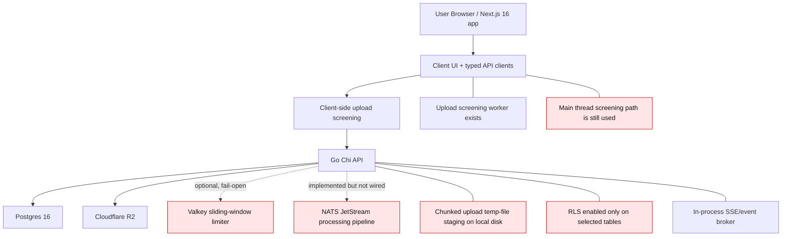

# RawDrive 360 Audit

Date: 2026-04-10
Repository: `C:\Users\admin\Desktop\RawDriveCobolt`
Audited version target: `v0.0.35`
Audited milestone target: `M16 - upload-side abuse screening tier`
Audited branch: `main`
Audited commit: `6b622012d86188aa09a8ca82cb50b555f67430f7`

## 1. Scope

This document captures a full-repo architecture, functionality, security, quality,
and production-hardening audit of the RawDrive monorepo.

Primary sources of truth used during the audit:

- Actual code under `backend/`, `frontend/`, `e2e/`, `infra/`, and `docker-compose.yml`
- `frontend/AGENTS.md`
- `docs/TechnicalRequirements/**`
- `docs/runbooks/**`
- Current runtime/test/build behavior observed from this workspace

Known documentation caveat:

- The top-level `README.md` is stale and was intentionally ignored.
- Some files under `docs/TechnicalRequirements/Gallery/` also describe an older
  Python/multi-service architecture that does not match this repository and are
  called out below as documentation drift.

## 2. Reality Check

RawDrive is currently a layered modular monolith, not a true microservice estate.

Current code reality:

- Backend: one Go API using Chi, package-layered under `internal/{handler,service,repository,middleware}`
- Frontend: one Next.js App Router application
- Data plane: one Postgres instance with optional Valkey and NATS sidecars
- Storage: Cloudflare R2 via S3-compatible APIs

Version drift observed:

- Root `package.json` version is `0.0.35`
- `frontend/package.json` version is `0.1.0`
- `cobolt-state.json` still reports stage `M15-enterprise-hardening`
- Prompt/project docs said "Next.js 15", but actual frontend dependency is `next@16.2.2`

Positive signals:

- `pnpm --dir frontend build` passed
- `npm run test:frontend` passed
- `npm run lint` passed
- `go build ./cmd/api` passed
- Backend package test suite was mostly green; failure was isolated to one Windows/rootless Docker testcontainer path

## 3. Methodology

The audit combined:

1. Static code walkthrough of backend handlers, services, repositories, middleware, migrations, and frontend pages/components/hooks/lib clients
2. Requirements review against `docs/TechnicalRequirements/**`
3. Security review against OWASP Top 10 and SaaS-specific multi-tenant risks
4. Runtime validation with build/test/compose commands
5. Route and feature surface inventory

Commands executed during the audit:

```bash
git status --short
git rev-parse --abbrev-ref HEAD
git rev-parse HEAD
docker compose up -d
docker compose --env-file _cobolt-docker/.env up -d
docker compose --env-file _cobolt-docker/.env ps
npm run test:backend
npm run test:frontend
npm run lint
pnpm --dir frontend build
go build ./cmd/api
```

## 4. Executive Summary

### 4.1 Overall Assessment

RawDrive has substantial implementation breadth and is no longer a skeleton codebase.
Major product surfaces exist for galleries, proofing, AI, admin, streams, dealer
ops, messaging, notifications, storage, and privacy workflows. The codebase is
readable, package boundaries are mostly understandable, and the frontend has a
typed API client layer rather than pure ad hoc fetches.

However, the production-hardening bar for an M16 release is not yet met. The repo
contains several critical security flaws, multiple requirement-to-runtime gaps,
important documentation drift, and non-trivial delivery/test reproducibility issues.

### 4.2 Severity Counts

- P0: 4
- P1: 7
- P2: 7
- P3: 2

### 4.3 Release Recommendation

Do not treat the current repo state as production-ready for M16 until all P0 and
P1 findings are closed and the M16 upload screening path is proven end to end with
real file flows.

### 4.4 Immediate Blockers

1. Password reset accepts any unexpired OTP.
2. OAuth/login token flow exposes tokens via URL query params and browser storage.
3. M16 backend final assertion is incomplete in the live upload path, and scan
   metadata is not reliably persisted on asset rows.
4. Admin/platform secrets are stored in plaintext despite the documented
   "encrypted at rest" contract.

## 5. Current Architecture



### 5.1 Architectural Notes

- The repo is a monorepo, but the runtime is effectively one app plus attached infra.
- Package layering is generally coherent: handlers call services, services call repositories.
- Some abstractions are ahead of actual runtime wiring:
  - JetStream processing pipeline exists but is not constructed/started from `main.go`
  - Valkey limiter is optional and explicitly fail-open
  - Consent withdrawal cascade emitter is wired as `nil`
- Some docs still describe a different service topology entirely.

## 6. Verification Results

### 6.1 Build and Test Outcomes

| Command | Result | Notes |
|---|---|---|
| `pnpm --dir frontend build` | Pass | Next.js 16.2.2 production build completed successfully |
| `npm run test:frontend` | Pass | 216 tests passed |
| `npm run lint` | Pass | Frontend lint clean |
| `go build ./cmd/api` | Pass | Backend API compiles |
| `npm run test:backend` | Partial | Most packages passed; `backend/tests/m13` failed because Windows/rootless Docker testcontainer provider is unsupported |
| `docker compose up -d` | Fail | Root compose requires env values not available by default |
| `docker compose --env-file _cobolt-docker/.env up -d` | Pass | Infra containers came up successfully |
| Dockerized Playwright execution | Fail | Playwright container mount path is wrong due to `../:/app` volume mapping |

### 6.2 Delivery Engineering Read

The build pipeline story is uneven:

- Local frontend build is healthy.
- Backend compiles.
- Root compose bootstrap is not self-serve.
- Dockerized Playwright path is broken from the root compose file.
- No repo-owned GitHub Actions or Dependabot configuration was found.

## 7. Detailed Findings by Domain

### 7.1 Monorepo Health and Delivery

Strengths:

- Clear repo split by backend/frontend/e2e/docs/infra
- Frontend compiles and tests
- Backend compiles

Issues:

- Root compose is not reproducible without an external env file.
- Playwright container mounts the parent directory, not the repo.
- Release metadata is drifted across files.
- CI/security automation is absent from the repo.

### 7.2 Backend Architecture

Strengths:

- Handlers, services, repositories, and middleware are separated cleanly enough for onboarding.
- Route registration by milestone is explicit in files like `routes_m2.go`, `routes_m4.go`, `routes_m5.go`, and `routes_m8.go`.
- The backend surface is broad and not obviously toy-level.

Issues:

- Runtime wiring still uses dev-like fallbacks in key places:
  - stdout event publishers instead of NATS
  - optional/fail-open Valkey limiter
  - plaintext HTTP fallback when TLS env vars are missing
- Structured logging and tracing are inconsistent.
- Several compliance/security primitives exist in code but are not fully wired in runtime.

### 7.3 Frontend Architecture

Strengths:

- Next.js App Router tree is broad and compiles cleanly.
- TypeScript strict mode is enabled.
- Typed API client modules exist for major domains.

Issues:

- Auth handling is browser-storage based rather than session-hardened.
- No explicit route-level `loading.tsx` / `error.tsx` files were found under `frontend/src/app`.
- The design-token rules documented in repo guidance are not consistently enforced.
- Legacy `/upload` route still ships.
- Some surfaces still use fallback/demo data and remote assets.

### 7.4 Data Flow and Integration

Strengths:

- Gallery, proofing, stream, admin, messaging, and notification routes appear broadly aligned between frontend client modules and backend route registration.
- Asset storage and download surfaces are implemented.

Issues:

- Upload flow does not meet the documented TUS/resumability contract.
- Gallery detail page performs N+1 asset hydration.
- Consent withdrawal does not emit real cascade events.
- BYOS frontend flow is not aligned with backend contract.

## 8. Issue Register

| ID | Severity | Area | Evidence | Finding | Recommended Fix | Effort |
|---|---|---|---|---|---|---|
| F-001 | P0 | Auth | `backend/internal/auth/auth.go:705-745` | Password reset accepts any OTP that is merely present and unexpired. | Enforce exact OTP verification, replay prevention, expiration, and dedicated regression tests. | S |
| F-002 | P0 | Auth | `backend/internal/auth/handler.go:408-415`, `frontend/src/lib/auth.ts:20-32`, `frontend/src/components/auth/LoginForm.tsx:53-60` | OAuth/login tokens are exposed in URL query params and then persisted to local/session storage. | Move to cookie-based refresh flow and server-side callback handling; do not store refresh tokens in browser storage. | M |
| F-003 | P0 | Upload Security | `backend/internal/handler/chunked_upload.go:295-349`, repo search showed no production callsites for final-byte verification helpers | M16 backend final assertion is incomplete in the live upload path. | Wire final manifest/hash verification into both chunked and direct upload finalize paths. | M |
| F-004 | P0 | Moderation / M16 | `backend/internal/service/upload_service.go:72-84`, `backend/internal/database/migrations/053_upload_scan_metadata.up.sql:6-18` | `upload_scan_*` moderation metadata exists in schema but is not persisted by live upload code. | Persist scan status, findings, manifest hash, policy version, and risk score on every upload path. | M |
| F-005 | P0 | Secrets | `backend/internal/repository/platform_settings_repo.go:96-109`, `backend/internal/handler/admin_settings_handler.go:68-92` | Platform settings secrets are stored plaintext despite the documented encrypted-at-rest contract. | Add service-layer encryption with KEK/DEK or KMS-backed envelope encryption and transparent decrypt-on-read. | M |
| F-006 | P1 | Auth / Sessions | `backend/internal/auth/auth.go:256-268`, `backend/internal/auth/auth.go:338-360` | JWT signing keys and refresh/session state are generated and stored in memory at runtime only. | Load stable keys from secret management and persist refresh sessions in durable storage. | M |
| F-007 | P1 | Compliance / IAM | Repo-wide search found no TOTP/MFA implementation; requirement exists in `docs/TechnicalRequirements/Security_Compliance_Privacy.md:44-47` | Mandatory MFA for photographers/staff is not implemented. | Add TOTP/WebAuthn rollout with enforcement policy and recovery flow. | M |
| F-008 | P1 | Storage | `backend/internal/storage/factory.go:10-17`, `backend/internal/handler/chunked_upload.go:168-177` | Local filesystem storage driver still exists, and chunked uploads stage bytes on disk. | Remove `local` provider support and redesign temp handling around controlled encrypted ephemeral staging/streaming. | M |
| F-009 | P1 | Multi-tenancy | `backend/internal/middleware/db_context.go:20-24`, `backend/internal/database/migrations/008_create_rls.up.sql:19-48` | Workspace context is interpolated into SQL, and RLS is enabled only on a small subset of workspace-scoped tables. | Parameterize `set_config`, extend RLS to all tenant-scoped tables, and add negative leakage tests. | M |
| F-010 | P1 | Security Headers / TLS | `backend/internal/middleware/security_headers.go:5-14`, `frontend/next.config.ts:7-35`, `backend/cmd/api/main.go:978-980` | No CSP/Referrer-Policy/Permissions-Policy and plaintext HTTP fallback still exists. | Add hardened headers on both API and frontend and require TLS at runtime or trusted proxy only. | S |
| F-011 | P1 | BYOS / Storage UX | `frontend/src/app/(dashboard)/settings/storage/page.tsx:42-79`, `backend/internal/handler/storage_config_handler.go:21-59` | Storage settings page hardcodes plan tier and uses a route shape that does not match backend expectations. | Source workspace/plan from auth context and align page actions with backend route contracts. | S |
| F-012 | P1 | DevEx / E2E | `docker-compose.yml:59-67` | Root compose bootstrap is broken for Playwright because the volume maps `../:/app`. | Fix volume mapping to repo root and make dockerized Playwright the supported happy path. | S |
| F-013 | P1 | Upload / TUS | `backend/internal/handler/chunked_upload.go:160-166`, `frontend/src/hooks/use-upload.ts:11-25`, `docs/TechnicalRequirements/Gallery/Asset_Management.md:14-18` | Uploads are not true spec-compliant TUS: fixed 5 MB chunks, 2 GB cap, in-memory session tracking, no persistent resume across restarts. | Replace/upgrade to a true resumable implementation with persistent state and documented size/throughput behavior. | M |
| F-014 | P2 | Async Architecture | `backend/internal/service/processing_pipeline.go:36-107`, no `NewProcessingPipeline(...)` callsites found | JetStream pipeline exists but is not wired into runtime. | Either wire and operate it or remove dead-path complexity and document the simpler model. | M |
| F-015 | P2 | Rate Limiting | `backend/internal/middleware/valkey_ratelimit.go:47-88`, `backend/cmd/api/main.go:369-394` | Valkey-backed rate limiting is optional and fail-open, leaving inconsistent abuse protection. | Define which routes must fail-closed and add environment validation for production. | M |
| F-016 | P2 | Frontend Performance | `frontend/src/app/(dashboard)/galleries/[id]/page.tsx:60-75` | Gallery detail performs N+1 asset fetch hydration. | Return hydrated gallery assets in one endpoint or batch asset fetches. | S |
| F-017 | P2 | Privacy Wiring | `backend/cmd/api/main.go:420-425` | Consent withdrawal cascade emitter is intentionally wired as `nil`, so downstream purge behavior is not active at runtime. | Wire the actual emitter and verify it end to end. | S |
| F-018 | P2 | Privacy UX | Backend DSR/consent routes exist, but repo search found no frontend privacy center or DSR UI | Compliance workflows are only partially productized. | Add self-service privacy UI for consent status, withdrawal, export, and erasure tracking. | M |
| F-019 | P2 | Frontend Standards | `frontend/src/app/(dashboard)/upload/page.tsx:7-34`, `frontend/src/components/ui/glass-icon-button.tsx:45-120`, `frontend/src/components/upload/upload-progress.tsx:119-138` | Frontend deviates from repo UI laws: legacy `/upload` route ships, token rules are not enforced, and raw buttons are still used in some action surfaces. | Remove or redirect legacy routes and normalize components around tokenized design-system primitives. | M |
| F-020 | P2 | Product Data / Presentation | `frontend/src/app/(dashboard)/dashboard/page.tsx:31-72`, `frontend/src/app/page.tsx:121-125`, `frontend/src/lib/tokens.ts:137-170` | Dashboard and marketing still use fallback/demo data, remote assets, and hardcoded pricing metadata. | Move business data to backend/config sources and keep the product free of external demo dependencies. | S |
| F-021 | P2 | Observability | Widespread `log.Printf`/`fmt.Printf` usage across services and workers, with no repo-owned metrics/tracing stack evidence | Logging is inconsistent, and there is no mature observability story for uploads, AI jobs, privacy flows, or infra. | Standardize structured logging and add metrics/traces around critical flows. | M |
| F-022 | P3 | Documentation | `docs/TechnicalRequirements/Gallery/GALLERY_DESIGN_STUDIO_VERIFICATION.md:485-490` | Some "verification" docs still describe a Python service layout that does not exist in this repo. | Rewrite or archive drifted docs and keep one canonical implementation-status source. | S |
| F-023 | P3 | Release Governance | `package.json:3`, `frontend/package.json:3`, `cobolt-state.json:4-5`; no repo-owned CI/Dependabot config found | Version/stage metadata is drifted and delivery governance is weak. | Create one release source of truth and add CI, dependency scanning, and automated security gates. | S |

## 9. Feature Matrix vs Requirements

| Feature Area | Status | Evidence | Assessment |
|---|---|---|---|
| Auth activation flow | Yellow | Password login and account activation flows exist | Base flow exists, but overall auth posture is weakened by reset/session flaws |
| Password reset | Red | `backend/internal/auth/auth.go:705-745` | Critically insecure |
| MFA / strong IAM | Red | Requirement exists; implementation not found | Missing |
| State-first tenancy / RBAC | Yellow | Claims and role middleware exist, partial RLS exists | Partially implemented; not yet proven comprehensive |
| Gallery CRUD | Green | Backend routes and frontend pages exist and compile | Present and broadly wired |
| Gallery detail / asset browsing | Yellow | Feature exists, but uses N+1 asset hydration | Functional but inefficient |
| Upload inside gallery | Yellow | Upload tooling is embedded in gallery detail, but standalone `/upload` route still ships | Mostly aligned with product rule, not fully cleaned up |
| Resumable uploads / TUS | Yellow | Upload flow works, but does not match spec requirements for true resumability | Partial |
| WebP derivatives / EXIF | Yellow | Services exist | Not fully re-verified end to end in browser flow due Playwright/bootstrap issues |
| M16 browser screening | Yellow | Client-side screen/manifest path exists | Present, but worker is unused and screening still buffers whole files on main thread |
| M16 backend final assertion | Red | Final-byte enforcement not wired in production upload path | Incomplete |
| Moderation queue / allowlist override | Red | Schema/services exist, but live upload path does not populate moderation metadata correctly | Incomplete |
| Public gallery / proofing | Yellow | Route and client layers exist | Broadly present, but E2E coverage gaps remain |
| BYOS | Yellow | Backend enterprise gate exists; frontend page is drifted/hardcoded | Partial |
| Streams | Yellow | Stream routes and clients exist, frontend builds | Present; not fully runtime-verified in this audit |
| Messaging / notifications | Yellow | Route and client layers exist | Present; runtime quality not fully validated end to end |
| DSR / consent backend | Yellow | DSR and consent routes/services exist | Backend primitives exist, but end-user UX and runtime cascade wiring are incomplete |
| E2E upload/gallery with real photos | Red | No `e2e/tests` usage of `tests/photos/` was found | Missing against repo testing rule |

## 10. Security Deep Dive

### 10.1 OWASP Mapping

| OWASP Category | Status | Key Evidence |
|---|---|---|
| A01 Broken Access Control | Red | Partial RLS scope, SQL interpolation for workspace context, BYOS/settings contract drift |
| A02 Cryptographic Failures | Red | Tokens in URLs/browser storage, plaintext secrets in DB |
| A05 Security Misconfiguration | Red | Missing CSP/Referrer/Permissions policies, plaintext HTTP fallback, broken compose/E2E bootstrap |
| A07 Identification and Authentication Failures | Red | Any-OTP password reset, ephemeral JWT keys, missing MFA |
| A08 Software and Data Integrity Failures | Red | Incomplete M16 final assertion and moderation persistence |
| A09 Security Logging and Monitoring Failures | Yellow | Audit tables exist, but logging/tracing/runtime event wiring are inconsistent |
| A06 Vulnerable and Outdated Components | Yellow | No repo-owned automated dependency/security scanning setup was found |

### 10.2 Hypothetical Exploit Paths

#### Exploit A: Password Reset Account Takeover

Path:

1. Attacker knows victim email.
2. Attacker initiates password reset.
3. Any active, unexpired reset entry is enough.
4. Attacker submits arbitrary OTP value.
5. Password is changed successfully.

Impact:

- Full account takeover
- Workspace access
- Access to galleries, billing, client data, and possibly admin functions depending on role

#### Exploit B: Token Exfiltration via URL / Browser Storage

Path:

1. OAuth callback redirects with `access_token` and `refresh_token` in query string.
2. Frontend persists them to localStorage/sessionStorage.
3. Token leaks through browser history, extensions, logs, shared devices, or XSS.

Impact:

- Session hijack
- Replay of authenticated API requests
- Long-lived refresh abuse if not revoked quickly

#### Exploit C: M16 Screening Bypass

Path:

1. Malicious client forges or bypasses local screening contract.
2. Backend session-create validates only the manifest superficially.
3. Finalize path uploads bytes and creates asset row without live final-byte re-verification.
4. Moderation queue may never see correct scan metadata.

Impact:

- Suspicious or malformed originals persist in storage
- Moderation analytics become misleading
- Abuse screening becomes trust-on-client rather than verified assertion

#### Exploit D: Plaintext Secret Exposure

Path:

1. Platform setting written through admin settings API.
2. Value stored directly in `platform_settings.value`.
3. DB read access, backup exposure, or accidental export reveals raw secret.

Impact:

- Credential compromise for storage, payments, AI, email, and messaging integrations
- Lateral movement into cloud resources

## 11. Code Quality and Maintainability

### 11.1 Strengths

- Backend package boundaries are understandable.
- Frontend is typed and compiled under strict mode.
- API client modules exist for most product domains.
- Route registration files make milestone surfaces discoverable.

### 11.2 Debt Hotspots

- Logging is inconsistent and not standardized.
- Runtime wiring often lags behind the abstractions already implemented.
- Design-system and token rules are documented more strongly than they are enforced.
- Docs contain contradictory implementation claims.
- Some frontend surfaces still mix real data with fallback/demo data.

## 12. Performance and Scalability

### 12.1 Observed Risks

- Upload screening reads the entire file into main-thread memory in `frontend/src/hooks/use-upload.ts`.
- A screening worker exists but is not used.
- Gallery detail page incurs N+1 fetches on asset hydration.
- Upload session state is in memory, so restart/pod loss breaks resume semantics.
- Fixed 5 MB chunking and 2 GB cap diverge from the documented 50 GB / adaptive behavior.
- Valkey rate limiting is optional and fail-open.
- JetStream pipeline is present in code but not operating in runtime.

### 12.2 Likely Production Bottlenecks

- Large gallery detail pages
- High-concurrency uploads
- Moderation/search/AI worker observability gaps
- Browser-side memory pressure during large upload preflight

## 13. Testing and Evidence Gaps

### 13.1 What Was Verified

- Frontend build
- Frontend unit tests
- Frontend lint
- Backend compile
- Backend package tests, with one infra-specific failure path

### 13.2 What Was Not Fully Verified

- End-to-end upload with real `tests/photos/` assets in Dockerized Playwright
- Full browser proofing/gallery/stream flows under a working compose + Playwright stack
- Production-like NATS/Valkey integrated behavior
- Full DSAR and consent withdrawal UX from the browser

### 13.3 Why Not

- Root compose defaults are incomplete
- Playwright container mount is incorrect from the root compose file
- One backend test suite path depends on unsupported Windows/rootless Docker behavior

## 14. Recommended M17 Action Plan

### 14.1 P0 Sprint

1. Fix password reset OTP verification.
2. Replace query-param/browser-storage token flow with secure session handling.
3. Complete M16 backend final assertion and moderation metadata persistence.
4. Encrypt platform settings secrets at rest.

### 14.2 P1 Sprint

1. Persist JWT/session state and introduce stable signing keys.
2. Implement MFA for photographers/staff.
3. Remove local storage driver support and redesign temp-byte handling.
4. Extend RLS to all tenant-scoped tables and fix workspace-context SQL.
5. Add CSP/Referrer-Policy/Permissions-Policy and lock down plaintext HTTP fallback.
6. Repair BYOS settings UI/backend contract.
7. Fix root compose and Playwright pathing.
8. Bring upload/resume behavior in line with documented TUS requirements.

### 14.3 P2 Sprint

1. Either wire JetStream/Valkey as real infra dependencies or simplify the architecture.
2. Eliminate gallery-detail N+1 hydration.
3. Wire consent withdrawal cascade emitter.
4. Build privacy center UI for consent and DSR.
5. Remove demo/fallback data and remote assets from core product surfaces.
6. Standardize frontend design-system enforcement.
7. Add structured logs, metrics, and traces.

### 14.4 P3 Governance

1. Rewrite or archive drifted docs.
2. Add CI, dependency scanning, and one canonical release/stage metadata source.

## 15. Verification Checklist After Fixes

```bash
docker compose --env-file _cobolt-docker/.env up -d
go build ./backend/cmd/api
npm run test:backend
npm run test:frontend
npm run lint
pnpm --dir frontend build
docker compose --env-file _cobolt-docker/.env exec -T playwright bash -lc "cd /app/e2e && npx playwright test"
```

Specific must-pass release checks:

- Password reset rejects incorrect OTP values
- OAuth callback never exposes tokens in URL
- Refresh tokens are not stored in browser-accessible storage
- Upload finalization rejects manifest/hash mismatch
- `upload_scan_*` fields are populated for every uploaded asset
- False-positive override tokens are consumed exactly once
- BYOS settings work only for enterprise workspaces
- Real upload/gallery E2E tests use files from `tests/photos/`

## 16. Bottom Line

RawDrive has real product breadth and a meaningful amount of implementation
already in place. This is not a blank-slate repo. But the hardening gap between
"feature present" and "feature production-safe, compliant, and verifiably working"
is still material.

The repo is closest to a late-stage product build that needs a disciplined
hardening release, not a greenfield implementation that only needs more features.
If the P0 and P1 issues are addressed in M17 with strong verification, the codebase
can move from "broadly implemented but risky" to "operationally credible."
