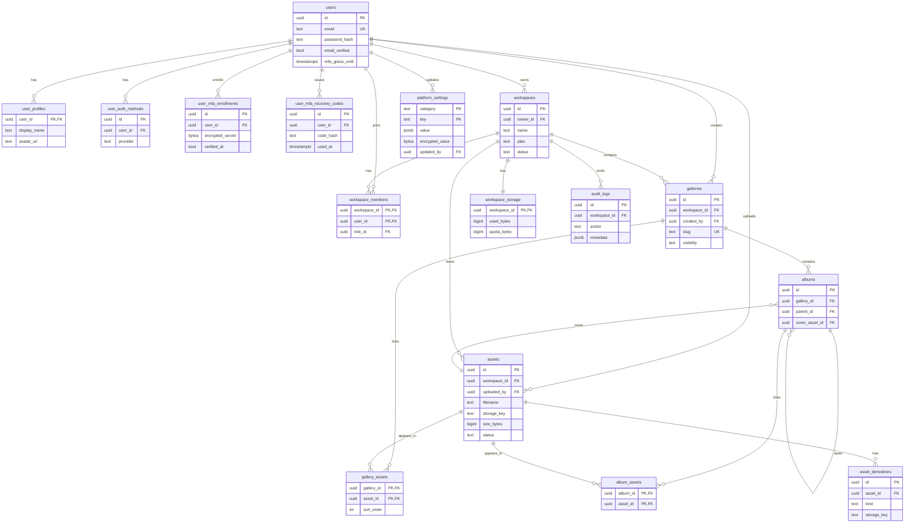

# RawDrive Database Schema

This directory documents the live Postgres schema produced by the 142 migrations under `backend/internal/database/migrations/`.

ISSUE-005 (brownfield P1) closure: the repository previously had zero ERD or schema reference — understanding the shape of the database required reading every migration in order. This document and the accompanying `schema.sql` dump are the canonical reference.

## Files

| File | Content | When to regenerate |
|---|---|---|
| `schema.sql` | Full `pg_dump --schema-only` snapshot of the live development database | After every migration that lands on `main` — regenerate via `scripts/refresh-schema.sh` |
| `README.md` (this file) | Core-entity ERD and refresh instructions | When new top-level entities or relationships are introduced |

`schema.sql` is authoritative for column-level detail (types, constraints, indexes, defaults). The ERD below is a high-level map of the domain and intentionally omits supporting tables (analytics, metrics, audit, ephemeral sessions) so the diagram stays readable.

## Refreshing the schema dump

The dev compose stack must be running (`docker compose up -d`). From the repo root:

```bash
./scripts/refresh-schema.sh
```

This runs `pg_dump --schema-only --no-owner --no-privileges` inside the `postgres` container and writes the result to `docs/db/schema.sql`. Commit the regenerated file as part of the PR that lands the migration.

## Core entity ERD (17 tables)

The diagram covers the top-level identity, workspace, gallery, asset, and album entities plus the M17 MFA tables. All 104 tables in the schema are documented in full in `schema.sql`.



## Notable schema facts

- **Multi-tenant key:** nearly every user-facing table carries `workspace_id` with a FK to `workspaces.id`. `BulkMoveToGallery` in `asset_repo.go` illustrates the correct enforcement pattern (ISSUE-007 fix).
- **Soft-delete:** tables with `deleted_at timestamptz` are soft-deleted. Repository queries must filter `deleted_at IS NULL`.
- **RLS:** row-level security is expected to be enforced via the tenant middleware that calls `SET app.workspace_id = ...` per-request. See `backend/internal/middleware/tenant.go`.
- **Encryption at rest (F-005):** `platform_settings.encrypted_value` and `user_mfa_enrollments.encrypted_secret` are envelope-encrypted with the `PLATFORM_SETTINGS_KEK`.
- **Migrations are forward-only in CI** but each migration ships a paired `.down.sql` for emergency local rollback.
- **Vector search:** `pgvector` is enabled. Tables like `quality_scores` and embedding caches store `vector(n)` columns.

## Why no full 104-table ERD?

A single mermaid ERD covering all 104 tables would be unreadable (mermaid starts to overflow around 30 tables and becomes unusable past 50). The authoritative column-level reference is `schema.sql`. If you need a full visual graph, regenerate from `schema.sql` with a dedicated tool — SchemaSpy, [dbdiagram.io](https://dbdiagram.io), or `pg_dump | dbml` pipelines all handle the full table set better than mermaid.
