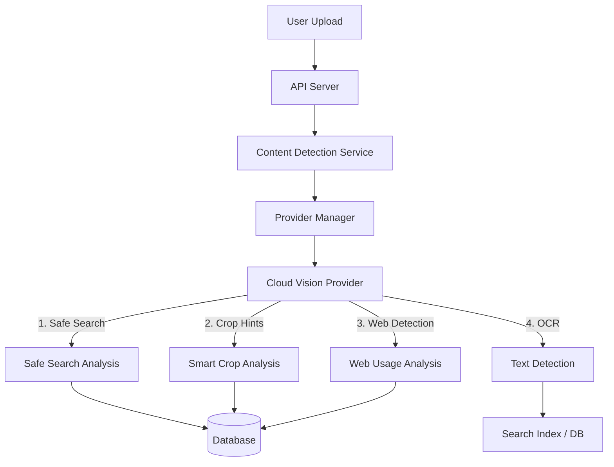

# Future Google Cloud Vision Enhancements: Design & Implementation Plan

This document outlines the architectural design and implementation plan for integrating additional Google Cloud Vision capabilities into RawDrive. These enhancements aim to improve content safety, user experience, and asset searchability.

## 1. Architectural Overview

The current architecture uses a `CloudVisionProvider` within the `ContentDetectionService`. We will extend this pattern. All new features will be implemented as methods within the active provider, with results determining data storage strategies (e.g., new tables vs. existing JSON columns).

---

## 2. Feature Implementation Plans

### Feature 1: Safe Search (Content Moderation)
**Goal:** Automatically flag or hide inappropriate content in public galleries.

#### Technical Design
*   **Provider Update:** Add `detect_safe_search(image_buffer)` to `CloudVisionProvider`.
*   **Schema Changes:**
    *   Add `moderation_status` (enum: `approved`, `review_needed`, `rejected`) and `moderation_details` (JSON) to `assets` table.
*   **Logic:**
    *   If `adult`, `violence`, or `racy` likelihood is `LIKELY` or `VERY_LIKELY` -> Set status `review_needed` or `rejected`.
    *   Update `GalleryPublicView` to filter out non-approved assets.

### Feature 2: Smart Crop Hints
**Goal:** Generate improved thumbnails that center on the most important part of the image (faces, objects) rather than center-cropping.

#### Technical Design
*   **Provider Update:** Add `detect_crop_hints(image_buffer, aspect_ratios)` to `CloudVisionProvider`.
*   **Schema Changes:**
    *   Add `smart_crop_coords` (JSON) to `assets` table. Format: `{ "1:1": {x,y,w,h}, "16:9": {x,y,w,h} }`.
*   **Logic:**
    *   During processing, request crop hints for common aspect ratios (1:1, 4:3, 16:9).
    *   Frontend `Image` component uses these coordinates to set `object-position` CSS or request dynamically cropped variants.

### Feature 3: Web Detection (Copyright Tracking)
**Goal:** Allow photographers to see where their images are being used on the web.

#### Technical Design
*   **Provider Update:** Add `detect_web_usage(image_buffer)` to `CloudVisionProvider`.
*   **Schema Changes:**
    *   New table `asset_web_matches`:
        *   `id`, `asset_id`, `url`, `page_title`, `match_type` (full, partial, similar_image), `detected_at`.
*   **Logic:**
    *   Run as a background job (lower priority).
    *   Store discovered URLs.
    *   UI: "Web Usage" tab in Asset Details view.

### Feature 4: Text Detection (OCR)
**Goal:** Make photos searchable by the text contained within them (e.g., street signs, menus, name tags).

#### Technical Design
*   **Provider Update:** Add `detect_text(image_buffer)` to `CloudVisionProvider`.
*   **Schema Changes:**
    *   Add `extracted_text` (process TSVECTOR) column to `assets` for PostgreSQL full-text search.
*   **Logic:**
    *   Extract full text blob.
    *   Index `extracted_text` for search queries.
    *   Update `SearchService` to query this column.

---

## 3. Recommended Implementation Order

1.  **Safe Search**: High impact on trust and safety. Low complexity.
2.  **Smart Crop Hints**: High Visual/UX impact. Low complexity.
3.  **OCR**: High utility for power users. Medium complexity.
4.  **Web Detection**: Niche professional feature. Medium complexity.
